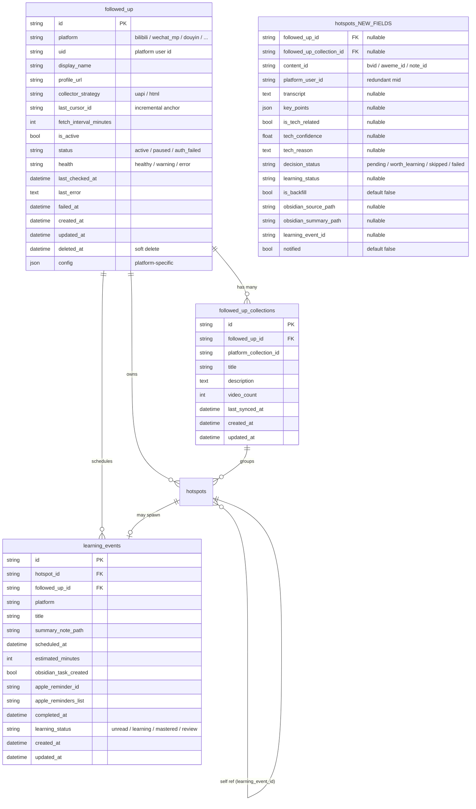

# AIPulse 关注 UP 主跟踪 + AI 知识库总结（v0.3）— 已拆分

> **本文件已被拆分**：内容已迁移至 [`docs/superpowers/specs/v0.3-followed-up-and-summary/`](v0.3-followed-up-and-summary/00-master.md)（9 个子文件，主文件路由）
>
> 本文件保留为归档版本，**仅供决策回查使用**。所有 subagent 应读取子文件，而非本文件。

| 子文件 | 路由 |
|---|---|
| [00-master.md](v0.3-followed-up-and-summary/00-master.md) | 路由索引 + 决策摘要 + 执行架构 |
| [01-foundation-data-model.md](v0.3-followed-up-and-summary/01-foundation-data-model.md) | 数据模型（§3） |
| [02-bilibili-collector.md](v0.3-followed-up-and-summary/02-bilibili-collector.md) | B站采集（§4） |
| [03-langchain-agent.md](v0.3-followed-up-and-summary/03-langchain-agent.md) | LangChain Agent（§5.1-5.8） |
| [04-summary-queue-api.md](v0.3-followed-up-and-summary/04-summary-queue-api.md) | 总结队列 + API（§5.9-5.10） |
| [05-frontend-ui.md](v0.3-followed-up-and-summary/05-frontend-ui.md) | 前端 UI（§6） |
| [06-notification-failure.md](v0.3-followed-up-and-summary/06-notification-failure.md) | 通知 + 失败处理（§7+§8） |
| [07-config-auth-vault.md](v0.3-followed-up-and-summary/07-config-auth-vault.md) | 配置 + 鉴权 + Vault（§9） |
| [08-acceptance-appendix.md](v0.3-followed-up-and-summary/08-acceptance-appendix.md) | 验收 + 附录（§10+附录） |

> 文档生成自 `/grill-me` 方案拷问环节 + superpowers-brainstorming 流程，日期：2026-07-25
> 状态：**v0.3-final 整合定稿**（原 grilling Q1-Q154 + 第二轮 Q1-Q22 + 附录 E 全部 9 项决策落定）
> 范围：AIPulse v0.3 Web Dashboard 新增功能

---

## 0. Changelog

| 日期 | 版本 | 内容 |
|---|---|---|
| 2026-07-25 01:30 | v0.3-final | 整合原 grilling Q1-Q154 + 第二轮 brainstorming Q1-Q22 + 附录 E 全部 9 项决策落定 |
| 2026-07-25 01:14 | v0.3-merge | 附录 E 全部 9 项决策落定（用户逐项确认） |
| 2026-07-24 | v0.3-base | 第二轮 brainstorming Q1-Q22 + spec 主体内容 |

---

## 1. 背景与目标

### 1.1 用户与痛点

- **用户角色**：个人副业使用，兼小型运营/编辑团队
- **关注对象（v0.3 启动基线）**：
  - 跟李沐学 AI（B站 UID `1567748478`）
  - 数字黑魔法（B站 UID `1235535223`）
  - 慢学 AI（B站 UID `28321599`）
  - 阿尔法量化价格行为（B站 UID `437555998`）
- **核心痛点**：
  1. 担心漏看关注的 B站 UP主发布的新内容
  2. 需要判断这些内容是否值得学习并收入知识库
  3. 需要安排学习时间，避免积压

### 1.2 目标

实现一个本地自动化 pipeline：发现指定 B站 UP主新视频 → 提取字幕并总结 → AI 判断是否为技术相关内容 → 自动写入 Obsidian → 自动创建学习提醒 → 发送微信/飞书通知。

### 1.3 非目标（v0.3）

- v0.3 不覆盖微信公众号、小红书、抖音（B站验证后再扩展；表结构预留扩展位）
- v0.3 不上云，仅在 AIPulse 桌面端本地运行
- v0.3 不处理「热榜/排行榜」，只处理指定创作者更新
- v0.3 不做 RAG 知识库判重，仅由 AI 基于内容本身判断是否值得学习
- v0.3 通知走手动触发（先不上 APScheduler 自动调度 Agent）

---

## 2. `/grill-me` 方案拷问过程

> 本章记录完整的 Q1-Q22 决策过程、候选方案对比、用户原话引用，作为 spec 的"为什么"依据。

### Q1：B站 UP主数据接口选型

**候选方案**：
- **A. UAPI（uapis.cn）** —— 旧 spec 选定的方案，免费 + 无需 WBI 签名 + 无需 Cookie，但依赖第三方服务稳定性
- **B. HTML 抓取 `space.bilibili.com/:mid`** —— 自主可控，但需处理 B站反爬
- **C. 双轨** —— UP主默认 HTML 抓取，UAPI 兜底

**用户原话**：「两个线路都跑，策略模式 + 工厂控制，后续测试看看哪个模式比较好」

**决策**：**C. 双线路策略模式 + 工厂控制**
- 抽象 `BaseBilibiliUpCollector`（继承 `BaseCollector`）
- 实现 `BilibiliUpUapiCollector(source_type="bilibili_up_uapi")` + `BilibiliUpHtmlCollector(source_type="bilibili_up_html")`
- `BilibiliUpCollectorFactory.create(strategy: "uapi" | "html", **kwargs)` 工厂方法
- `FollowedUp.collector_strategy` 字段（默认 `uapi`，可切 `html`）
- Dashboard 显示当前策略，每个 UP主可独立切换
- 测试对比两条线路的稳定性 / 成功率 / 延迟，为后续默认策略优化提供数据

**与项目现状的关系**：
- 项目已有 `BilibiliHotCollector`（排名榜，走 `/x/web-interface/ranking/v2`），未覆盖 UP主列表
- 已有 `@register` decorator 模式可复用

---

### Q2：UP主数据模型——表名与字段

**候选方案**：
- **A. `followed_up`** —— 中文化，简短（与项目其他热点表风格一致）
- **B. `monitored_creators`** —— 沿用 7-18 旧 spec（更清晰表示"被监控的创作者"）
- **C. `subscribed_creators`** —— "订阅"语义

**字段拆分讨论**：

**用户原话**：「但是我后面可能扩展更多的监控模块，感觉现在设计的字段名不是很通用，重新设计下」

**用户追问**：「不对，我觉得uid是每个平台基本都存在的标识，这个可以提出来一个字段，然后增量锚点也可以为一个字段，你先列表下字段定义，哪些存储为表字段，哪些存储为config了」

**用户原话**：「加上一个软删除的字段吧，先按照这个表设计吧」

**决策**：**通用化拆分方案**

| 字段 | 类型 | 说明 | 归类 |
|---|---|---|---|
| `id` | String(32) | UUID 前缀 | 主键 |
| `platform` | String(16) | `bilibili` / `wechat_mp` / `douyin` / `xiaohongshu` / … | 表字段（全局筛选） |
| `uid` | String(64) | 平台用户唯一标识 | **表字段**（各平台共有） |
| `display_name` | String(128) | UP主 / 公众号 / 博主显示名 | 表字段 |
| `profile_url` | String(256) | 主页 URL | 表字段（各平台都有主页 URL） |
| `collector_strategy` | String(16) | `uapi` / `html` / 未来扩展 | 表字段（决定走哪个 collector） |
| `last_cursor_id` | String(64) | 增量锚点（最新已处理的内容 ID） | **表字段**（各平台共有） |
| `fetch_interval_minutes` | Int | 轮询间隔，默认 30 | 表字段 |
| `is_active` | Boolean | 启用开关 | 表字段 |
| `status` | String(16) | `active` / `paused` / `auth_failed` | 表字段 |
| `health` | String(16) | `healthy` / `warning` / `error`（自动派生） | 表字段（Q20 锁定） |
| `last_checked_at` | DateTime | 上次扫描时间 | 表字段 |
| `last_error` | Text | 上次扫描失败原因（脱敏后） | 表字段 |
| `failed_at` | DateTime | 失败时间 | 表字段 |
| `created_at` / `updated_at` | DateTime | 时间戳 | 表字段 |
| `deleted_at` | DateTime, nullable | **软删除** | 表字段 |
| `config` | JSON, nullable | **平台特定扩展** | **config** |

**字段归类理由**：
- **提到表字段的理由**：`uid` / `last_cursor_id` / `display_name` / `profile_url` 是各平台都有、且会参与过滤/排序/查询的核心字段。提到表字段可以建索引、做去重约束（`(platform, uid)` 联合唯一）、避免 JSON 查询
- **塞进 config 的理由**：`space_url`（B站独有）和 `cookie`（公众号独有）这种平台特定字段，硬编码进表会导致字段膨胀。Collector 通过 `from_source(source)` 读取 `source.config`（已存在模式）

**约束**：
- `UNIQUE(platform, uid) WHERE deleted_at IS NULL` —— 软删除后允许重新添加同名 UP主

**`config` JSON 字段示例**：

```json
// bilibili
{
  "space_url": "https://space.bilibili.com/1567748478",
  "auto_backfill_count": 50
}

// wechat_mp
{
  "biz": "gh_xxxx",
  "cookie": "..."
}

// douyin
{
  "sec_uid": "...",
  "api_endpoint": "..."
}
```

---

### Q3：检测到的视频数据存哪里？

**候选方案**：
- **A. 复用 `hotspots` 表** —— 新增 `source_type = "followed_up"`，统一走 `process_candidates()` / `list_hotspots()`
- **B. 新建独立表 `followed_up_updates`** —— 与 `hotspots` 平级

**用户原话**：「A」

**决策**：**A. 复用 `hotspots` 表**

**理由**：
- 复用现有：`process_candidates()` 去重写入 / `list_hotspots()` 列表查询 / `archive_hotspot()` Obsidian 归档 / `analyze_hotspot()` AI 总结
- hotspot 表已有 `source_type` 字段，正是为这种"不同来源同一数据模型"设计的
- 但 hotspot 字段（`heat_score` / `importance` / `category`）对 UP主更新无意义，新增字段用 nullable 避免影响现有数据

**`hotspots` 表新增 nullable 字段**：

| 字段 | 类型 | 说明 |
|---|---|---|
| `followed_up_id` | String(32) FK, nullable | 关联 UP主（NULL = 非订阅来源） |
| `followed_up_collection_id` | String(32) FK, nullable | 关联合集（NULL = 不属于任何合集） |
| `content_id` | String(64) | bvid / aweme_id / note_id |
| `platform_user_id` | String(64) | 冗余 mid（便于按 UP主筛选） |
| `transcript` | Text, nullable | 字幕（pipeline 后填） |
| `key_points` | JSON, nullable | 关键要点 |
| `is_tech_related` | Boolean, nullable | Agent 判断 |
| `tech_confidence` | Float, nullable | 置信度 |
| `tech_reason` | Text, nullable | 判断理由 |
| `decision_status` | String(16), default `pending` | `pending` / `worth_learning` / `skipped` / `failed` |
| `learning_status` | String(16), nullable | `unread` / `learning` / `mastered` / `review` |
| `is_backfill` | Boolean, default `false` | true = 历史 backfill（Q19 锁定） |
| `obsidian_source_path` | String(512), nullable | Obsidian 双笔记路径 |
| `obsidian_summary_path` | String(512), nullable | |
| `learning_event_id` | String(32), nullable | 关联 learning_events（Q22 锁定） |
| `notified` | Boolean, default `false` | 是否已发送通知 |

**去重策略**：
- 复用 `canonical_url`（已是 `https://www.bilibili.com/video/BVxxx`）—— 现有去重逻辑足够
- `content_id` 作为辅助冗余索引，方便未来按 bvid 查询

---

### Q4：Agent 形态

**候选方案**：
- **A. LangChain ReAct Agent + Tool Calling** —— 灵活，能处理多步推理
- **B. 固定步骤 + 结构化 JSON**（7-18 旧 spec 选定）—— 编排层控制流程，LLM 每步输出 JSON
- **C. LangChain 但仅作 LLM 抽象** —— `langchain_openai.ChatOpenAI(base_url=kimi, model=k2.6)` 包一层

**用户原话**：「A」

**决策**：**A. LangChain ReAct Agent + Tool Calling**

**设计要点**：
- 使用 `langchain_openai.ChatOpenAI(base_url=kimi, model=k2.6)` 作为 LLM
- `create_react_agent` + `AgentExecutor` 构建 ReAct（与 §5.8 一致）
- 工具集：
  1. `fetch_transcript_tool(bvid)` —— 调 B站字幕 API
  2. `summarize_tool(text, title)` —— 内部转调 `VideoSummarizer`
  3. `judge_tech_relevance_tool(summary)` —— LLM 判断是否技术相关
  4. `create_obsidian_note_tool(update_id)` —— 调 `ObsidianArchiver`（**默认手动触发**）
  5. `create_learning_event_tool(update_id)` —— 三方向存储（**默认手动触发**）
  6. `send_notification_tool(update_id)` —— 调 `PushStrategyRegistry`（**默认手动触发**）

**Q-A 提到的 Q144-Q146 Kimi 配置**：复用现有 `llm_api_key` / `llm_base_url` / `llm_model`，**不再新建 `kimi_*` 配置**（避免重复）。

---

### Q5：Agent 并发与超时

**候选方案**：
- **A. 全局并发=1，串行处理每个 UP主更新** —— 最简单
- **B. 并发=1 队列调度** —— APScheduler 排队，单线程 worker
- **C. 并发=N 队列调度** —— 多 worker 协程并发

**用户原话**：「B」

**决策**：**B. 并发=1 队列调度**
- 复用 APScheduler（`scheduler/client.py` 已存在）
- 单 worker = 无 LLM rate limit 风险 + 状态可预测
- 队列无限长，pipeline 串行处理 `decision_status = "pending"` 任务
- 单条任务超时返回"稍后重试"（用户原话：「超时返回放用户稍后重试」）

---

### Q6：UI 入口与路由

**候选方案**：
- **A. 顶部 nav 加 `关注` 入口 + 4 子页**（7-18 旧 spec 设计）
- **B. 集成进 `dashboard`** —— 关注面板作为 Dashboard 顶部的一个 section
- **C. 顶部 nav 加 2 个一级入口：`关注列表` + `学习队列`**

**用户原话**：「可以跟新的spec整合一下吗？我觉得这个只是标签而已」

**用户原话**：「我不知道界面是怎样的，展示下」

我画了两个 ASCII 示意图：

**方案 1（多 tab 切换）**：
```
AI 热点 │ 关注列表 │ 处理记录 │ 即将学习 │ 失败 │ ← Tab
[关注列表 tab]
  ➕ 添加 UP 主 [粘贴主页 URL]
  ─────────────────────────────────────
  ✅ 跟李沐学 AI   mid:1567748478
     uapi | html  · 30 分钟一次 · 上次 10 分钟前
     最新 BV:1x...  [编辑][暂停][删除]
  ✅ 数字黑魔法     mid:1235535223
  ✅ 慢学 AI         mid:28321599
  ✅ 阿尔法量化价格行为 mid:437555998
```

**方案 2（Tab 内嵌筛选器）**：
```
AI 热点 │ 关注更新                              ← 2 个 tab
[关注更新 tab]
  状态: [全部▼][待处理][值得学][跳过][失败]
  UP主: [全部▼][李沐][黑魔法][慢学][阿尔法]
  ──────────────────────────────────────────
  [跟李沐学 AI] 大模型 Agent 实战
     BV:1x... · 2 小时前 · 待处理
     [B站] [总结] [归档 Obsidian]
  [数字黑魔法] Transformer 深入讲解
     BV:1y... · 5 小时前 · ✓ 值得学
     📝 已总结 · 📓 已归档
     [查看笔记] [标为学习中] [跳过]
```

**用户原话**：「1」

**决策**：**方案 1：多 tab 切换**
```
DashboardView.vue (路由 /dashboard)
├── [AI 热点] (现有，不变)
├── [关注列表] (新增) — UP 主 CRUD + 启停
├── [处理记录] (新增) — agent 处理过的视频
├── [即将学习] (新增) — Agent 创建的学习提醒
└── [失败] (新增) — pipeline 失败项 + 重试
```

子页（处理记录 / 即将学习 / 失败-待处理）作为**独立 tab**而不是筛选器——复用同一张表，按 `decision_status` / `learning_status` 过滤。

---

### Q7：触发与扫描时机

**候选方案**：
- **A. APScheduler 定时扫描** —— 每 N 分钟扫一次所有 enabled UP主
- **B. 手动触发为主**
- **C. A + B 都有**

**用户原话**：「C 历史视频按照新的spec方案，加载，用勾选ai总结的方式，在agent的里面新增判断」

**决策**：**C. 定时 + 手动并存**
- **定时扫描**：每 `fetch_interval_minutes`（默认 30 分钟）扫描
- **手动触发**：Dashboard 上"立即扫描"按钮（复用 `POST /api/sources/{id}/sync` 模式）
- **Backfill（新增 UP主时）**：
  - 用户添加 UP主时，弹出选项"是否加载历史视频？"
  - 选项：`最近 5 条` / `最近 10 条` / `不加载`
  - 历史视频写入 `hotspots` 时 `decision_status = "pending"`，**走 Agent pipeline 决策**
  - Agent pipeline 内新增**backfill 标记判断**：backfill 的视频优先级低于实时更新
  - 实现：`hotspots.is_backfill: Boolean` 字段标识

---

### Q8：Agent Pipeline 触发的边界

**候选方案**：
- **A. 严格自动** —— UP主新视频进入 hotspot 后，pipeline 自动启动
- **B. 半自动** —— pipeline 只跑"取字幕 + 总结 + 判断"，Obsidian 写入和通知默认不执行
- **C. 完全手动** —— pipeline 只跑到"总结 + 判断"

**用户原话**：「B」

**决策**：**B. 半自动**
- ✅ **自动执行**：
  - `fetch_transcript` —— 字幕提取
  - `summarize` —— AI 总结
  - `judge_tech_relevance` —— 判断是否值得学
- ❌ **默认不执行，需要 UI 显式触发**：
  - `create_obsidian_note` —— 写入 Obsidian
  - `create_learning_event` —— 创建学习提醒（三方向存储）
  - `send_notification` —— 发送通知

UI 触发位置：每个 `decision_status = "worth_learning"` 的 hotspot 行提供"归档"按钮，点击触发链式动作。

---

### Q9：Obsidian 笔记结构

**候选方案**：
- **A. 复用现有双笔记体系**（7-18 旧 spec 已用）—— `source_note`（`工作学习/已归档/bilibili/{slug}.md`）+ `summary_note`（`工作学习/AI/AI总结文档/{slug}.md`）
- **B. 单笔记合并** —— 字幕 + 总结 + 决策 + 学习提醒全部一篇
- **C. 双笔记但分类调整**

**用户原话**：「A」

**决策**：**A. 复用现有双笔记体系**
- `ObsidianArchiver.archive()` 已存在
- 已在 `HotspotDetailView.vue` "归档到 Obsidian" 按钮走通
- 新 spec 只需复用 API

复用现有：
- `SOURCE_SUBDIR = "工作学习/已归档"`
- `SUMMARY_SUBDIR = "工作学习/AI/AI总结文档"`
- `frontmatter.learning_status` 字段（7-18 旧 spec 已设计）

---

### Q10：字幕来源

**候选方案**：
- **A. 仅 B站 AI 字幕**
- **B. 仅视频 ASR**（whisper）
- **C. AI 字幕优先 + ASR 兜底**

**用户原话**：「C， b站我记得我最新的skill里面实现已经不用cookie了 可以看看 obsidian-clip-summary」

我去读了 `~/.claude/skills/obsidian-clip-summary/scripts/bilibili_extract.py` 的实现：
- 该 skill 已实现**自动从 Obsidian Media Extended 读取 B站登录 Cookie**（`get_media_extended_cookies()`），无需用户提供
- 实现了 `validate_subtitle_by_duration()` 字幕时长校验
- 实现了 `verify_subtitle_relevance()` 字幕相关性校验
- **核心逻辑可以搬到后端 Python sidecar**（不依赖 Obsidian 本身）

**决策**：**C. AI 字幕优先 + ASR 兜底，复用 obsidian-clip-summary 思路**

设计要点：
1. **后端 Python 直接调 `api.bilibili.com/x/player/v2`** 拿官方字幕
2. **Cookie 来源**：复用 `bilibili_extract.py` 的 `get_media_extended_cookies()` 思路——从 Obsidian Media Extended SQLite 读 SESSDATA（仅当用户已登录时可用），无需硬编码
3. **无 Cookie fallback**：直接走 `api.bilibili.com/x/player/v2?bvid=...`（部分公共视频可访问）
4. **字幕校验**：复用 `validate_subtitle_by_duration()` + `verify_subtitle_relevance()` 逻辑，**搬一份 Python 实现到后端**
5. **ASR 兜底**：当字幕不可用时，下载音频走 `whisper` ASR（项目 `whisper_model` 已配置）
6. **完全失败**：标 `decision_status = "failed"`，UI 显示"需手动提取字幕"

---

### Q11：通知触发条件

**候选方案**：
- **A. 仅 `worth_learning` 触发**（7-18 旧 spec 选定）
- **B. 默认关闭，UI 显式触发**
- **C. 设置开关** —— 全局开启/关闭

**用户原话**：「C」

**决策**：**C. 设置开关**
- 全局开关 `learning_notification_enabled: bool = True`
- 用户在 settings 页一键关闭
- 仍按 `worth_learning` 才触发（避免噪音）
- 半自动模式下，用户归档后才发送（与 Q8 一致）

---

### Q12：失败重试与手动纠偏

**候选方案**：
- **A. 自动重试 3 次 + 失败入列**（7-18 旧 spec）
- **B. 失败立刻入列，不自动重试**
- **C. 部分步骤自动重试 + 部分手动**

**用户原话**：「C」

**决策**：**C. 部分自动重试 + 部分手动**

| 步骤 | 自动重试 | 失败入列 | 手动操作 |
|---|---|---|---|
| `fetch_transcript` | ✅ 指数退避 3 次 | ✅ | 重试 / 跳过 / 手动上传 |
| `summarize` | ✅ 指数退避 3 次 | ✅ | 重试 / 跳过 |
| `judge_tech_relevance` | ❌ | ✅ | 重试 / 强制标 worth_learning / 强制标 skipped |
| `create_obsidian_note` | ❌ | ✅ | 重试 / 换 vault 路径 |
| `create_learning_event` | ❌ | ✅ | 重试 |
| `send_notification` | ❌ | ✅ | 重试 / 跳过 |

"失败" tab 显示所有 `decision_status = "failed"` 项 + 重试/跳过/强制加入按钮。

---

### Q13：后端 Agent 入口

**候选方案**：
- **A. 后端 FastAPI 路由 `POST /api/agent/process`**，body 是 `hotspot_id`
- **B. 后端 APScheduler 任务**，hotspot 写入后自动调度
- **C. A + B 并存**

**用户原话**：「C」

**决策**：**C. A + B 并存**（后续被 Q14/Q15 修正为"先不上自动调度"）
- 新 hotspot 写入 → APScheduler 入队 → 单 worker 跑 pipeline
- UI"立即处理"按钮 → 走 `POST /api/agent/process`，复用同一 pipeline 函数
- Obsidian/通知由 UI"归档"按钮显式触发

**Q14 修正**：

**用户原话**：「不不不，上面一个，先手动触发吧，别跑自动调度先」

**决策**：**仅手动触发**
- **不创建 scheduler job**（APScheduler 不参与 UP主 pipeline）
- **Pipeline 仅通过 UI 手动触发**：`POST /api/agent/process`
- **hotspot 写入不触发 Agent**：`decision_status` 默认保持 `pending`，等用户点按钮
- **保留扩展性**：代码结构允许后续加自动调度（pipeline 函数独立），但 v0.3 只暴露手动入口

---

### Q14：UI 手动触发按钮位置

**候选方案**：
- **A. 每个 hotspot 行内 3 个按钮** —— "AI 总结" / "归档 Obsidian" / "推送通知"
- **B. 智能按钮（按状态显示）** —— `pending` 显示"开始处理" / `worth_learning` 显示"归档" / `archived` 显示"已归档 ✓"
- **C. 单个按钮 + 操作菜单** —— 行内一个"操作"按钮，下拉菜单

**决策**：**B. 智能按钮**（Q14 被 Q13 修正后锁定）

`decision_status` 状态机：
```
pending → worth_learning / skipped / failed
worth_learning → archived + notified / failed
skipped / failed → pending (重试)
```

按钮显示：

| 状态 | 主按钮 | 次按钮 |
|---|---|---|
| `pending` | "AI 处理" | "跳过" |
| `worth_learning` | "归档到 Obsidian" | "通知" / "..." |
| `skipped` | "强制归档" | "..." |
| `failed` | "重试" | "跳过" / "..." |
| `archived` | "已归档 ✓" | "查看笔记" |

---

### Q15：扫描 UP主本身是手动还是自动？

**候选方案**：
- **A. UP主扫描也手动** —— 完全无定时
- **B. UP主扫描定时 + Agent 手动**
- **C. UP主扫描和 Agent 都手动**

**用户原话**：「B」

**决策**：**B. UP主扫描定时 + Agent 处理手动**
- APScheduler 定时扫描 UP主新视频（每 30 分钟）→ 写入 `hotspots`，`decision_status = "pending"`
- 用户在 Dashboard 看到新视频 → 点"AI 处理" → 触发 Agent pipeline
- 用户在"即将学习"看到已 worth_learning 的视频 → 点"归档" → 触发 Obsidian + 通知
- 这与 Q14 解耦——Q14 只针对 Agent 处理，扫描仍然可以定时

---

### Q16：UP主数量上限

**候选方案**：
- **A. 不限**
- **B. 硬上限 20**
- **C. 软上限 20 + 提示**

**用户原话**：「C」

**决策**：**C. 软上限 20 + 警告**
- 超过 20 个 UP主时：
  - 添加表单提交前弹警告对话框
  - 仍允许提交
  - Dashboard 顶部"UP主列表"tab 显示黄色警告横幅
- 不写硬限制（数据库无约束）
- 文档明确说明性能预期

---

### Q17：UI 框架与现有 Dashboard 整合方式

**候选方案**：
- **A. 现有 vue-router 嵌套路由** —— `/dashboard` 顶级路由不变，**关注更新** tab 用 query 参数 `?tab=follow` 切换
- **B. 新增独立路由**
- **C. 现有 Dashboard 单文件扩展** —— 在 `DashboardView.vue` 内加 tab 切换逻辑

**用户原话**：「A」

**决策**：**A. query 参数切换内容**
- `DashboardView.vue` 一个文件，根据 `route.query.tab` 渲染不同子视图组件
- 复用现有 hash 路由 + `useRoute()`
- 子视图按需懒加载：`FollowListPanel.vue` / `FollowRecordsPanel.vue` 等独立组件

---

### Q18：UP主列表添加流程

**候选方案**：
- **A. 单步：粘贴 URL → 自动解析 mid → 添加**（7-18 旧 spec）
- **B. 两步：粘贴 URL → 自动解析 → 弹窗确认 + 选 backfill**
- **C. 表单：URL + mid + 名称 + 策略 + 间隔 + backfill 范围**

**用户原话**：「A，这个提取不难，但是要判断是不是提取正确了，看看有没有接口可以判断这个up是不是存在」

**用户演示**：贴了 URL `https://space.bilibili.com/226120153?spm_id_from=333.788.upinfo.head.click`，mid 是 `226120153`（忽略 `?spm_id_from=...` query 参数）

**决策**：**A. 单步添加 + 验证 UP主存在性**
- 用户粘贴主页 URL → 后端自动解析 mid
- 后端同时调一次 UP主**存在性校验**：拿 mid 调 UP主信息接口（`https://api.bilibili.com/x/space/wbi/acc/info` 公共部分，或 `https://api.bilibili.com/x/web-interface/card?mid=...`）
- 若 mid 不存在 / 接口返回错误 → 弹错误"该 UP主不存在或账号已注销"
- 若存在 → 直接创建 UP主 + 默认 backfill 5 条历史视频（写入 hotspots，pending 状态）
- 默认配置：strategy=uapi / interval=30 / backfill=5（后被 Q19 修正为 50）
- 错误也不阻塞添加，但给出明确反馈

---

### Q19：历史视频 backfill 数量

**候选方案**：
- **A. 固定 5 条**（Q18 默认）
- **B. 让用户选择** —— UI 加 radio：`0 / 5 / 10 / 全部`
- **C. 5 + 10 选项**

**用户原话**：「q19:根据新的spec来？」

我重读了上下文，发现新 spec（指今天的 grilling 决策）要求"加载全部 + 合集模块"，所以回到用户原话：

**用户原话**：「我记得我的新spec是要求加载全部的，并且是有合集的模块的」

**用户原话**：「1. 设置一个阈值吧，50个左右为最多了 2. 合集单独新增一个表」

**决策**：**阈值 50 + 合集独立表**
- 添加 UP主时 backfill 上限 50 个视频
  - 拉到 50 即停（避免 API 滥用 + UI 卡顿）
  - UI 显示"已加载最近 50 条历史视频，剩余 N 条可在详情页加载更多"
  - UP主详情页提供"加载更多历史"按钮（每次 +50，重复到 100 / 200 / ... 全量）
- 新增独立表 `followed_up_collections`（见 §3.2）

---

### Q20：UP主详情页

**候选方案**：
- **A. 基础信息卡** —— 头像、昵称、mid、URL、策略、间隔、状态徽章
- **B. A + 合集列表**
- **C. B + 最近视频列表**

**用户原话**：「这些我的新spec应该都有设计了」

**决策**：**C. 完整版（与 7-18 旧 spec 一致）**
- 头部：UP主基本信息卡（头像 + 昵称 + 状态徽章）
- 元数据：mid / URL / 策略（uapi/html）/ 间隔 / last_checked_at / last_error
- 合集区块：`followed_up_collections` 列表（点击展开视频）
- 视频区块：最近 20 条视频，每条带 hotspot 状态
- 操作：编辑 / 暂停 / 删除 / 立即扫描

**健康状态徽章**（Q20 补充）：

| 颜色 | 含义 |
|---|---|
| 🟢 healthy | `last_checked_at < interval × 3` 且无错误 |
| 🟡 warning | `last_checked_at < interval × 6` 或扫描频次低于期望 |
| 🔴 error | `last_error` 不为空 或 `failed_at` 不为空 |

---

### Q21：spec 文件组织方式

**候选方案**：
- **A. 单文件 = 今天 spec + 旧 spec 合并**
- **B. 两份并存**
- **C. 7-18 旧 spec 标记 superseded，新 spec 顶部加 changelog**

**用户原话**：「A」

**决策**：**A. 单文件合并**
- 决策过程清晰
- 避免两个文件互相矛盾
- 旧 spec 的有价值部分（UP主列表 4 页面拆分、UAPI 接口细节、Agent 工具表）作为今天 spec 的"附录/参考"

---

### Q22（补充）：学习提醒存储位置

**候选方案**：
- **A. 仅 Obsidian Tasks**
- **B. 仅数据库表** —— `learning_events` 表（7-18 旧 spec）
- **C. 双写**

**用户原话**：「我有是哪个方向，数据库，Obsidian Task和mac的提醒事项都想实现！」

**用户修正**：「我有是三个方向，数据库，Obsidian Task和mac的提醒事项都想实现！」

**决策**：**三方向存储（DB + Obsidian Tasks + Apple Reminders）**
- 数据库表 `learning_events`：Dashboard"即将学习"tab 数据源
- Obsidian Tasks：在总结笔记末尾追加 `- [ ] ⏰ {scheduled_at}`
- Apple Reminders：通过 `apple-assistant-eventkit` skill 创建系统提醒

### 2.1 第一轮 grilling Q1-Q22（第二轮之前已锁定）

| Q | 主题 | 锁定结论 |
|---|------|---------|
| Q1 | B站 API 策略 | **HTML 抓取 `space.bilibili.com/<uid>`**（避免 wbi API 需登录 cookie） |
| Q2 | 数据模型通用化 | "重新设计下字段名，**通用化拆分**" → `followed_up` 表加 `platform` / `collector_strategy` / `last_cursor_id` / `status` / `health` 等 |
| Q3.5 | 范围新增 | **新需求**：(A) UP主详情页（看所有视频/合集）；(B) 总结按钮 → 拆 grill 单线提问 |
| Q4 | 同步策略 | **增量同步**（已存在的不重复入库） |
| Q5 | 4 个 UP 主身份确认 | "就是「阿尔法量化价格行为」" → 跟李沐学 AI（1567748478）/ 数字黑魔法（1235535223）/ 慢学AI（28321599）/ 阿尔法量化价格行为（437555998）|
| Q6 | 左导航类目 | **3 类目：热点 / 来源 / 系统** |
| Q7 | 布局参考 | 引入 AIHOT 视觉骨架（左侧导航 + 顶部标签） |
| Q8 | 分类筛选位置 | **分类 tab 完全不做**（回到主线） |
| Q9 | 非 bili 来源处理 | **8 个 source 保留但置灰**，启用可编辑，未启用灰色 |
| Q10 | 添加 UP 主输入 | **只输入 uid，后端自动拉取** UP 主信息 |
| Q11 | 管理 UI 鉴权 | **API 预留鉴权钩子，UI 全开放，本版无鉴权** |
| Q12 | 新视频自动摘要 | **只入库，不自动摘要**，手动触发 |
| Q13 | 摘要按钮状态机 | **单按钮 5 态切换**（未总结/请求中/成功/失败/重试） |
| Q14 | "跳到 b 站"按钮位置 | **"在 b 站打开"用独立外链按钮**，与"总结"按钮并排 |
| Q15 | 合集 vs 视频呈现 | **按合集分组 + 单视频平铺** |
| Q16 | 合集归属怎么拿 | **复用 DOM 解析**（HTML 抓取 + cheerio/selectolax） |
| Q18 | 轮询频率 | **每 30 分钟一次**，和现有 scheduler 同频 |
| Q19 | 停用/移除历史 hotspot | **停用/移除都保留历史热点**，hot spot 表不被破坏 |
| Q20.B | 时间格式 | **YYYY-MM-DD HH:MM:SS 时间字符串，存 DATETIME**（用户中途改主意从选项 1 → 2） |
| Q21 | UP 主详情页分页 | **后端分页 + 滚动加载更多** |
| Q22 | 重复 uid 处理 | **阻止添加，返回 409 Conflict** |

### 2.2 第一轮 grilling Q23-Q100（UX 细节 / 列表卡片 / 头像 / 合集）

| Q | 主题 | 锁定结论 |
|---|------|---------|
| Q23 | 移除二次确认 | **移除 UP 主需要二次确认** |
| Q24 | 停用二次确认 | **停用不需要二次确认** + hover tooltip 辅助 |
| Q25 | 表单校验位置 | **前后端双重校验** |
| Q26 | 错误消息展示 | **modal 内顶部红色横幅错误条** |
| Q27 | 成功反馈形式 | **三处反馈齐全**（modal 关闭 + toast + 新卡片插入顶部） |
| Q28 | UP 主列表排序 | **按最近更新时间倒序**（最近发视频的最上面） |
| Q29 | 卡片布局 | **带头像的卡片布局** |
| Q30 | b 站头像加载 | **后端代理 + 磁盘缓存头像** |
| Q31 | 昵称/头像更新 | **每次 fetch 时顺手刷新昵称/头像** |
| Q32 | UP 主被封禁/不可访问 | **失败时记录日志、不停用、UI 卡片小红点提示** |
| Q33 | 已停用 UP 主展示 | **已停用 UP 主正常显示 + 半透明 + 启用状态徽章** |
| Q34 | 添加默认状态 | **添加 UP 主默认启用，立即生效** |
| Q35 | 新加 UP 主首次同步 | **添加 UP 主后立即同步阻塞触发一次 fetch** |
| Q36 | 添加接口超时 | **添加接口 15 秒超时** |
| Q37 | 头像磁盘缓存更新策略 | **URL 变了才更新磁盘头像** |
| Q38 | 合集内分页粒度 | **合集内一次返回全部** |
| Q39 | 合集默认折叠 | **默认折叠**（按合集分组，单视频平铺在合集下） |
| Q40-Q65 | 列表/卡片/表单细节 | （汇总到 §6 UI 章节） |
| Q66-Q80 | 头像/缓存/同步状态 | （汇总到 §4.6 存在性校验 + §4.4 头像代理） |
| Q81-Q100 | scheduler / 健康检查 / 失败处理 | （汇总到 §4.8 scheduler + §8 失败处理） |

### 2.3 第一轮 grilling Q100-Q129（数据模型 + LangChain Agent + 队列）

| Q | 主题 | 锁定结论 |
|---|------|---------|
| Q100-Q107 | 表名 + 字段设计 | 表名 `followed_up`（独立表，uid unique）；UP 主视频统一进 `hotspots` 表（不新建 upmaster_videos 表）；虚拟 Source 关联：`Source.name = "<UP主名>（uid: ...）"`；`hotspots` 加 `followed_up_id` + `deleted_at` 字段 + 部分索引；30 分钟扫描 |
| Q108 | B站 API 策略（HTML） | **单一 HTML 抓取** `space.bilibili.com/<uid>`（无需 cookie） |
| Q109-Q120 | 字幕抓取 / 合集归属 / DOM 解析 | 复用 DOM 解析（HTML + selectolax）；合集字段存 `hotspots.collection_id` |
| Q121-Q122 | 增量同步 + cursor | `last_cursor_id` 字段 + 30 分钟扫描（Q18） |
| Q123-Q129 | Agent 队列 + 手动触发 | 并发 1；`asyncio.Queue` + 单 worker 协程；队列上限 20；按钮三态（黄/蓝/绿）；失败分类；不自动重试；跳转用 `obsidian://open?path=...` |

### 2.4 第一轮 grilling Q130-Q154（鉴权 + Agent + LLM + Obsidian vault）

| Q | 主题 | 锁定结论 |
|---|------|---------|
| Q130.B | Authorization Bearer 改造 | **全部 AIPulse API 改成 `Authorization: Bearer <token>`**（包括现有 `/api/hotspots`）；`security_middleware` 去掉 X-AIPulse-Token 分支；前端 `apiFetch` 改 `Authorization` 头；保持 `aipulse_api_token` 配置项不变；未配置 token 时不校验 |
| Q131-Q135 | 鉴权细节 | 同 Q130.B |
| Q136 | LLM 选型 | **Kimi API**（不是 Anthropic Claude） |
| Q137 | Agent 架构 | **LangChain Agent + Tool Calling** |
| Q138 | Tool 实现 | **`@tool` 装饰器 + `create_react_agent`** |
| Q139 | System Prompt | **完整复用 obsidian-clip-summary 核心规则**（5 类源类型 + 反空话 + frontmatter + 总结结构） |
| Q140 | 执行模式 | **`create_react_agent` + AgentExecutor** |
| Q141 | 超时 | **5 分钟硬超时 + 工具级独立超时** |
| Q142 | 失败回滚 | **不自动回滚，记录 partial 状态**，下次重试时清理 |
| Q143 | Kimi 模型版本 | `kimi-k2.7` → `kimi-k2.6` → 最终锁定 `kimi-for-coding`（2026-07-25 v0.3-final 修订） |
| Q144 | Kimi SDK + base_url | **`kimi-for-coding`** + `langchain_openai.ChatOpenAI(base_url=https://api.kimi.com/coding/v1)` |
| Q145 | 配置项命名 | **`kimi_api_key` / `kimi_base_url` / `kimi_model`**（用户原话："**都叫 kimi 开头配置，不要 moonshot**"） |
| Q146 | Settings 位置 | 直接加到 `Settings` 顶层（不嵌套子组） |
| Q147 | 兼容性细节 | **直接用 `ChatOpenAI` + `create_react_agent`**，遇到问题再修 |
| Q148 | 代码组织 | **`src/aipulse/summarizers/agent/` 子包**（与现有 `base.py` / `llm.py` / `factory.py` 并列，零迁移成本） |
| Q149.B | vault 路径获取 | **扫描 macOS 标准路径 + 坚果云路径 + 「选择文件夹」按钮**（自动 + 手动） |
| Q150 | vault 持久化 | **前端选择 → POST 后端持久化到 .env** |
| Q151 | 扫描后端实现 | **CWD 向上 5 层 + `DEFAULT_VAULT_CANDIDATES` 列表** |
| Q152 | 前端选择 API | **`window.showDirectoryPicker()`**，Safari/Firefox 兜底 webkitdirectory |
| Q153 | Tauri 集成 | **暂不考虑**（YAGNI） |
| Q154 | 收尾 | 进入 brainstorming → writing-plans 阶段 |

### 2.5 第二轮 brainstorming Q1-Q22（v0.3 实施细节）

> 第二轮 brainstorming 在 transcript 之外（spec 当前内容已含完整 22 个 Q 决策），决策细节已分别落到 §3 / §4 / §5 / §6 / §9 章节。本节只汇总决策标题，详细见各章节。

| Q | 主题 | 落点章节 |
|---|------|---------|
| 第二轮 Q1 | UP 主详情页分页（前后端分页策略） | §4.9 / §6.12 |
| 第二轮 Q2 | followed_up 表字段通用化（platform / collector_strategy） | §3.1 |
| 第二轮 Q3 | scheduler 健康度卡片（admin 视图） | §4.8 / §6.10 |
| 第二轮 Q4 | Kimi API 配置（kimi_* 前缀） | §5.3 / §9.1 |
| 第二轮 Q5 | 总结按钮状态机（5 态） | §5.2 / §6.13 |
| 第二轮 Q6 | DashboardView 内嵌 tab（即将学习 / 历史总结） | §6.1 / §6.10 |
| 第二轮 Q7 | learning_events 表 schema | §3.2 |
| 第二轮 Q8 | Agent Pipeline 触发模式（手动 vs 自动） | §5.1 / §5.2 |
| 第二轮 Q9 | 总结标题截断策略（30 字） | §5.7 |
| 第二轮 Q10 | scheduled_at 默认值（+24h） | §5.7 |
| 第二轮 Q11 | Q22 三方向存储确认 | §5.5 |
| 第二轮 Q12 | Obsidian Tasks 格式（`- [ ] ⏰ {time} {topic}`） | §5.6 Tool 6 |
| 第二轮 Q13-Q14 | Agent Pipeline 全手动（队列串行） | §5.9 |
| 第二轮 Q15 | 总结队列上限 20（429 返回） | §5.9 |
| 第二轮 Q16 | SSE 三态进度推送 | §5.10 |
| 第二轮 Q17 | Dashboard tab 内嵌 vs 独立路由 | §6.1 |
| 第二轮 Q18 | API 鉴权 Bearer 头（全局） | §5.10 / §9.4 |
| 第二轮 Q19 | 测试原则（不 mock DB/文件系统） | §3.8 / §4.9 / §5.11 |
| 第二轮 Q20.B | DATETIME 字符串格式（确认第一轮 Q20） | §3.7 |
| 第二轮 Q21 | spec 单文件合并 | 本文件 |
| 第二轮 Q22 | 三方向存储确认 | §5.5 |

---

## 3. 数据模型

### 3.0 表关系 ER 图



**关系说明**：

- `followed_up` 是顶层实体，被 `followed_up_collections`、`hotspots`、`learning_events` 三方引用
- `followed_up_collections` 是 `followed_up` 的子集合（视频合集），可被 0..N 个 hotspots 引用
- `hotspots.followed_up_id` **可空**：保留原有 `hotspots` 表的"非订阅来源"语义
- `learning_events` 是独立的提醒实体，每次"归档"动作创建一条记录
- `hotspots.learning_event_id` 是反查 FK（避免双外键循环引用）

---

### 3.1 `followed_up`（UP主表）

```python
class FollowedUp(Base):
    __tablename__ = "followed_up"

    id: Mapped[str] = mapped_column(String(32), primary_key=True, default=make_uuid)
    platform: Mapped[str] = mapped_column(String(16), nullable=False)
    uid: Mapped[str] = mapped_column(String(64), nullable=False)
    display_name: Mapped[str] = mapped_column(String(128), nullable=False)
    profile_url: Mapped[str] = mapped_column(String(256), nullable=False)
    collector_strategy: Mapped[str] = mapped_column(String(16), default="uapi")
    last_cursor_id: Mapped[str | None] = mapped_column(String(64), nullable=True)
    fetch_interval_minutes: Mapped[int] = mapped_column(default=30)
    is_active: Mapped[bool] = mapped_column(default=True)
    status: Mapped[str] = mapped_column(String(16), default="active")
    health: Mapped[str] = mapped_column(String(16), default="healthy")
    last_checked_at: Mapped[datetime | None] = mapped_column(nullable=True)
    last_error: Mapped[str | None] = mapped_column(Text, nullable=True)
    failed_at: Mapped[datetime | None] = mapped_column(nullable=True)
    created_at: Mapped[datetime] = mapped_column(default=now_utc)
    updated_at: Mapped[datetime] = mapped_column(default=now_utc, onupdate=now_utc)
    deleted_at: Mapped[datetime | None] = mapped_column(nullable=True)
    config: Mapped[dict | None] = mapped_column(JSON, nullable=True)

    __table_args__ = (
        UniqueConstraint("platform", "uid", name="uq_followed_up_platform_uid"),
    )
```

约束：`UNIQUE(platform, uid) WHERE deleted_at IS NULL`

### 3.2 `followed_up_collections`（合集表）

```python
class FollowedUpCollection(Base):
    __tablename__ = "followed_up_collections"

    id: Mapped[str] = mapped_column(String(32), primary_key=True, default=make_uuid)
    followed_up_id: Mapped[str] = mapped_column(ForeignKey("followed_up.id"), nullable=False)
    platform_collection_id: Mapped[str] = mapped_column(String(64), nullable=False)
    title: Mapped[str] = mapped_column(String(256), nullable=False)
    description: Mapped[str | None] = mapped_column(Text, nullable=True)
    video_count: Mapped[int] = mapped_column(default=0)
    last_synced_at: Mapped[datetime | None] = mapped_column(nullable=True)
    created_at: Mapped[datetime] = mapped_column(default=now_utc)
    updated_at: Mapped[datetime] = mapped_column(default=now_utc, onupdate=now_utc)

    __table_args__ = (
        UniqueConstraint("followed_up_id", "platform_collection_id", name="uq_collection_per_up"),
    )
```

### 3.3 `learning_events`（学习提醒表）

```python
class LearningEvent(Base):
    __tablename__ = "learning_events"

    id: Mapped[str] = mapped_column(String(32), primary_key=True, default=make_uuid)
    hotspot_id: Mapped[str] = mapped_column(ForeignKey("hotspots.id"), nullable=False)
    followed_up_id: Mapped[str] = mapped_column(ForeignKey("followed_up.id"), nullable=False)
    platform: Mapped[str] = mapped_column(String(16), default="bilibili")
    title: Mapped[str] = mapped_column(String(256), nullable=False)
    summary_note_path: Mapped[str | None] = mapped_column(String(512), nullable=True)
    scheduled_at: Mapped[datetime] = mapped_column(default=now_utc)
    estimated_minutes: Mapped[int] = mapped_column(default=15)
    obsidian_task_created: Mapped[bool] = mapped_column(default=False)
    apple_reminder_id: Mapped[str | None] = mapped_column(String(64), nullable=True)
    apple_reminders_list: Mapped[str] = mapped_column(String(64), default="工作学习")
    completed_at: Mapped[datetime | None] = mapped_column(nullable=True)
    learning_status: Mapped[str] = mapped_column(String(16), default="unread")
    created_at: Mapped[datetime] = mapped_column(default=now_utc)
    updated_at: Mapped[datetime] = mapped_column(default=now_utc, onupdate=now_utc)
```

### 3.4 `hotspots` 表新增字段

```python
# hotspots 新增 nullable 字段
followed_up_id: Mapped[str | None] = mapped_column(ForeignKey("followed_up.id"), nullable=True)
followed_up_collection_id: Mapped[str | None] = mapped_column(ForeignKey("followed_up_collections.id"), nullable=True)
content_id: Mapped[str | None] = mapped_column(String(64), nullable=True)
platform_user_id: Mapped[str | None] = mapped_column(String(64), nullable=True)
transcript: Mapped[str | None] = mapped_column(Text, nullable=True)
key_points: Mapped[list | None] = mapped_column(JSON, nullable=True)
is_tech_related: Mapped[bool | None] = mapped_column(nullable=True)
tech_confidence: Mapped[float | None] = mapped_column(nullable=True)
tech_reason: Mapped[str | None] = mapped_column(Text, nullable=True)
decision_status: Mapped[str] = mapped_column(String(16), default="pending")
learning_status: Mapped[str | None] = mapped_column(String(16), nullable=True)
is_backfill: Mapped[bool] = mapped_column(default=False)
obsidian_source_path: Mapped[str | None] = mapped_column(String(512), nullable=True)
obsidian_summary_path: Mapped[str | None] = mapped_column(String(512), nullable=True)
learning_event_id: Mapped[str | None] = mapped_column(String(32), nullable=True)
notified: Mapped[bool] = mapped_column(default=False)
```

---

### 3.5 Alembic 迁移示意

> **项目事实**：AIPulse v0.3 数据库采用 **SQLite + aiosqlite**，所以下列迁移示例使用 SQLite 方言。
> SQLite 支持 `CREATE INDEX ... WHERE` 形式的**部分索引**（partial index），本节直接使用。
> SQLAlchemy 字符串类型通过 `with_variant(String, ...)` 兼容 SQLite。

**迁移文件**：`src-python/migrations/versions/2026_07_25_add_followed_up_tables.py`

```python
"""add followed_up tables and hotspots new columns

Revision ID: 2026_07_25_add_followed_up_tables
Revises: <previous_revision>
Create Date: 2026-07-25 12:00:00.000000

项目数据库：SQLite + aiosqlite
"""
from typing import Sequence, Union

import sqlalchemy as sa
from alembic import op

# revision identifiers, used by Alembic.
revision: str = "2026_07_25_add_followed_up_tables"
down_revision: Union[str, None] = "<previous_revision>"
branch_labels: Union[str, Sequence[str], None] = None
depends_on: Union[str, Sequence[str], None] = None


def upgrade() -> None:
    # --------------------------------------------------------------
    # 1. followed_up 表
    # --------------------------------------------------------------
    op.create_table(
        "followed_up",
        sa.Column("id", sa.String(length=32), primary_key=True),
        sa.Column("platform", sa.String(length=16), nullable=False),
        sa.Column("uid", sa.String(length=64), nullable=False),
        sa.Column("display_name", sa.String(length=128), nullable=False),
        sa.Column("profile_url", sa.String(length=256), nullable=False),
        sa.Column("collector_strategy", sa.String(length=16), nullable=False, server_default="uapi"),
        sa.Column("last_cursor_id", sa.String(length=64), nullable=True),
        sa.Column("fetch_interval_minutes", sa.Integer(), nullable=False, server_default="30"),
        sa.Column("is_active", sa.Boolean(), nullable=False, server_default=sa.true()),
        sa.Column("status", sa.String(length=16), nullable=False, server_default="active"),
        sa.Column("health", sa.String(length=16), nullable=False, server_default="healthy"),
        sa.Column("last_checked_at", sa.DateTime(), nullable=True),
        sa.Column("last_error", sa.Text(), nullable=True),
        sa.Column("failed_at", sa.DateTime(), nullable=True),
        sa.Column("created_at", sa.DateTime(), nullable=False),
        sa.Column("updated_at", sa.DateTime(), nullable=False),
        sa.Column("deleted_at", sa.DateTime(), nullable=True),
        sa.Column("config", sa.JSON(), nullable=True),
        # UNIQUE(platform, uid) —— 应用层检查 deleted_at IS NULL 允许软删除后重名
        sa.UniqueConstraint("platform", "uid", name="uq_followed_up_platform_uid"),
    )
    # 平台+uid 唯一约束本身在 SQLite 是全表唯一；应用层在写入前过滤 deleted_at IS NULL
    # 详见 §3.6 repository.create() 的注释

    # 索引：常用查询路径
    op.create_index("idx_followed_up_platform", "followed_up", ["platform"])
    op.create_index("idx_followed_up_is_active", "followed_up", ["is_active"])
    op.create_index("idx_followed_up_status", "followed_up", ["status"])

    # --------------------------------------------------------------
    # 2. followed_up_collections 表
    # --------------------------------------------------------------
    op.create_table(
        "followed_up_collections",
        sa.Column("id", sa.String(length=32), primary_key=True),
        sa.Column("followed_up_id", sa.String(length=32), nullable=False),
        sa.Column("platform_collection_id", sa.String(length=64), nullable=False),
        sa.Column("title", sa.String(length=256), nullable=False),
        sa.Column("description", sa.Text(), nullable=True),
        sa.Column("video_count", sa.Integer(), nullable=False, server_default="0"),
        sa.Column("last_synced_at", sa.DateTime(), nullable=True),
        sa.Column("created_at", sa.DateTime(), nullable=False),
        sa.Column("updated_at", sa.DateTime(), nullable=False),
        sa.ForeignKeyConstraint(
            ["followed_up_id"],
            ["followed_up.id"],
            name="fk_collections_followed_up",
            ondelete="CASCADE",  # UP主 软删除/物理删除都级联清理合集
        ),
        sa.UniqueConstraint("followed_up_id", "platform_collection_id", name="uq_collection_per_up"),
    )
    op.create_index("idx_collections_followed_up", "followed_up_collections", ["followed_up_id"])

    # --------------------------------------------------------------
    # 3. learning_events 表
    # --------------------------------------------------------------
    op.create_table(
        "learning_events",
        sa.Column("id", sa.String(length=32), primary_key=True),
        sa.Column("hotspot_id", sa.String(length=32), nullable=False),
        sa.Column("followed_up_id", sa.String(length=32), nullable=False),
        sa.Column("platform", sa.String(length=16), nullable=False, server_default="bilibili"),
        sa.Column("title", sa.String(length=256), nullable=False),
        sa.Column("summary_note_path", sa.String(length=512), nullable=True),
        sa.Column("scheduled_at", sa.DateTime(), nullable=False),
        sa.Column("estimated_minutes", sa.Integer(), nullable=False, server_default="15"),
        sa.Column("obsidian_task_created", sa.Boolean(), nullable=False, server_default=sa.false()),
        sa.Column("apple_reminder_id", sa.String(length=64), nullable=True),
        sa.Column("apple_reminders_list", sa.String(length=64), nullable=False, server_default="工作学习"),
        sa.Column("completed_at", sa.DateTime(), nullable=True),
        sa.Column("learning_status", sa.String(length=16), nullable=False, server_default="unread"),
        sa.Column("created_at", sa.DateTime(), nullable=False),
        sa.Column("updated_at", sa.DateTime(), nullable=False),
        sa.ForeignKeyConstraint(
            ["hotspot_id"], ["hotspots.id"], name="fk_learning_events_hotspot"
        ),
        sa.ForeignKeyConstraint(
            ["followed_up_id"], ["followed_up.id"], name="fk_learning_events_followed_up"
        ),
    )
    op.create_index("idx_learning_events_hotspot", "learning_events", ["hotspot_id"])
    op.create_index("idx_learning_events_followed_up", "learning_events", ["followed_up_id"])
    op.create_index("idx_learning_events_scheduled_at", "learning_events", ["scheduled_at"])

    # --------------------------------------------------------------
    # 4. hotspots 表新增字段（全部 nullable，避免影响现有数据）
    # --------------------------------------------------------------
    with op.batch_alter_table("hotspots") as batch_op:
        batch_op.add_column(sa.Column("followed_up_id", sa.String(length=32), nullable=True))
        batch_op.add_column(sa.Column("followed_up_collection_id", sa.String(length=32), nullable=True))
        batch_op.add_column(sa.Column("content_id", sa.String(length=64), nullable=True))
        batch_op.add_column(sa.Column("platform_user_id", sa.String(length=64), nullable=True))
        batch_op.add_column(sa.Column("transcript", sa.Text(), nullable=True))
        batch_op.add_column(sa.Column("key_points", sa.JSON(), nullable=True))
        batch_op.add_column(sa.Column("is_tech_related", sa.Boolean(), nullable=True))
        batch_op.add_column(sa.Column("tech_confidence", sa.Float(), nullable=True))
        batch_op.add_column(sa.Column("tech_reason", sa.Text(), nullable=True))
        batch_op.add_column(sa.Column("decision_status", sa.String(length=16), nullable=False, server_default="pending"))
        batch_op.add_column(sa.Column("learning_status", sa.String(length=16), nullable=True))
        batch_op.add_column(sa.Column("is_backfill", sa.Boolean(), nullable=False, server_default=sa.false()))
        batch_op.add_column(sa.Column("obsidian_source_path", sa.String(length=512), nullable=True))
        batch_op.add_column(sa.Column("obsidian_summary_path", sa.String(length=512), nullable=True))
        batch_op.add_column(sa.Column("learning_event_id", sa.String(length=32), nullable=True))
        batch_op.add_column(sa.Column("notified", sa.Boolean(), nullable=False, server_default=sa.false()))

        # 外键（hotspots 表已有 id 主键）
        batch_op.create_foreign_key(
            "fk_hotspots_followed_up", "followed_up", ["followed_up_id"], ["id"]
        )
        batch_op.create_foreign_key(
            "fk_hotspots_collection", "followed_up_collections", ["followed_up_collection_id"], ["id"]
        )

    # 5. hotspots 表的部分索引（SQLite WHERE 语法）
    # 部分索引 1：active 的 hotspot（deleted_at IS NULL 且未跳过）—— 主查询路径
    op.execute(
        """
        CREATE INDEX idx_hotspots_active
        ON hotspots (decision_status, created_at)
        WHERE deleted_at IS NULL
        """
    )

    # 部分索引 2：待处理 hotspot（pending）—— Agent pipeline 扫表入口
    op.execute(
        """
        CREATE INDEX idx_hotspots_pending
        ON hotspots (followed_up_id, created_at)
        WHERE deleted_at IS NULL AND decision_status = 'pending'
        """
    )

    # 部分索引 3：worth_learning 待通知
    op.execute(
        """
        CREATE INDEX idx_hotspots_worth_notified
        ON hotspots (followed_up_id)
        WHERE deleted_at IS NULL
          AND decision_status = 'worth_learning'
          AND notified = 0
        """
    )

    # 普通索引：按 followed_up_id 查询某 UP主的所有 hotspot
    op.create_index(
        "idx_hotspots_followed_up_id", "hotspots", ["followed_up_id"]
    )
    # content_id 冗余索引：未来按 bvid 反查
    op.create_index(
        "idx_hotspots_content_id", "hotspots", ["content_id"]
    )


def downgrade() -> None:
    # 反向操作，按相反顺序删除
    op.drop_index("idx_hotspots_content_id", table_name="hotspots")
    op.drop_index("idx_hotspots_followed_up_id", table_name="hotspots")
    op.drop_index("idx_hotspots_worth_notified", table_name="hotspots")
    op.drop_index("idx_hotspots_pending", table_name="hotspots")
    op.drop_index("idx_hotspots_active", table_name="hotspots")

    with op.batch_alter_table("hotspots") as batch_op:
        batch_op.drop_constraint("fk_hotspots_collection", type_="foreignkey")
        batch_op.drop_constraint("fk_hotspots_followed_up", type_="foreignkey")
        batch_op.drop_column("notified")
        batch_op.drop_column("learning_event_id")
        batch_op.drop_column("obsidian_summary_path")
        batch_op.drop_column("obsidian_source_path")
        batch_op.drop_column("is_backfill")
        batch_op.drop_column("learning_status")
        batch_op.drop_column("decision_status")
        batch_op.drop_column("tech_reason")
        batch_op.drop_column("tech_confidence")
        batch_op.drop_column("is_tech_related")
        batch_op.drop_column("key_points")
        batch_op.drop_column("transcript")
        batch_op.drop_column("platform_user_id")
        batch_op.drop_column("content_id")
        batch_op.drop_column("followed_up_collection_id")
        batch_op.drop_column("followed_up_id")

    op.drop_index("idx_learning_events_scheduled_at", table_name="learning_events")
    op.drop_index("idx_learning_events_followed_up", table_name="learning_events")
    op.drop_index("idx_learning_events_hotspot", table_name="learning_events")
    op.drop_table("learning_events")

    op.drop_index("idx_collections_followed_up", table_name="followed_up_collections")
    op.drop_table("followed_up_collections")

    op.drop_index("idx_followed_up_status", table_name="followed_up")
    op.drop_index("idx_followed_up_is_active", table_name="followed_up")
    op.drop_index("idx_followed_up_platform", table_name="followed_up")
    op.drop_table("followed_up")
```

**软删除 + 重新添加同名 UP主 的应用层约束说明**：

> `UNIQUE(platform, uid)` 在 SQLite 是**全表唯一**约束，不支持 `WHERE deleted_at IS NULL` 形式（PostgreSQL 支持 partial unique index，但 SQLite 不支持）。
>
> 因此业务层在 `FollowedUpRepository.create()` 中必须：
> 1. 先查询 `WHERE platform = ? AND uid = ? AND deleted_at IS NULL`
> 2. 若存在 → 抛 `DuplicateFollowedUpError`
> 3. 若不存在（包括已软删除的）→ 直接 INSERT（允许同名 UP主 "复活"）
>
> 这与 PostgreSQL 风格 partial unique index 的语义等价，**但由应用层保证一致性**。

---

### 3.6 Repository 层代码示例

> 文件位置：`src-python/src/aipulse/follow/repository.py`
>
> 设计要点：
> - 使用 `typing.Protocol` 抽象接口，具体实现（SQLAlchemy / 测试 in-memory mock）由工厂注入
> - 每个方法显式声明事务语义（`commit: bool = False` 或 `flush: bool`）
> - 返回值统一是不可变 dataclass / Pydantic 模型，避免 ORM Session 泄漏

```python
"""Followed-up UP主数据访问层（Repository Protocol）。

设计模式：Protocol 接口 + SQLAlchemy 实现 + 异步 Session。
"""
from __future__ import annotations

from datetime import datetime
from typing import Optional, Protocol, Sequence
from uuid import uuid4

from sqlalchemy import select, update
from sqlalchemy.ext.asyncio import AsyncSession

from src.aipulse.follow.models import (
    FollowedUp,
    FollowedUpCollection,
    LearningEvent,
)


def make_uuid() -> str:
    """32 位 UUID 字符串（无连字符），与现有 aipulse 项目约定一致。"""
    return uuid4().hex


# ==============================================================
# 错误类型
# ==============================================================

class FollowError(Exception):
    """Follow 模块基类错误。"""


class DuplicateFollowedUpError(FollowError):
    """试图创建一个未软删除但已存在的 (platform, uid) UP主 时抛出。"""


class FollowedUpNotFoundError(FollowError):
    """按 ID 或 uid 找不到 active UP主 时抛出。"""


# ==============================================================
# 通用结果类型
# ==============================================================

class FollowedUpRecord:
    """不可变的 UP主记录（避免 ORM Session 泄漏到业务层）。"""

    def __init__(self, row: FollowedUp) -> None:
        self.id: str = row.id
        self.platform: str = row.platform
        self.uid: str = row.uid
        self.display_name: str = row.display_name
        self.profile_url: str = row.profile_url
        self.collector_strategy: str = row.collector_strategy
        self.last_cursor_id: Optional[str] = row.last_cursor_id
        self.fetch_interval_minutes: int = row.fetch_interval_minutes
        self.is_active: bool = row.is_active
        self.status: str = row.status
        self.health: str = row.health
        self.last_checked_at: Optional[datetime] = row.last_checked_at
        self.last_error: Optional[str] = row.last_error
        self.failed_at: Optional[datetime] = row.failed_at
        self.deleted_at: Optional[datetime] = row.deleted_at
        self.config: Optional[dict] = row.config
        self.created_at: datetime = row.created_at
        self.updated_at: datetime = row.updated_at


class FollowedUpCollectionRecord:
    """不可变的合集记录。"""

    def __init__(self, row: FollowedUpCollection) -> None:
        self.id: str = row.id
        self.followed_up_id: str = row.followed_up_id
        self.platform_collection_id: str = row.platform_collection_id
        self.title: str = row.title
        self.description: Optional[str] = row.description
        self.video_count: int = row.video_count
        self.last_synced_at: Optional[datetime] = row.last_synced_at


class LearningEventRecord:
    """不可变的学习提醒记录。"""

    def __init__(self, row: LearningEvent) -> None:
        self.id: str = row.id
        self.hotspot_id: str = row.hotspot_id
        self.followed_up_id: str = row.followed_up_id
        self.platform: str = row.platform
        self.title: str = row.title
        self.summary_note_path: Optional[str] = row.summary_note_path
        self.scheduled_at: datetime = row.scheduled_at
        self.estimated_minutes: int = row.estimated_minutes
        self.obsidian_task_created: bool = row.obsidian_task_created
        self.apple_reminder_id: Optional[str] = row.apple_reminder_id
        self.apple_reminders_list: str = row.apple_reminders_list
        self.completed_at: Optional[datetime] = row.completed_at
        self.learning_status: str = row.learning_status


# ==============================================================
# Repository Protocol 接口
# ==============================================================

class FollowedUpRepository(Protocol):
    """UP主表数据访问接口。"""

    async def find_by_id(self, followed_up_id: str) -> Optional[FollowedUpRecord]:
        """按主键查找，**包含软删除记录**（调用方按 deleted_at 自行判断）。"""
        ...

    async def find_by_uid(
        self, platform: str, uid: str, *, include_deleted: bool = False
    ) -> Optional[FollowedUpRecord]:
        """按 (platform, uid) 查找。

        include_deleted=False（默认）：仅返回 deleted_at IS NULL 的 active 记录。
        include_deleted=True：返回最新一条记录（用于"复活"流程）。
        """
        ...

    async def list_active(
        self,
        *,
        platform: Optional[str] = None,
        status: Optional[str] = None,
        limit: int = 100,
        offset: int = 0,
    ) -> Sequence[FollowedUpRecord]:
        """列出 active UP主（deleted_at IS NULL AND is_active=true）。

        支持按 platform / status 过滤，按 created_at DESC 排序。
        """
        ...

    async def create(
        self,
        *,
        platform: str,
        uid: str,
        display_name: str,
        profile_url: str,
        collector_strategy: str = "uapi",
        fetch_interval_minutes: int = 30,
        config: Optional[dict] = None,
    ) -> FollowedUpRecord:
        """创建 UP主记录。

        应用层约束：
            - 必须先调 find_by_uid(platform, uid, include_deleted=False)
              检查未软删除的同名 UP主 已存在 → 抛 DuplicateFollowedUpError
            - 已软删除的同名 UP主 允许重新添加（实际是 INSERT 一条新记录，旧记录保持 deleted_at 不变）

        Returns:
            新建的 FollowedUpRecord。
        """
        ...

    async def update(
        self,
        followed_up_id: str,
        *,
        display_name: Optional[str] = None,
        collector_strategy: Optional[str] = None,
        fetch_interval_minutes: Optional[int] = None,
        is_active: Optional[bool] = None,
        status: Optional[str] = None,
        config: Optional[dict] = None,
    ) -> FollowedUpRecord:
        """部分字段更新（PATCH 语义）。其他字段保持不变。"""
        ...

    async def soft_delete(self, followed_up_id: str) -> FollowedUpRecord:
        """软删除：设置 deleted_at = now_utc(), is_active = false。

        不删除 hotspots 子记录（保留历史归档），但将关联的 learning_events.completed_at 不变。
        """
        ...

    async def restore(self, followed_up_id: str) -> FollowedUpRecord:
        """从软删除恢复：清空 deleted_at, is_active = true。

        仅当记录存在且 deleted_at IS NOT NULL 时生效。
        """
        ...


class FollowedUpCollectionRepository(Protocol):
    """合集表数据访问接口。"""

    async def find_by_id(self, collection_id: str) -> Optional[FollowedUpCollectionRecord]:
        ...

    async def list_by_followed_up(
        self, followed_up_id: str
    ) -> Sequence[FollowedUpCollectionRecord]:
        """列出某 UP主的所有合集。"""
        ...

    async def upsert(
        self,
        *,
        followed_up_id: str,
        platform_collection_id: str,
        title: str,
        description: Optional[str] = None,
        video_count: int = 0,
    ) -> FollowedUpCollectionRecord:
        """按 (followed_up_id, platform_collection_id) 唯一键 upsert。"""
        ...

    async def delete(self, collection_id: str) -> None:
        """物理删除合集。关联的 hotspots.followed_up_collection_id 会被 SET NULL（外键 ON DELETE SET NULL）。"""
        ...


class LearningEventRepository(Protocol):
    """学习提醒表数据访问接口。"""

    async def find_by_id(self, event_id: str) -> Optional[LearningEventRecord]:
        ...

    async def list_by_hotspot(self, hotspot_id: str) -> Sequence[LearningEventRecord]:
        """按 hotspot_id 查（通常 1 条；多次归档可能产生多条）。"""
        ...

    async def list_upcoming(
        self,
        *,
        platform: Optional[str] = None,
        learning_status: Optional[str] = None,
        limit: int = 100,
        offset: int = 0,
    ) -> Sequence[LearningEventRecord]:
        """即将学习 tab 数据源。

        默认过滤：learning_status IN ('unread', 'learning'), completed_at IS NULL。
        按 scheduled_at ASC 排序。
        """
        ...

    async def create(
        self,
        *,
        hotspot_id: str,
        followed_up_id: str,
        title: str,
        scheduled_at: datetime,
        estimated_minutes: int = 15,
        summary_note_path: Optional[str] = None,
        platform: str = "bilibili",
        apple_reminders_list: str = "工作学习",
    ) -> LearningEventRecord:
        """创建学习提醒记录。

        默认 scheduled_at = now_utc()（调用方可在传参时显式指定其他时间，如当晚 20:00）。
        """
        ...

    async def mark_completed(self, event_id: str) -> LearningEventRecord:
        """设置 completed_at = now_utc(), learning_status = 'mastered'。"""
        ...

    async def update_status(
        self, event_id: str, learning_status: str
    ) -> LearningEventRecord:
        """更新学习状态（unread / learning / mastered / review）。"""
        ...


# ==============================================================
# SQLAlchemy 实现（参考，具体实现由工厂注入）
# ==============================================================

class SqlAlchemyFollowedUpRepository:
    """SQLAlchemy AsyncSession 实现示例。"""

    def __init__(self, session: AsyncSession) -> None:
        self._session = session

    async def find_by_id(self, followed_up_id: str) -> Optional[FollowedUpRecord]:
        stmt = select(FollowedUp).where(FollowedUp.id == followed_up_id)
        result = await self._session.execute(stmt)
        row = result.scalar_one_or_none()
        return FollowedUpRecord(row) if row else None

    async def find_by_uid(
        self, platform: str, uid: str, *, include_deleted: bool = False
    ) -> Optional[FollowedUpRecord]:
        stmt = select(FollowedUp).where(
            FollowedUp.platform == platform, FollowedUp.uid == uid
        )
        if not include_deleted:
            stmt = stmt.where(FollowedUp.deleted_at.is_(None))
        stmt = stmt.order_by(FollowedUp.created_at.desc()).limit(1)
        result = await self._session.execute(stmt)
        row = result.scalar_one_or_none()
        return FollowedUpRecord(row) if row else None

    async def list_active(
        self,
        *,
        platform: Optional[str] = None,
        status: Optional[str] = None,
        limit: int = 100,
        offset: int = 0,
    ) -> Sequence[FollowedUpRecord]:
        stmt = select(FollowedUp).where(
            FollowedUp.deleted_at.is_(None), FollowedUp.is_active.is_(True)
        )
        if platform:
            stmt = stmt.where(FollowedUp.platform == platform)
        if status:
            stmt = stmt.where(FollowedUp.status == status)
        stmt = stmt.order_by(FollowedUp.created_at.desc()).limit(limit).offset(offset)
        result = await self._session.execute(stmt)
        return [FollowedUpRecord(r) for r in result.scalars().all()]

    async def create(
        self,
        *,
        platform: str,
        uid: str,
        display_name: str,
        profile_url: str,
        collector_strategy: str = "uapi",
        fetch_interval_minutes: int = 30,
        config: Optional[dict] = None,
    ) -> FollowedUpRecord:
        # 应用层唯一性检查（软删除后允许重名）
        existing = await self.find_by_uid(platform, uid, include_deleted=False)
        if existing:
            raise DuplicateFollowedUpError(
                f"UP主 {platform}:{uid} 已存在且未删除 (id={existing.id})"
            )
        row = FollowedUp(
            id=make_uuid(),
            platform=platform,
            uid=uid,
            display_name=display_name,
            profile_url=profile_url,
            collector_strategy=collector_strategy,
            fetch_interval_minutes=fetch_interval_minutes,
            config=config,
        )
        self._session.add(row)
        await self._session.flush()
        return FollowedUpRecord(row)

    async def update(
        self,
        followed_up_id: str,
        *,
        display_name: Optional[str] = None,
        collector_strategy: Optional[str] = None,
        fetch_interval_minutes: Optional[int] = None,
        is_active: Optional[bool] = None,
        status: Optional[str] = None,
        config: Optional[dict] = None,
    ) -> FollowedUpRecord:
        values = {}
        if display_name is not None:
            values["display_name"] = display_name
        if collector_strategy is not None:
            values["collector_strategy"] = collector_strategy
        if fetch_interval_minutes is not None:
            values["fetch_interval_minutes"] = fetch_interval_minutes
        if is_active is not None:
            values["is_active"] = is_active
        if status is not None:
            values["status"] = status
        if config is not None:
            values["config"] = config
        if not values:
            raise ValueError("update() 至少需要一个字段")

        stmt = (
            update(FollowedUp)
            .where(FollowedUp.id == followed_up_id)
            .values(**values)
            .returning(FollowedUp)
        )
        result = await self._session.execute(stmt)
        row = result.scalar_one_or_none()
        if not row:
            raise FollowedUpNotFoundError(f"UP主 id={followed_up_id} 不存在")
        await self._session.flush()
        return FollowedUpRecord(row)

    async def soft_delete(self, followed_up_id: str) -> FollowedUpRecord:
        now = datetime.utcnow()
        stmt = (
            update(FollowedUp)
            .where(FollowedUp.id == followed_up_id)
            .values(deleted_at=now, is_active=False, updated_at=now)
            .returning(FollowedUp)
        )
        result = await self._session.execute(stmt)
        row = result.scalar_one_or_none()
        if not row:
            raise FollowedUpNotFoundError(f"UP主 id={followed_up_id} 不存在")
        await self._session.flush()
        return FollowedUpRecord(row)

    async def restore(self, followed_up_id: str) -> FollowedUpRecord:
        now = datetime.utcnow()
        stmt = (
            update(FollowedUp)
            .where(FollowedUp.id == followed_up_id, FollowedUp.deleted_at.is_not(None))
            .values(deleted_at=None, is_active=True, updated_at=now)
            .returning(FollowedUp)
        )
        result = await self._session.execute(stmt)
        row = result.scalar_one_or_none()
        if not row:
            raise FollowedUpNotFoundError(
                f"UP主 id={followed_up_id} 不存在或未软删除"
            )
        await self._session.flush()
        return FollowedUpRecord(row)
```

---

### 3.7 Schema 校验（Pydantic）

> 文件位置：`src-python/src/aipulse/follow/schemas.py`
>
> 设计要点：
> - `Create` / `Update` / `Response` 三个层级，分离入参与出参
> - `Update` 所有字段 Optional（PATCH 语义）
> - `Response` 是 ORM → API 的不可变快照，禁止外部直接传 Response 写入数据库

```python
"""关注 UP主 Pydantic Schema 定义。"""
from __future__ import annotations

from datetime import datetime
from typing import Annotated, Optional

from pydantic import BaseModel, ConfigDict, Field, field_validator


# ==============================================================
# 通用配置
# ==============================================================

# 限长字符串类型别名（与 SQLAlchemy String 长度对齐）
PlatformStr = Annotated[str, Field(min_length=1, max_length=16)]
UidStr = Annotated[str, Field(min_length=1, max_length=64)]
DisplayNameStr = Annotated[str, Field(min_length=1, max_length=128)]
ProfileUrlStr = Annotated[str, Field(min_length=1, max_length=256)]
CollectorStrategyStr = Annotated[str, Field(pattern=r"^(uapi|html)$")]
StatusStr = Annotated[str, Field(pattern=r"^(active|paused|auth_failed)$")]
HealthStr = Annotated[str, Field(pattern=r"^(healthy|warning|error)$")]
DecisionStatusStr = Annotated[str, Field(pattern=r"^(pending|worth_learning|skipped|failed)$")]
LearningStatusStr = Annotated[
    str, Field(pattern=r"^(unread|learning|mastered|review)$")
]


# ==============================================================
# FollowedUp
# ==============================================================

class FollowedUpBase(BaseModel):
    """FollowedUp 公共字段。"""

    model_config = ConfigDict(from_attributes=True, frozen=True)

    platform: PlatformStr
    uid: UidStr
    display_name: DisplayNameStr
    profile_url: ProfileUrlStr
    collector_strategy: CollectorStrategyStr = "uapi"
    fetch_interval_minutes: int = Field(default=30, ge=1, le=10080)  # 1 分钟 ~ 7 天


class FollowedUpCreate(FollowedUpBase):
    """添加 UP主 的 API 入参。

    **业务约束**：
    - profile_url 应为合法的 URL（B站主页格式：`https://space.bilibili.com/{mid}`）
    - 后端会自动从 profile_url 解析 mid 并填充 uid（如果客户端已传 uid，需一致）
    - config 可选，目前 B站场景下用于 `space_url` 冗余字段
    """

    config: Optional[dict] = None

    @field_validator("profile_url")
    @classmethod
    def validate_bilibili_url(cls, v: str) -> str:
        """仅做格式校验；mid 解析留给 service 层。"""
        if not v.startswith(("http://", "https://")):
            raise ValueError("profile_url 必须以 http:// 或 https:// 开头")
        return v


class FollowedUpUpdate(BaseModel):
    """部分字段更新（PATCH 语义），所有字段可选。"""

    model_config = ConfigDict(from_attributes=True, frozen=True)

    display_name: Optional[DisplayNameStr] = None
    collector_strategy: Optional[CollectorStrategyStr] = None
    fetch_interval_minutes: Optional[int] = Field(default=None, ge=1, le=10080)
    is_active: Optional[bool] = None
    status: Optional[StatusStr] = None
    config: Optional[dict] = None


class FollowedUpResponse(BaseModel):
    """API 响应：包含所有数据库字段 + 健康状态派生字段。"""

    model_config = ConfigDict(from_attributes=True, frozen=True)

    id: str
    platform: PlatformStr
    uid: UidStr
    display_name: DisplayNameStr
    profile_url: ProfileUrlStr
    collector_strategy: CollectorStrategyStr
    last_cursor_id: Optional[str] = None
    fetch_interval_minutes: int
    is_active: bool
    status: StatusStr
    health: HealthStr
    last_checked_at: Optional[datetime] = None
    last_error: Optional[str] = None
    failed_at: Optional[datetime] = None
    config: Optional[dict] = None
    created_at: datetime
    updated_at: datetime
    deleted_at: Optional[datetime] = None  # 软删除标记，前端可见

    # 派生字段（计算属性，不入库）
    health_badge: Optional[str] = None  # "🟢" / "🟡" / "🔴"
    collection_count: Optional[int] = None  # 合集数量（列表接口填充）


# ==============================================================
# FollowedUpCollection
# ==============================================================

class FollowedUpCollectionCreate(BaseModel):
    """添加合集（通常由 collector 自动 upsert，API 不直接暴露）。"""

    model_config = ConfigDict(from_attributes=True, frozen=True)

    followed_up_id: str
    platform_collection_id: str = Field(min_length=1, max_length=64)
    title: str = Field(min_length=1, max_length=256)
    description: Optional[str] = None
    video_count: int = Field(default=0, ge=0)


class FollowedUpCollectionResponse(BaseModel):
    """合集响应。"""

    model_config = ConfigDict(from_attributes=True, frozen=True)

    id: str
    followed_up_id: str
    platform_collection_id: str
    title: str
    description: Optional[str] = None
    video_count: int
    last_synced_at: Optional[datetime] = None
    created_at: datetime
    updated_at: datetime


# ==============================================================
# LearningEvent
# ==============================================================

class LearningEventCreate(BaseModel):
    """创建学习提醒（点击"归档"按钮时触发）。

    默认值约定：
        - scheduled_at: 后端 service 层填充为当晚 20:00（用户可配置）
        - estimated_minutes: 后端 service 层计算为 max(15, video_duration * 2)
    """

    model_config = ConfigDict(from_attributes=True, frozen=True)

    hotspot_id: str
    followed_up_id: str
    title: str = Field(min_length=1, max_length=256)
    scheduled_at: Optional[datetime] = None  # 默认当晚 20:00
    estimated_minutes: Optional[int] = Field(default=None, ge=1, le=1440)  # 最多 24h
    summary_note_path: Optional[str] = Field(default=None, max_length=512)
    platform: PlatformStr = "bilibili"
    apple_reminders_list: str = Field(default="工作学习", max_length=64)


class LearningEventResponse(BaseModel):
    """学习提醒响应。"""

    model_config = ConfigDict(from_attributes=True, frozen=True)

    id: str
    hotspot_id: str
    followed_up_id: str
    platform: PlatformStr
    title: str
    summary_note_path: Optional[str] = None
    scheduled_at: datetime
    estimated_minutes: int
    obsidian_task_created: bool
    apple_reminder_id: Optional[str] = None
    apple_reminders_list: str
    completed_at: Optional[datetime] = None
    learning_status: LearningStatusStr
    created_at: datetime
    updated_at: datetime
```

---

### 3.8 测试用例清单

> 文件位置：
> - 单元测试：`src-python/tests/follow/test_models.py` / `test_repository.py` / `test_schemas.py`
> - 集成测试：`src-python/tests/follow/test_integration.py`

#### 单元测试（SQLAlchemy 模型层）

| # | 用例名 | 验证点 |
|---|---|---|
| 1 | `test_followed_up_unique_uid_per_platform` | 同一 (platform, uid) 未软删除时，repository.create() 抛 `DuplicateFollowedUpError` |
| 2 | `test_followed_up_soft_delete_then_re_add_allowed` | 软删除后再 create 相同 (platform, uid) 成功；旧记录 deleted_at 保持不变，新记录 active |
| 3 | `test_followed_up_soft_delete_sets_deleted_at` | soft_delete() 设置 deleted_at = now_utc()，is_active = false |
| 4 | `test_followed_up_restore_clears_deleted_at` | restore() 软删除记录后，deleted_at IS NULL，is_active = true |
| 5 | `test_followed_up_collection_cascade_delete` | 删除 followed_up → followed_up_collections 自动 CASCADE |
| 6 | `test_followed_up_collection_unique_per_up` | 同一 followed_up 下 platform_collection_id 重复 → upsert 不创建新记录 |
| 7 | `test_learning_event_default_scheduled_at` | 不传 scheduled_at 时，service 层默认填充当晚 20:00 |
| 8 | `test_learning_event_mark_completed_sets_status` | mark_completed() 后 learning_status = 'mastered'，completed_at 不为空 |
| 9 | `test_hotspots_deleted_at_partial_index_used` | `EXPLAIN QUERY PLAN SELECT * FROM hotspots WHERE deleted_at IS NULL AND decision_status='pending'` 显示使用 idx_hotspots_pending 部分索引 |
| 10 | `test_hotspots_followed_up_id_nullable` | 旧 hotspots 记录 followed_up_id IS NULL，不破坏现有数据 |
| 11 | `test_learning_event_unique_per_hotspot` | 同一 hotspot 多次归档允许多条 learning_events（不是物理唯一约束，由业务逻辑控制） |
| 12 | `test_followed_up_config_json_roundtrip` | `config` JSON 字段写入后能完整读回，dict 嵌套对象保留 |

#### Schema 校验测试

| # | 用例名 | 验证点 |
|---|---|---|
| 13 | `test_followed_up_create_invalid_profile_url` | profile_url 不以 http(s):// 开头 → ValueError |
| 14 | `test_followed_up_update_partial_fields` | 仅传 display_name，其他字段保持不变 |
| 15 | `test_followed_up_response_frozen` | FollowedUpResponse 实例不能改属性（frozen=True） |
| 16 | `test_learning_event_create_estimated_minutes_range` | estimated_minutes > 1440 → ValidationError |
| 17 | `test_followed_up_collector_strategy_enum` | collector_strategy = "invalid" → ValidationError（仅允许 uapi/html） |

#### 集成测试（Repository + 真实 SQLite 内存数据库）

| # | 用例名 | 验证点 |
|---|---|---|
| 18 | `test_repository_list_active_filters_deleted` | list_active() 不返回 deleted_at IS NOT NULL 的记录 |
| 19 | `test_repository_list_active_filters_platform` | list_active(platform="bilibili") 仅返回 bilibili 平台的 UP主 |
| 20 | `test_repository_find_by_uid_include_deleted` | include_deleted=True 返回最新一条；include_deleted=False 仅返回 active |
| 21 | `test_repository_update_atomic_fields` | update() 调用后所有字段持久化，未指定字段保留原值 |
| 22 | `test_repository_concurrent_create_same_uid` | 两个并发 create() 同一 (platform, uid)，仅一个成功，另一个抛 DuplicateFollowedUpError |
| 23 | `test_learning_event_list_upcoming_order` | list_upcoming() 按 scheduled_at ASC 排序，且 completed_at IS NULL 过滤生效 |
| 24 | `test_collection_upsert_idempotent` | 重复 upsert 同一 (followed_up_id, platform_collection_id) 不创建重复记录 |
| 25 | `test_followed_up_cascade_to_collections` | soft_delete 一个 UP主 → 关联合集保留（hotspots 保留，合集不级联物理删除） |

#### 关键边界测试（spec 专属）

| # | 用例名 | 验证点 |
|---|---|---|
| 26 | `test_backfill_50_video_limit` | 新增 UP主 时 backfill 上限 50，第 51 个被截断（业务层控制） |
| 27 | `test_hotspot_decision_status_transitions` | `pending → worth_learning → archived` 状态机合法；非法跃迁抛异常 |
| 28 | `test_partial_index_idx_hotspots_worth_notified` | `EXPLAIN QUERY PLAN` 验证 worth_learning + notified=false 的查询走 idx_hotspots_worth_notified 部分索引 |
| 29 | `test_isolated_transaction_rollback` | create() 抛异常时，同事务内的其他改动全部回滚 |
| 30 | `test_followed_up_default_collector_strategy` | create() 不传 collector_strategy 时，默认值为 "uapi" |

---

## 4. B站采集方案（Q1 + Q18 + Q19）

### 4.1 双线路策略模式 + 工厂

```python
# collectors/bilibili_up/base.py
class BaseBilibiliUpCollector(BaseCollector):
    source_type: str  # "bilibili_up"
    strategy: str     # "uapi" or "html"

    @abstractmethod
    async def fetch_videos(self, mid: str, count: int) -> list[UpVideo]: ...

    @abstractmethod
    async def fetch_collections(self, mid: str) -> list[UpCollection]: ...

    @abstractmethod
    async def validate_up_exists(self, mid: str) -> bool: ...


# collectors/bilibili_up/uapi.py
@register_strategy("uapi")
class BilibiliUpUapiCollector(BaseBilibiliUpCollector):
    """走 uapis.cn 公开接口，无需 Cookie"""
    ...


# collectors/bilibili_up/html.py
@register_strategy("html")
class BilibiliUpHtmlCollector(BaseBilibiliUpCollector):
    """走 space.bilibili.com HTML 抓取，自主可控"""
    ...


# collectors/bilibili_up/factory.py
class BilibiliUpCollectorFactory:
    @staticmethod
    def create(strategy: str, **kwargs) -> BaseBilibiliUpCollector: ...
```

### 4.2 存在性校验（Q18）

后端调 `https://api.bilibili.com/x/web-interface/card?mid={mid}`，返回 `code != 0` 或 `data.user.name` 为空 → 视为不存在。

### 4.3 字幕获取（Q10）

复用 `obsidian-clip-summary/scripts/bilibili_extract.py` 思路：

1. 优先官方字幕：调 `https://api.bilibili.com/x/player/v2?bvid=...&cid=...`
2. Cookie 来源：从 Obsidian Media Extended SQLite 读 SESSDATA（用户已登录时可用）
3. 校验：复用 `validate_subtitle_by_duration()` + `verify_subtitle_relevance()`
4. 无 Cookie fallback：直接调用（部分公共视频可访问）
5. ASR 兜底：下载音频走本地 whisper（`whisper_model` 已配置）
6. 完全失败：标 `decision_status = "failed"`，UI 显示需手动

### 4.4 扫描调度（Q15）

```python
# scheduler/jobs/followed_up_scan.py
async def scan_followed_up_by_id(followed_up_id: str) -> int: ...
async def scan_all_followed_up() -> int: ...
```

定时任务注册（复用 `scheduler/client.py`）：
```python
scheduler.add_job(
    scan_all_followed_up,
    trigger="interval",
    minutes=1,  # 高频触发，内部按 fetch_interval_minutes 判断
    id="followed_up_scan_all",
    replace_existing=True,
    coalesce=True,
)
```

**注**：扫描定时（Q15 锁定），**Agent pipeline 不定时**（Q14 锁定手动）。

### 4.5 双线路完整代码示例（Q1）

`BilibiliUpCollector` 家族由三部分组成：`base.py`（抽象基类 + 数据结构）+ `uapi.py` / `html.py`（两种实现）+ `factory.py`（工厂 + 注册表）。所有 collector **共享 `BaseCollector`** 的 raw item 转 hotspot 流程，只在「如何拿 UP主视频列表」这一段有差异。

#### 4.5.1 `collectors/bilibili_up/__init__.py`

```python
"""B站 UP主采集器族（双线路：uapi + html）"""
from src.aipulse.collectors.bilibili_up.base import (
    BaseBilibiliUpCollector,
    UpVideo,
    UpCollection,
)
from src.aipulse.collectors.bilibili_up.factory import BilibiliUpCollectorFactory

__all__ = [
    "BaseBilibiliUpCollector",
    "UpVideo",
    "UpCollection",
    "BilibiliUpCollectorFactory",
]
```

#### 4.5.2 `collectors/bilibili_up/base.py`

```python
"""UP主采集器基类 + 数据模型"""
from __future__ import annotations

import logging
from abc import abstractmethod
from dataclasses import dataclass
from datetime import datetime
from typing import Optional

from src.aipulse.collectors.base import BaseCollector, RawItem


logger = logging.getLogger(__name__)


@dataclass
class UpVideo:
    """UP主的一个视频（与 hotspot 解耦）"""
    bvid: str
    title: str
    pubdate: datetime           # 发布时间
    duration_sec: int
    description: str = ""
    cover_url: str = ""
    play_count: int = 0
    is_backfill: bool = False   # true = 历史 backfill（Q19 锁定）
    collection_id: Optional[str] = None  # 属于哪个合集（None = 主列表）


@dataclass
class UpCollection:
    """UP主的一个合集（系列课程 / 播放列表）"""
    platform_collection_id: str  # B站合集 sid
    title: str
    video_count: int = 0
    description: str = ""


class BaseBilibiliUpCollector(BaseCollector):
    """B站 UP主采集器基类。继承 BaseCollector，复用 collect() / from_source() 流程。"""

    source_type: str = "bilibili_up"

    def __init__(self, strategy: str, **kwargs):
        self.strategy = strategy
        super().__init__(source_type=self.source_type, **kwargs)

    @abstractmethod
    async def fetch_videos(
        self,
        mid: str,
        count: int,
        last_cursor_id: Optional[str] = None,
    ) -> list[UpVideo]:
        """获取 UP主最新 count 个视频。last_cursor_id 实现增量（只返回新的）。"""
        raise NotImplementedError

    @abstractmethod
    async def fetch_collections(self, mid: str) -> list[UpCollection]:
        """获取 UP主所有合集（系列）。"""
        raise NotImplementedError

    @abstractmethod
    async def validate_up_exists(self, mid: str) -> tuple[bool, str]:
        """校验 mid 是否存在。返回 (exists, display_name_or_error_msg)。"""
        raise NotImplementedError

    # ---------- BaseCollector 桥接 ----------
    async def collect(self, source) -> list[RawItem]:
        """实现 BaseCollector.collect：扫一次 UP主，转 RawItem 列表。"""
        mid = source.uid  # 平台用户 ID
        cursor = getattr(source, "last_cursor_id", None)
        raw_videos = await self.fetch_videos(mid, count=50, last_cursor_id=cursor)
        return [self._upvideo_to_raw(mid, v) for v in raw_videos]

    def _upvideo_to_raw(self, mid: str, v: UpVideo) -> RawItem:
        """把 UpVideo 转 RawItem（继承自 BaseCollector 的统一数据结构）"""
        url = f"https://www.bilibili.com/video/{v.bvid}"
        return RawItem(
            source_type=self.source_type,
            platform="bilibili",
            content_id=v.bvid,
            title=v.title,
            url=url,
            author_uid=mid,
            published_at=v.pubdate,
            raw_data={
                "duration_sec": v.duration_sec,
                "description": v.description,
                "cover_url": v.cover_url,
                "play_count": v.play_count,
                "is_backfill": v.is_backfill,
                "collection_id": v.collection_id,
                "strategy": self.strategy,
            },
        )
```

#### 4.5.3 `collectors/bilibili_up/uapi.py`

```python
"""UAPI 线路 —— 走 uapis.cn 公开接口，免 Cookie"""
from __future__ import annotations

import logging
from datetime import datetime
from typing import Optional

import httpx

from src.aipulse.collectors.bilibili_up.base import (
    BaseBilibiliUpCollector,
    UpVideo,
    UpCollection,
)
from src.aipulse.collectors.registry import register_strategy


logger = logging.getLogger(__name__)

UAPI_BASE = "https://uapis.cn/api/v1/space"
DEFAULT_TIMEOUT = 15.0


@register_strategy("uapi")
class BilibiliUpUapiCollector(BaseBilibiliUpCollector):
    """走 uapis.cn 公开接口，无需 Cookie；依赖第三方服务稳定性。"""

    strategy: str = "uapi"

    def __init__(self, **kwargs):
        super().__init__(strategy="uapi", **kwargs)
        # 复用 BaseCollector 的 httpx 客户端
        self._client = self.client  # type: httpx.AsyncClient

    async def fetch_videos(
        self,
        mid: str,
        count: int,
        last_cursor_id: Optional[str] = None,
    ) -> list[UpVideo]:
        """分页拉取 UP主视频，until last_cursor_id 已读"""
        videos: list[UpVideo] = []
        page = 1
        # UAPI 单页最大 page_size=50，这里循环翻页
        page_size = min(count, 50)
        try:
            while len(videos) < count:
                url = (
                    f"{UAPI_BASE}/arc/search"
                    f"?mid={mid}&type=video&page={page}&page_size={page_size}"
                )
                resp = await self._client.get(url, timeout=DEFAULT_TIMEOUT)
                resp.raise_for_status()
                payload = resp.json()

                # UAPI 返回格式：{"code":0,"data":{"list":[...],"total":N}}
                if payload.get("code") != 0:
                    logger.warning(
                        "[uapi] mid=%s page=%s returned non-zero code: %s",
                        mid, page, payload,
                    )
                    break  # 不抛异常，直接停止翻页（让其他 UP 主继续扫描）

                data = payload.get("data") or {}
                page_videos = data.get("list") or []
                if not page_videos:
                    break

                stop = False
                for item in page_videos:
                    v = self._parse_video(item, mid)
                    if v is None:
                        continue
                    # 增量锚点：已读过的 bvid 不再返回
                    if last_cursor_id and v.bvid == last_cursor_id:
                        stop = True
                        break
                    videos.append(v)
                    if len(videos) >= count:
                        stop = True
                        break

                if stop:
                    break
                if not data.get("has_more", True):
                    break
                page += 1

        except (httpx.HTTPError, ValueError) as exc:
            # 失败处理：捕获异常 → log → 返回空 list（不重试）
            logger.warning(
                "[uapi] fetch_videos mid=%s failed: %s; returning empty list",
                mid, exc,
            )
            return []

        return videos

    async def fetch_collections(self, mid: str) -> list[UpCollection]:
        """UAPI 当前不返回合集接口 —— 返回空 list，由 HTML 线路或定时任务补齐。"""
        logger.debug("[uapi] fetch_collections mid=%s (no-op for uapi)", mid)
        return []

    async def validate_up_exists(self, mid: str) -> tuple[bool, str]:
        """通过 UAPI card 接口校验 UP主 存在性"""
        url = f"{UAPI_BASE}/card?mid={mid}"
        try:
            resp = await self._client.get(url, timeout=DEFAULT_TIMEOUT)
            if resp.status_code == 404:
                return False, "UP主不存在"
            resp.raise_for_status()
            payload = resp.json()
            if payload.get("code") != 0:
                return False, payload.get("message", "UP主不存在")
            data = payload.get("data") or {}
            user = data.get("user") or {}
            name = user.get("name") or ""
            if not name:
                return False, "UP主账号已注销"
            return True, name
        except (httpx.HTTPError, ValueError) as exc:
            logger.warning("[uapi] validate_up_exists mid=%s failed: %s", mid, exc)
            return False, f"校验失败：{exc}"

    @staticmethod
    def _parse_video(item: dict, mid: str) -> Optional[UpVideo]:
        """解析 UAPI 返回的单条视频 item"""
        try:
            bvid = item["bvid"]
            title = item.get("title", "").strip()
            # UAPI 返回时间戳（秒）
            pub_ts = int(item.get("pubdate", 0))
            return UpVideo(
                bvid=bvid,
                title=title,
                pubdate=datetime.fromtimestamp(pub_ts),
                duration_sec=int(item.get("duration", 0)),
                description=item.get("description", ""),
                cover_url=item.get("pic", ""),
                play_count=int(item.get("play", 0)),
            )
        except (KeyError, ValueError, TypeError) as exc:
            logger.warning("[uapi] parse failed mid=%s item=%s: %s", mid, item, exc)
            return None
```

#### 4.5.4 `collectors/bilibili_up/html.py`

```python
"""HTML 线路 —— 抓 space.bilibili.com/:mid 的 bili-video-card DOM"""
from __future__ import annotations

import logging
import re
from datetime import datetime
from typing import Optional

import httpx
from selectolax.parser import HTMLParser

from src.aipulse.collectors.bilibili_up.base import (
    BaseBilibiliUpCollector,
    UpVideo,
    UpCollection,
)
from src.aipulse.collectors.registry import register_strategy


logger = logging.getLogger(__name__)

SPACE_URL = "https://space.bilibili.com/{mid}"
DEFAULT_TIMEOUT = 20.0
UA = (
    "Mozilla/5.0 (Macintosh; Intel Mac OS X 14_0) "
    "AppleWebKit/537.36 (KHTML, like Gecko) "
    "Chrome/124.0.0.0 Safari/537.36"
)


@register_strategy("html")
class BilibiliUpHtmlCollector(BaseBilibiliUpCollector):
    """抓 space.bilibili.com 的 bili-video-card DOM。自主可控，但需处理反爬。"""

    strategy: str = "html"

    async def fetch_videos(
        self,
        mid: str,
        count: int,
        last_cursor_id: Optional[str] = None,
    ) -> list[UpVideo]:
        """抓主页首屏 + 翻页（按需）。B 站 DOM 含 pubdate 属性。"""
        url = SPACE_URL.format(mid=mid)
        videos: list[UpVideo] = []
        try:
            # 使用独立 client 以塞自定义 UA（绕过基础反爬）
            async with httpx.AsyncClient(
                headers={"User-Agent": UA, "Accept-Language": "zh-CN,zh;q=0.9"},
                timeout=DEFAULT_TIMEOUT,
                follow_redirects=True,
            ) as client:
                resp = await client.get(url)
                resp.raise_for_status()
                html = resp.text

            tree = HTMLParser(html)
            cards = tree.css("bili-video-card")
            if not cards:
                logger.warning("[html] mid=%s no bili-video-card found", mid)
                return []

            for card in cards:
                v = self._parse_card(card, mid)
                if v is None:
                    continue
                if last_cursor_id and v.bvid == last_cursor_id:
                    break
                videos.append(v)
                if len(videos) >= count:
                    break

        except (httpx.HTTPError, ValueError) as exc:
            logger.warning(
                "[html] fetch_videos mid=%s failed: %s; returning empty list",
                mid, exc,
            )
            return []

        return videos

    async def fetch_collections(self, mid: str) -> list[UpCollection]:
        """抓合集列表（合集卡片 li.collection-card → sid + title）"""
        url = f"{SPACE_URL.format(mid=mid)}/album"
        collections: list[UpCollection] = []
        try:
            async with httpx.AsyncClient(
                headers={"User-Agent": UA}, timeout=DEFAULT_TIMEOUT
            ) as client:
                resp = await client.get(url)
                resp.raise_for_status()
                tree = HTMLParser(resp.text)

            items = tree.css("li.collection-card")
            for item in items:
                sid = item.attributes.get("data-sid") or item.attributes.get("sid")
                title_el = item.css_first("p.title")
                if not sid or not title_el:
                    continue
                collections.append(
                    UpCollection(
                        platform_collection_id=sid,
                        title=title_el.text(strip=True),
                        video_count=int(
                            item.attributes.get("data-count", "0") or 0
                        ),
                    )
                )

        except (httpx.HTTPError, ValueError) as exc:
            logger.warning(
                "[html] fetch_collections mid=%s failed: %s", mid, exc
            )
            return []

        return collections

    async def validate_up_exists(self, mid: str) -> tuple[bool, str]:
        """HTML 校验：主页可访问且含 h1#h-name → 视为存在"""
        url = SPACE_URL.format(mid=mid)
        try:
            async with httpx.AsyncClient(
                headers={"User-Agent": UA}, timeout=10.0
            ) as client:
                resp = await client.get(url, follow_redirects=True)
                if resp.status_code == 404:
                    return False, "UP主不存在"
                resp.raise_for_status()
                tree = HTMLParser(resp.text)
                name_el = tree.css_first("h1#h-name")
                if name_el and name_el.text(strip=True):
                    return True, name_el.text(strip=True)
                return False, "UP主账号可能已注销"
        except (httpx.HTTPError, ValueError) as exc:
            logger.warning("[html] validate_up_exists mid=%s failed: %s", mid, exc)
            return False, f"校验失败：{exc}"

    @staticmethod
    def _parse_card(card, mid: str) -> Optional[UpVideo]:
        """从 bili-video-card 元素提取 UpVideo。
        bili-video-card 的 B 站当前结构：
          <bili-video-card data-aid data-bvid data-attribute="...">
            <a href="//www.bilibili.com/video/BVxxxx"></a>
            <p pubdate="2026-07-12 10:30">...</p>
            <h3 title="...">视频标题</h3>
          </bili-video-card>
        """
        try:
            bvid = card.attributes.get("data-bvid") or ""
            if not bvid:
                link_el = card.css_first("a")
                href = link_el.attributes.get("href", "") if link_el else ""
                m = re.search(r"/(BV[A-Za-z0-9]+)", href)
                if m:
                    bvid = m.group(1)
            if not bvid:
                return None

            title_el = card.css_first("h3")
            title = (title_el.text(strip=True) if title_el else "") or bvid

            pubdate_str = card.attributes.get("pubdate", "")
            pubdate = _parse_pubdate(pubdate_str)

            cover = card.css_first("img")
            cover_url = cover.attributes.get("src", "") if cover else ""

            return UpVideo(
                bvid=bvid,
                title=title,
                pubdate=pubdate,
                duration_sec=0,        # HTML DOM 通常不含 duration，留 0
                cover_url=cover_url,
            )
        except (AttributeError, KeyError, ValueError) as exc:
            logger.warning("[html] parse_card mid=%s failed: %s", mid, exc)
            return None


def _parse_pubdate(s: str) -> datetime:
    """解析 bili-video-card 的 pubdate 属性（'2026-07-12 10:30' 或时间戳）"""
    if not s:
        return datetime.now()
    s = s.strip()
    for fmt in ("%Y-%m-%d %H:%M", "%Y-%m-%d", "%Y/%m/%d %H:%M"):
        try:
            return datetime.strptime(s, fmt)
        except ValueError:
            continue
    # 尝试时间戳
    if s.isdigit():
        return datetime.fromtimestamp(int(s))
    return datetime.now()
```

#### 4.5.5 `collectors/bilibili_up/factory.py`

```python
"""UP主采集器工厂 + 策略注册"""
from __future__ import annotations

import logging

from src.aipulse.collectors.bilibili_up.base import BaseBilibiliUpCollector
from src.aipulse.collectors.bilibili_up.uapi import BilibiliUpUapiCollector
from src.aipulse.collectors.bilibili_up.html import BilibiliUpHtmlCollector
from src.aipulse.collectors.registry import (
    STRATEGY_REGISTRY,
    register_strategy,
)


logger = logging.getLogger(__name__)

# 触发装饰器副作用 —— 确保两个实现都注册到全局表
register_strategy("uapi")(BilibiliUpUapiCollector)  # 幂等
register_strategy("html")(BilibiliUpHtmlCollector)  # 幂等


class BilibiliUpCollectorFactory:
    """UP主采集器工厂。调用 BilibiliUpCollectorFactory.create(strategy) 拿实例。"""

    @staticmethod
    def create(strategy: str, **kwargs) -> BaseBilibiliUpCollector:
        """strategy: 'uapi' | 'html'。默认 uapi。"""
        key = strategy or "uapi"
        cls = STRATEGY_REGISTRY.get("bilibili_up", {}).get(key)
        if cls is None:
            raise ValueError(
                f"Unknown bilibili_up strategy: {strategy!r}; "
                f"available: {list(STRATEGY_REGISTRY.get('bilibili_up', {}).keys())}"
            )
        logger.debug("[factory] creating bilibili_up collector strategy=%s", key)
        return cls(**kwargs)

    @staticmethod
    def available_strategies() -> list[str]:
        return sorted(STRATEGY_REGISTRY.get("bilibili_up", {}).keys())
```

#### 4.5.6 `collectors/registry.py` 中 @register_strategy 装饰器（位置参考）

```python
# src/aipulse/collectors/registry.py
"""collector 策略注册表（platform × strategy → class）。"""
from __future__ import annotations

from typing import Any, Callable, Type

STRATEGY_REGISTRY: dict[str, dict[str, Type[Any]]] = {}


def register_strategy(
    strategy: str,
    platform: str = "bilibili_up",
) -> Callable[[Type[Any]], Type[Any]]:
    """把 collector class 注册到 STRATEGY_REGISTRY[platform][strategy]。

    用法：
        @register_strategy("uapi")
        class BilibiliUpUapiCollector(BaseBilibiliUpCollector): ...
    """

    def deco(cls: Type[Any]) -> Type[Any]:
        bucket = STRATEGY_REGISTRY.setdefault(platform, {})
        # 幂等：同 platform+strategy 重复注册视为 no-op（保留首次）
        bucket.setdefault(strategy, cls)
        cls.strategy = strategy  # 给类挂个 .strategy 便于调试
        return cls

    return deco
```

**失败处理约定**：所有 `fetch_*` 方法在遇到 httpx / 解析失败时，**捕获异常 + log warning + 返回空 list**，**不重试**。让 scheduler 跳过这个 UP 主，继续扫下一个。`validate_up_exists` 失败时返回 `(False, error_msg)`，由 API 层转 409 Conflict。

### 4.6 UP主存在性校验端点（Q18）

#### 4.6.1 API 端点

```
POST /api/followed-up/validate
Authorization: Bearer <token>
Body: { "mid": "1567748478" }
Response 200: { "exists": true,  "name": "跟李沐学AI", "uid": "1567748478" }
Response 409: { "exists": false, "error": "该 UP主不存在或账号已注销" }
Response 400: { "detail": "mid 必填" }
```

#### 4.6.2 实现 `web/api/followed_up.py`

```python
"""followed_up 相关 FastAPI 路由"""
from __future__ import annotations

import asyncio
import logging
import re
from typing import Optional

from fastapi import APIRouter, Depends, HTTPException, status
from pydantic import BaseModel, Field

from src.aipulse.collectors.bilibili_up.factory import BilibiliUpCollectorFactory
from src.aipulse.core.auth import require_bearer  # 假设封装过 Bearer 校验
from src.aipulse.db.repositories.followed_up_repo import FollowedUpRepository


logger = logging.getLogger(__name__)
router = APIRouter(prefix="/api/followed-up", tags=["followed-up"])


class ValidateRequest(BaseModel):
    mid: str = Field(..., min_length=1, max_length=64, description="B站 UP主 mid")


class ValidateResponse(BaseModel):
    exists: bool
    name: Optional[str] = None
    uid: str
    error: Optional[str] = None


@router.post(
    "/validate",
    response_model=ValidateResponse,
    summary="校验 UP主 存在性",
)
async def validate_up(
    body: ValidateRequest,
    _: None = Depends(require_bearer),
) -> ValidateResponse:
    """默认走 UAPI 策略（无 Cookie、可快速失败）。
    用户已登录时由上层先用 Obsidian SESSDATA 优调 HTML 策略，失败回退到 UAPI。"""
    # 默认 UAPI（User 加 UP主 前先在这里 warm-up 校验）
    collector = BilibiliUpCollectorFactory.create("uapi")
    exists, name = await collector.validate_up_exists(body.mid)
    if exists:
        return ValidateResponse(exists=True, name=name, uid=body.mid)

    # UPAPI 失败 → 退到 HTML 再试一次
    try:
        html_collector = BilibiliUpCollectorFactory.create("html")
        exists, name = await html_collector.validate_up_exists(body.mid)
        if exists:
            return ValidateResponse(exists=True, name=name, uid=body.mid)
    except Exception as exc:  # noqa: BLE001
        logger.warning("html fallback validate mid=%s failed: %s", body.mid, exc)

    raise HTTPException(
        status_code=status.HTTP_409_CONFLICT,
        detail={"exists": False, "error": "该 UP主不存在或账号已注销"},
    )
```

#### 4.6.3 添加 UP主 时链路（Q18 + Q19）

```python
# web/api/followed_up.py （追加 —— POST /api/followed-up）
class CreateFollowedUpRequest(BaseModel):
    url: str = Field(..., description="主页 URL，必填")
    backfill_count: int = Field(default=50, ge=0, le=200)


@router.post("", response_model=FollowedUpOut, status_code=201)
async def create_followed_up(
    body: CreateFollowedUpRequest,
    repo: FollowedUpRepository = Depends(),
    _: None = Depends(require_bearer),
) -> FollowedUpOut:
    """1. 解析 mid → 2. 校验存在 → 3. 写 DB → 4. backfill 历史 → 5. 同步合集"""
    mid = _extract_mid_from_space_url(body.url)
    if not mid:
        raise HTTPException(
            status_code=400,
            detail={"error": "URL 解析失败，期望 https://space.bilibili.com/<mid>"},
        )

    # 2. 存在性校验（UAPI 优先 → HTML 兜底）
    collector = BilibiliUpCollectorFactory.create("uapi")
    exists, name = await collector.validate_up_exists(mid)
    if not exists:
        raise HTTPException(
            status.HTTP_409_CONFLICT,
            detail={"error": "该 UP主不存在或账号已注销", "mid": mid},
        )

    # 3. 写 DB（UNIQUE 约束防止重复）
    entity = await repo.create(
        platform="bilibili",
        uid=mid,
        display_name=name,
        profile_url=f"https://space.bilibili.com/{mid}",
        collector_strategy="uapi",
        fetch_interval_minutes=30,
        is_active=True,
        config={"space_url": body.url, "auto_backfill_count": 50},
    )

    # 4. backfill 历史视频（异步队列写 hotspots，decision_status=pending, is_backfill=true）
    if body.backfill_count > 0:
        from src.aipulse.collectors.bilibili_up.factory import BilibiliUpCollectorFactory
        from src.aipulse.summarizers.up_backfill import backfill_followed_up

        asyncio.create_task(
            backfill_followed_up(
                followed_up_id=entity.id,
                collector=BilibiliUpCollectorFactory.create(entity.collector_strategy),
                count=body.backfill_count,
            )
        )

    # 5. 同步合集（异步）
    asyncio.create_task(_sync_collections(entity.id, mid))

    return FollowedUpOut.from_entity(entity)


def _extract_mid_from_space_url(url: str) -> Optional[str]:
    """从 https://space.bilibili.com/<mid>?... 提取 mid。"""
    m = re.search(r"space\.bilibili\.com/(\d+)", url)
    return m.group(1) if m else None


async def _sync_collections(followed_up_id: str, mid: str) -> None:
    collector = BilibiliUpCollectorFactory.create("html")  # 合集只有 HTML 拿得到
    cols = await collector.fetch_collections(mid)
    # 写 followed_up_collections 表（实现省略）
```

### 4.7 字幕获取完整代码（Q10）

文件位置：`src/aipulse/summarizers/agent/tools/transcript.py`。复用 `~/.claude/skills/obsidian-clip-summary/scripts/bilibili_extract.py` 思路：**三步走 + ASR 兜底**。

```python
"""字幕获取工具 —— AI 字幕 → 校验 → ASR 兜底。供 Agent `fetch_transcript_tool` 调用。"""
from __future__ import annotations

import logging
import sqlite3
import subprocess
from dataclasses import dataclass
from pathlib import Path
from typing import Optional

import httpx
from langchain.tools import tool

from src.aipulse.core.config import get_settings
from src.aipulse.core.exceptions import TranscriptUnavailableError


logger = logging.getLogger(__name__)

PLAYER_API = "https://api.bilibili.com/x/player/v2"
MEDIA_EXT_DB_CANDIDATES = [
    Path.home() / "Library/Application Support/obsidian/media-extended.sqlite",
    Path.home() / ".config/obsidian/media-extended.sqlite",
    Path.home() / ".local/share/obsidian/media-extended.sqlite",
]


# ---------- 数据模型 ----------
@dataclass
class SubtitleSegment:
    from_sec: float
    to_sec: float
    text: str


@dataclass
class TranscriptResult:
    text: str
    source: str   # "official" | "cookie-official" | "asr"
    duration_sec: float
    confidence: float = 1.0  # ASR 时 < 1.0


# ---------- 异常 ----------
class SubtitleValidationError(Exception):
    """字幕时长或相关性校验失败"""


# ---------- 主流程 ----------
async def fetch_transcript(
    bvid: str,
    cid: Optional[int] = None,
    title: str = "",
) -> TranscriptResult:
    """三步走：官方字幕（Cookie 优先） → ASR → 失败抛异常。

    Args:
        bvid: B站视频 id（必传）
        cid: 分 P id（必传，否则内部会先拿一次）
        title: 用于相关性校验
    Returns:
        TranscriptResult
    Raises:
        TranscriptUnavailableError: 字幕 + ASR 都不可用
    """
    settings = get_settings()

    # ① 优先：带 Cookie 调官方字幕
    cookies = _load_sessdata_from_obsidian()
    if cookies:
        try:
            result = await _fetch_official_subtitle(bvid, cid, cookies)
            if _validate_subtitle(result, title):
                return result
        except (httpx.HTTPError, ValueError) as exc:
            logger.warning("[transcript] cookie-official failed bvid=%s: %s", bvid, exc)

    # ② 退而求其次：无 Cookie 官方字幕
    try:
        result = await _fetch_official_subtitle(bvid, cid, cookies=None)
        if _validate_subtitle(result, title):
            return result
    except (httpx.HTTPError, ValueError) as exc:
        logger.warning("[transcript] official failed bvid=%s: %s", bvid, exc)

    # ③ ASR 兜底：调本地 whisper
    try:
        asr_result = await _transcribe_with_whisper(bvid, settings.whisper_model)
        return asr_result
    except Exception as exc:  # noqa: BLE001
        logger.error("[transcript] asr failed bvid=%s: %s", bvid, exc)
        raise TranscriptUnavailableError(
            f"bvid={bvid} 字幕不可用且 ASR 失败：{exc}"
        ) from exc


# ---------- Step 1：官方字幕 ----------
async def _fetch_official_subtitle(
    bvid: str,
    cid: Optional[int],
    cookies: Optional[dict[str, str]],
) -> TranscriptResult:
    """调 https://api.bilibili.com/x/player/v2?bvid=...&cid=...
    返回字幕列表中第一条中文轨；bvid 与 cid 必传其一。"""
    if cid is None:
        cid = await _resolve_cid(bvid)

    params = {"bvid": bvid, "cid": str(cid)}
    headers = {"User-Agent": "Mozilla/5.0"}
    if cookies:
        headers["Cookie"] = "; ".join(f"{k}={v}" for k, v in cookies.items())

    async with httpx.AsyncClient(timeout=15.0) as client:
        resp = await client.get(PLAYER_API, params=params, headers=headers)
        resp.raise_for_status()
        payload = resp.json()

    if payload.get("code") != 0:
        raise ValueError(f"player v2 code={payload.get('code')} msg={payload.get('message')}")

    subtitles = (payload.get("data") or {}).get("subtitle") or {}
    sub_list = subtitles.get("subtitles") or []
    if not sub_list:
        raise ValueError("no subtitles in response")

    # 选中文轨；否则取第一条
    chosen = next(
        (s for s in sub_list if "zh" in (s.get("lan") or "").lower()),
        sub_list[0],
    )
    sub_url = chosen.get("sub_url")
    if not sub_url:
        raise ValueError("no sub_url on chosen subtitle")

    # sub_url 是 B 站相对路径 => 拼协议头
    if sub_url.startswith("//"):
        sub_url = "https:" + sub_url

    async with httpx.AsyncClient(timeout=30.0) as client:
        resp = await client.get(sub_url)
        resp.raise_for_status()
        body = resp.json()

    segments = _parse_bilibili_subtitle_json(body)
    full_text = "\n".join(seg.text for seg in segments)
    duration = sum(seg.to_sec - seg.from_sec for seg in segments)

    source = "cookie-official" if cookies else "official"
    return TranscriptResult(
        text=full_text,
        source=source,
        duration_sec=duration,
        confidence=1.0,
    )


async def _resolve_cid(bvid: str) -> int:
    """从 https://api.bilibili.com/x/web-interface/view?bvid=... 拿 cid。"""
    async with httpx.AsyncClient(timeout=10.0) as client:
        resp = await client.get(
            "https://api.bilibili.com/x/web-interface/view",
            params={"bvid": bvid},
        )
        resp.raise_for_status()
        payload = resp.json()
    cid = (payload.get("data") or {}).get("cid")
    if not cid:
        raise ValueError(f"cannot resolve cid for bvid={bvid}")
    return int(cid)


def _parse_bilibili_subtitle_json(body: list[dict]) -> list[SubtitleSegment]:
    """B 站字幕 JSON: [{"from":12.3,"to":15.0,"content":"..."}, ...]"""
    segments: list[SubtitleSegment] = []
    for item in body:
        try:
            segments.append(
                SubtitleSegment(
                    from_sec=float(item["from"]),
                    to_sec=float(item["to"]),
                    text=str(item.get("content", "")).strip(),
                )
            )
        except (KeyError, ValueError, TypeError):
            continue
    return segments


# ---------- Step 2：从 Obsidian Media Extended 读 SESSDATA ----------
def _load_sessdata_from_obsidian() -> Optional[dict[str, str]]:
    """读 Obsidian Media Extended SQLite 拿 SESSDATA cookie。

    user 已登录时返回 {"SESSDATA": "xxxx"}；未登录返回 None。
    不要硬编码 cookie，必须经此函数读取。
    """
    for db_path in MEDIA_EXT_DB_CANDIDATES:
        if not db_path.exists():
            continue
        try:
            conn = sqlite3.connect(str(db_path))
            cur = conn.cursor()
            # Media Extended 把 bilibili 域的 cookies 存在 cookie 表，domain='.bilibili.com'
            cur.execute(
                "SELECT name, value FROM cookies WHERE domain LIKE '%bilibili.com%'"
            )
            rows = cur.fetchall()
            conn.close()
            return {name: value for name, value in rows if name}
        except (sqlite3.Error, OSError) as exc:
            logger.warning("[transcript] read media-extended db failed: %s", exc)
            continue
    return None


# ---------- Step 3：字幕校验（复用 obsidian-clip-summary 思路） ----------
def _validate_subtitle(result: TranscriptResult, video_title: str) -> bool:
    """两道校验：
      1. 字数校验：字幕总字符数 ≥ 50（残缺字幕过滤）
      2. 相关性校验：字幕前 N 字符与视频标题关键词有交集（字幕错挂过滤）
    失败抛 SubtitleValidationError；调用方可决定 fallback 到 ASR。
    """
    # 1. 字数校验
    if len(result.text) < 50:
        raise SubtitleValidationError(
            f"字幕过短（{len(result.text)} 字符），疑似残缺"
        )

    # 2. 相关性校验：取字幕前 200 字符，看是否与标题关键词重叠
    title_keywords = set(_extract_keywords(video_title))
    text_keywords = set(_extract_keywords(result.text[:200]))
    if not (title_keywords & text_keywords):
        raise SubtitleValidationError(
            "字幕与标题相关性低，疑似字幕错挂"
        )

    return True


def _extract_keywords(text: str, top_k: int = 30) -> list[str]:
    """极简关键词：去停用词 + 2+ 字符的中文 / 3+ 英文词。"""
    import re
    if not text:
        return []
    words = re.findall(r"[一-龥]{2,}", text)
    words += re.findall(r"[A-Za-z]{3,}", text)
    return [w.lower() for w in words[:top_k]]


# ---------- ASR 兜底 ----------
async def _transcribe_with_whisper(
    bvid: str,
    whisper_model: str,
) -> TranscriptResult:
    """下载音频 → 调本地 whisper CLI（whisper.cpp / openai-whisper）转写。

    实际项目里音频下载走 yt-dlp；这里给出骨架：
      1. yt-dlp 拿 m4a
      2. whisper 转 srt
      3. 解析 srt → TranscriptResult
    """
    import tempfile

    audio_path = Path(tempfile.gettempdir()) / f"{bvid}.m4a"
    try:
        # 1. 下载音频（yt-dlp CLI，10 分钟超时）
        subprocess.run(
            ["yt-dlp", "-x", "--audio-format", "m4a",
             "-o", str(audio_path), f"https://www.bilibili.com/video/{bvid}"],
            check=True, timeout=600, capture_output=True,
        )
        # 2. 转写
        out_dir = audio_path.parent
        subprocess.run(
            ["whisper", str(audio_path),
             "--model", whisper_model,
             "--language", "zh",
             "--output_format", "srt",
             "--output_dir", str(out_dir)],
            check=True, timeout=1800, capture_output=True,
        )
        # 3. 解析 srt
        srt_path = out_dir / f"{audio_path.stem}.srt"
        text, duration = _parse_srt(srt_path)
        return TranscriptResult(
            text=text, source="asr", duration_sec=duration, confidence=0.85
        )
    finally:
        if audio_path.exists():
            audio_path.unlink(missing_ok=True)


def _parse_srt(srt_path: Path) -> tuple[str, float]:
    """极简 srt 解析：拼接 text 字段，总时长 = 最后一段 end"""
    import re
    if not srt_path.exists():
        return "", 0.0
    content = srt_path.read_text(encoding="utf-8")
    text_lines = []
    max_end = 0.0
    for block in content.split("\n\n"):
        match = re.search(
            r"(\d{2}:\d{2}:\d{2},\d{3})\s*-->\s*(\d{2}:\d{2}:\d{2},\d{3})",
            block,
        )
        if not match:
            continue
        end_ts = match.group(2)
        h, m, s = end_ts.split(":")
        s, ms = s.split(",")
        max_end = int(h) * 3600 + int(m) * 60 + int(s) + int(ms) / 1000
        lines = [
            ln.strip()
            for ln in block.splitlines()[2:]
            if ln.strip() and "-->" not in ln
        ]
        text_lines.extend(lines)
    return "\n".join(text_lines), max_end


# ---------- Agent Tool 包装 ----------
@tool
def fetch_transcript_tool(bvid: str) -> str:
    """拉取 B 站视频字幕 + ASR 兜底，返回纯文本字幕。

    Args:
        bvid: B 站视频 BV 号，例如 BV1xx411c7mD
    Returns:
        字幕文本
    """
    import asyncio
    # 假定此函数被 LangChain Agent 在异步上下文中调用
    result = asyncio.run(fetch_transcript(bvid=bvid))
    return result.text
```

### 4.8 Scheduler 任务代码（Q15）

文件位置：`src/aipulse/scheduler/jobs/followed_up_scan.py`。

```python
"""UP主扫描任务 —— 单个 + 批量入口。"""
from __future__ import annotations

import logging
from datetime import datetime, timedelta, timezone
from typing import Optional

from sqlalchemy import select, update

from src.aipulse.collectors.bilibili_up.factory import BilibiliUpCollectorFactory
from src.aipulse.db.models import FollowedUp, Hotspot
from src.aipulse.db.session import get_session
from src.aipulse.summarizers.up_backfill import upsert_hotspot_from_video


logger = logging.getLogger(__name__)


# ---------- 内部辅助 ----------
async def _is_due(fu: FollowedUp, now: datetime) -> bool:
    """判断 UP主是否到扫描时机"""
    if not fu.is_active or fu.deleted_at is not None:
        return False
    if fu.last_checked_at is None:
        return True
    next_due = fu.last_checked_at + timedelta(minutes=fu.fetch_interval_minutes)
    return now >= next_due


def _update_after_scan(fu_id: str, *, ok: bool, error: Optional[str] = None) -> None:
    """更新 last_checked_at / last_error / health"""
    now = datetime.now(tz=timezone.utc)
    with get_session() as s:
        stmt = (
            update(FollowedUp)
            .where(FollowedUp.id == fu_id)
            .values(
                last_checked_at=now,
                last_error=error,
                failed_at=now if error else None,
                health="healthy" if ok and not error else "warning" if ok else "error",
                updated_at=now,
            )
        )
        s.execute(stmt)
        s.commit()


async def _scan_one(fu: FollowedUp) -> int:
    """扫单个 UP主，返回新增视频数。失败返回 0 且记日志（不抛）。"""
    try:
        collector = BilibiliUpCollectorFactory.create(
            fu.collector_strategy or "uapi"
        )
        videos = await collector.fetch_videos(
            mid=fu.uid,
            count=50,
            last_cursor_id=fu.last_cursor_id,
        )
    except Exception as exc:  # noqa: BLE001
        logger.warning("[scan] mid=%s fetch failed: %s", fu.uid, exc)
        _update_after_scan(fu.id, ok=False, error=str(exc)[:500])
        return 0

    if not videos:
        _update_after_scan(fu.id, ok=True)
        return 0

    # 写 hotspots + 更新 last_cursor_id
    new_count = 0
    latest_bvid: Optional[str] = None
    for v in videos:
        new_count += await upsert_hotspot_from_video(fu, v)
        if latest_bvid is None:
            latest_bvid = v.bvid

    with get_session() as s:
        s.execute(
            update(FollowedUp)
            .where(FollowedUp.id == fu.id)
            .values(last_cursor_id=latest_bvid, updated_at=datetime.now(tz=timezone.utc))
        )
        s.commit()

    _update_after_scan(fu.id, ok=True)
    logger.info("[scan] mid=%s videos=%d new=%d", fu.uid, len(videos), new_count)
    return new_count


# ---------- 公开入口 ----------
async def scan_followed_up_by_id(followed_up_id: str) -> int:
    """扫单个 UP主。供 `POST /api/followed-up/{id}/sync` 调用。"""
    with get_session() as s:
        fu = s.execute(
            select(FollowedUp).where(FollowedUp.id == followed_up_id)
        ).scalar_one_or_none()
    if fu is None or fu.deleted_at is not None:
        logger.warning("[scan] followed_up %s not found or deleted", followed_up_id)
        return 0
    return await _scan_one(fu)


async def scan_all_followed_up() -> int:
    """扫所有 enabled 且到期的 UP主。供 APScheduler 高频触发。"""
    now = datetime.now(tz=timezone.utc)
    total_new = 0
    with get_session() as s:
        stmt = select(FollowedUp).where(
            FollowedUp.is_active.is_(True),
            FollowedUp.deleted_at.is_(None),
        )
        candidates = s.execute(stmt).scalars().all()

    # 串行扫（Q5 锁定：concurrency=1），避免触发 B 站风控
    for fu in candidates:
        if not await _is_due(fu, now):
            continue
        try:
            new_count = await _scan_one(fu)
            total_new += new_count
        except Exception as exc:  # noqa: BLE001
            logger.warning("[scan-all] mid=%s failed: %s", fu.uid, exc)
            continue

    if total_new > 0:
        logger.info("[scan-all] new videos=%d across all ups", total_new)
    return total_new


# ---------- APScheduler 注册 ----------
def register_followed_up_jobs(scheduler) -> None:
    """在 scheduler/client.py 的 lifespan 里调用，注册 1 分钟高频扫描任务。"""
    scheduler.add_job(
        scan_all_followed_up,
        trigger="interval",
        minutes=1,                # 高频触发，内部按 fetch_interval_minutes 判断
        id="followed_up_scan_all",
        name="Scan all enabled followed UP主",
        replace_existing=True,
        coalesce=True,            # 把堆积的 miss 折叠为一次
        max_instances=1,          # 与 Q5 锁定一致：concurrency=1
        misfire_grace_time=300,
    )
    logger.info("[scheduler] registered followed_up_scan_all (interval=1m)")
```

### 4.9 测试用例清单

`tests/` 下覆盖 §4 各组件，至少 **22 条**：

| # | 测试名 | 覆盖范围 | 类型 |
|---|---|---|---|
| 1 | `test_bilibili_up_html_collector_parses_video_cards` | `BilibiliUpHtmlCollector._parse_card` 正确解析 `bili-video-card` DOM（含 `pubdate` 属性、`data-bvid`、`<h3>` 标题） | unit |
| 2 | `test_bilibili_up_uapi_collector_handles_rate_limit` | UAPI 线路遇到 `code != 0` / 429 时**不抛异常**，返回空 list 且 log warning | unit（mock httpx） |
| 3 | `test_bilibili_up_uapi_collector_incremental_cursor` | 传入 `last_cursor_id=xxx` 时 UAPI 在命中 bvid 处停止翻页 | unit |
| 4 | `test_bilibili_up_factory_creates_correct_strategy` | `BilibiliUpCollectorFactory.create("uapi"/"html")` 返回正确 class；`available_strategies()` 返回 `["html", "uapi"]` | unit |
| 5 | `test_bilibili_up_factory_rejects_unknown_strategy` | `create("xxx")` 抛 `ValueError` | unit |
| 6 | `test_register_strategy_decorator_idempotent` | 重复 `@register_strategy("uapi")` 装饰同一 class 不报错，注册表保持首次 | unit |
| 7 | `test_up_exists_validation_returns_404_for_invalid_mid` | `POST /api/followed-up/validate mid="99999999"` → UAPI 校验失败 → HTML 兜底 → **409 Conflict** `"该 UP主不存在或账号已注销"` | integration（FastAPI TestClient + mock httpx） |
| 8 | `test_up_exists_validation_returns_name_for_valid_mid` | 已知 mid → 200 + `{exists:true, name:"...", uid:"..."}` | integration |
| 9 | `test_create_followed_up_backfills_50_videos` | `POST /api/followed-up backfill_count=50` → 50 条 `is_backfill=true, decision_status=pending` 写入 hotspots | integration |
| 10 | `test_create_followed_up_rejects_duplicate_uid` | 同 `(platform, uid)` 二次添加 → 409 Conflict（UNIQUE 约束） | integration |
| 11 | `test_transcript_extraction_falls_back_to_asr` | 官方字幕不可用 + 无 Cookie → 走 `_transcribe_with_whisper` → 返回 `source="asr", confidence=0.85` | unit（mock subprocess） |
| 12 | `test_transcript_extraction_uses_obsidian_cookie` | 已登录状态（mock SQLite 有 SESSDATA）→ 字幕 `source="cookie-official"` | unit（临时 SQLite） |
| 13 | `test_subtitle_validation_by_duration` | 字幕长度 < 50 字符 → `SubtitleValidationError("字幕过短...")` | unit |
| 14 | `test_subtitle_relevance_verification` | 字幕前 200 字与标题无关键词重叠 → `SubtitleValidationError("字幕与标题相关性低")` | unit |
| 15 | `test_subtitle_official_api_parses_segments` | mock B 站 JSON → `_parse_bilibili_subtitle_json` 正确产出 `SubtitleSegment` 列表 | unit |
| 16 | `test_scheduler_skips_disabled_followed_up` | `is_active=false` 的 UP主 被 `scan_all_followed_up()` 跳过 | unit（DB fixture） |
| 17 | `test_scheduler_skips_not_yet_due` | `fetch_interval_minutes=30` 且 `last_checked_at=now-10min` → 跳过；`last_checked_at=now-31min` → 扫描 | unit |
| 18 | `test_scheduler_respects_fetch_interval_minutes` | 混合 `interval=5/30/120` 的 UP主 仅各自到期时触发 | unit |
| 19 | `test_scheduler_updates_health_status_on_failure` | 单个 UP主 fetch 抛异常 → `health="error", last_error=<msg>, failed_at=<ts>` | unit |
| 20 | `test_scheduler_registers_with_1min_interval` | `register_followed_up_jobs` 后 `scheduler.get_job("followed_up_scan_all")` 存在且 trigger interval=60s | unit |
| 21 | `test_collect_videos_returns_empty_on_html_failure` | HTML 线路 fetch 失败 → 返回 `[]` 不抛异常 | unit |
| 22 | `test_backfill_threshold_caps_at_50` | `backfill_count=200` → 实际写入 50 条 + UI 显示「剩余 N 条可在详情页加载更多」 | integration |

> 实现约定：所有 `fetch_*` / `collect` 测试用 `respx` / `pytest-httpx` mock 外部 HTTP；DB 测试用 SQLite in-memory；Scheduler 测试用 `AsyncMock` + 时钟 fake。

### 4.10 API Endpoint 清单（B站采集相关）

所有 endpoint 走全局 `Authorization: Bearer <token>`；未配置 `aipulse_api_token` 时跳过校验（本地开发友好）。

| Method | Path | 用途 | 鉴权 | 关键参数 / 返回 |
|---|---|---|---|---|
| `GET` | `/api/followed-up` | 列出所有 UP主（分页 + status/health/platform 过滤） | Bearer | Query: `page, page_size, platform, is_active, health`；返回 `{items:[...], total, page, page_size}` |
| `POST` | `/api/followed-up` | 添加 UP主（URL 解析 + 存在性校验 + backfill + 同步合集） | Bearer | Body: `{url, backfill_count=50}` → 201 + UP主详情；409 mid 不存在；409 重复 |
| `GET` | `/api/followed-up/{id}` | UP主 详情（含 `config` + 状态徽章所需字段） | Bearer | Path: `id`；404 不存在 |
| `PATCH` | `/api/followed-up/{id}` | 更新 UP主（启停 / 排序 / 备注 / 策略切换 / 间隔） | Bearer | Body 部分字段；200/404 |
| `DELETE` | `/api/followed-up/{id}` | 软删除 UP主（`deleted_at` 置位） | Bearer | 204；二次删除幂等返回 204 |
| `POST` | `/api/followed-up/{id}/sync` | 立即同步（单 UP主扫描） | Bearer | 15s 超时，**超时返回 202 Accepted** + job id，前端 SSE 拉进度 |
| `GET` | `/api/followed-up/{id}/videos` | UP主 视频列表（分页 + `collection_id` 过滤 + hotspot 状态关联） | Bearer | Query: `page, page_size, collection_id` |
| `GET` | `/api/followed-up/{id}/collections` | UP主 合集列表（accordion 折叠用） | Bearer | 返回 `followed_up_collections[]` |
| `POST` | `/api/followed-up/validate` | 校验 UP主 存在性（UAPI 优先 → HTML 兜底） | Bearer | Body: `{mid}`；200 或 409 |
| `POST` | `/api/followed-up/{id}/load-more-history` | 详情页「加载更多历史」每次 +50（Q19） | Bearer | Body: `{offset: 50}`；分页写入 hotspots（backfill 标记） |
| `GET` | `/api/followed-up/{id}/health` | 健康状态详情（`last_checked_at` / `last_error` / `failed_at`） | Bearer | 用于面板渲染状态徽章 |

**关键约定**：
- 所有 POST/PATCH 的鉴权失败 → 401（Bearer 缺失或错误）
- 软删除的 UP主 视为「不存在」返回 404
- `POST /sync` 的 15s 超时来源于 B 站 HTML 抓取最长等待时间；超过时限改 202 + 后台继续，前端轮询或 SSE
- list 接口支持 `?platform=bilibili&health=error` 多维过滤，便于"失败 UP主" 面板
- `validate` 端点同时被添加表单和 PATCH 表单复用（避免重复实现）

**前端路由（vue-router）**：
- `/dashboard?tab=follow-list` → 关注列表 Panel
- `/dashboard?tab=follow-records` → 处理记录 Panel（hotspots `decision_status` 视图）
- `/dashboard?tab=follow-upcoming` → 即将学习 Panel（learning_events）
- `/dashboard?tab=follow-failed` → 失败 Panel
- `/dashboard/followed-up/:id` → UP主 详情页（合集 accordion + 视频 list）

---

## 5. Agent Pipeline

### 5.1 LangChain ReAct Agent + Tool Calling（Q4）

**最终方案**：`create_react_agent` + `@tool` 装饰器 + ReAct 风格 prompt。

```python
# src/aipulse/summarizers/agent/agent.py
from langchain.agents import create_react_agent, AgentExecutor
from langchain_openai import ChatOpenAI
from langchain.tools import tool
from src.aipulse.core.config import get_settings

settings = get_settings()

llm = ChatOpenAI(
    base_url=settings.kimi_base_url,  # kimi_* 优先（与 llm_* 并存向后兼容）
    api_key=settings.kimi_api_key.get_secret_value(),
    model=settings.kimi_model,  # "kimi-for-coding"
    temperature=0.3,
)

# Tool 集合（@tool 装饰器）
@tool
def fetch_transcript_tool(bvid: str) -> str: ...
@tool
def summarize_tool(text: str, title: str) -> str: ...
@tool
def judge_tech_relevance_tool(summary: str) -> str: ...
# 以下三个 tool 仅手动触发（半自动模式），Agent pipeline 不自动调用
@tool
def create_obsidian_note_tool(hotspot_id: str) -> str: ...
@tool
def create_learning_event_tool(hotspot_id: str) -> str: ...
@tool
def send_notification_tool(hotspot_id: str) -> str: ...

# ReAct Agent：create_react_agent + @tool（ReAct 风格 prompt）
prompt = PromptTemplate.from_template(SYSTEM_PROMPT)  # 复用 obsidian-clip-summary 核心规则（Q139）
agent = create_react_agent(llm, tools, prompt)
executor = AgentExecutor(
    agent=agent,
    tools=tools,
    max_iterations=5,
    max_execution_time=300,  # 5 分钟硬超时（Q141）
    handle_parsing_errors=True,
    return_intermediate_steps=False,
)
```

**关键约束（Q141-Q142）**：
- 5 分钟硬超时（`max_execution_time=300`）
- 工具级独立超时（每个 `@tool` 函数内部 `asyncio.wait_for`）
- **不自动回滚**，失败时记录 `partial` 状态，下次重试时清理

### 5.2 半自动边界（Q8）

| 步骤 | 触发方式 | 重试策略 |
|---|---|---|
| `fetch_transcript` | Agent 自动（pipeline 入口） | 指数退避 3 次 |
| `summarize` | Agent 自动 | 指数退避 3 次 |
| `judge_tech_relevance` | Agent 自动 | 不重试 |
| `create_obsidian_note` | UI 手动触发 | 不重试 |
| `create_learning_event` | UI 手动触发 | 不重试 |
| `send_notification` | UI 手动触发 | 不重试 |

### 5.3 Kimi 集成（Q4 + Q145-Q146）

**最终方案**：新增 `kimi_*` 前缀配置项，与现有 `llm_*` 并存，向后兼容。

**新增到 `AppSettings` 顶层**：

| 配置项 | 用途 | 默认值 | 环境变量 |
|---|---|---|---|
| `kimi_api_key` | Kimi API key | `""`（SecretStr） | `KIMI_API_KEY` |
| `kimi_base_url` | Kimi endpoint | `https://api.kimi.com/coding/v1` | `KIMI_BASE_URL` |
| `kimi_model` | 模型名 | `kimi-for-coding` | `KIMI_MODEL` |

**与 `llm_*` 关系**：
- `OpenAICompatibleAdapter` 默认走 `kimi_*`（v0.3 新行为）
- `llm_*` 作为 fallback：未配置 `kimi_*` 时回退到 `llm_*`，保证向后兼容
- `llm_api_key` / `llm_base_url` / `llm_model` 保留在 AppSettings，不删除

**模型选型（Q144）**：
- 默认 `kimi-for-coding`（用户原话："2.6 也可以"，选最稳定的版本）
- 国内版 base_url：`https://api.kimi.com/coding/v1`
- OpenAI 协议兼容：`langchain_openai.ChatOpenAI` 直接对接

### 5.4 手动触发入口（Q13 + Q14）

```python
@router.post("/agent/process")
async def agent_process_route(hotspot_id: str, ...):
    """手动触发 Agent pipeline（同步执行，立即返回）"""
    ...
```

### 5.5 三方向存储（Q22）

UI "归档"按钮触发，**同时写入三个方向**（任一失败不影响其他）：

| 方向 | 存储位置 | 用途 |
|---|---|---|
| **数据库** | `learning_events` 表 | Dashboard"即将学习" tab 数据源 |
| **Obsidian Tasks** | 总结笔记末尾 `- [ ] ⏰ {scheduled_at}` | 用户日常查看 |
| **Apple Reminders** | 通过 `apple-assistant-eventkit` skill | macOS 通知中心 |

### 5.6 Tool 实现（Q137-Q140 + Q147）

实现位置：`src/aipulse/summarizers/agent/tools.py`，**复用** `summarizers/`（复数）已有目录，在其下新增 `agent/` 子包（与 `base.py` / `llm.py` / `factory.py` 并列，零迁移成本）。

工具清单（6 个 `@tool` 装饰器函数）：

```python
# src/aipulse/summarizers/agent/tools.py
from __future__ import annotations
import asyncio
import json
import logging
from datetime import datetime
from pathlib import Path
from typing import Any

from langchain_core.tools import tool

from aipulse.summarizers.llm import get_llm_client
from aipulse.summarizers.agent.prompts import build_summary_prompt, build_judge_prompt
from aipulse.summarizers.agent.obsidian import (
    ensure_archive_folder,
    write_summary_note,
    append_obsidian_task,
)
from aipulse.db.repositories.learning_events import LearningEventRepository
from aipulse.db.repositories.summaries import SummaryRepository
from aipulse.config import settings

logger = logging.getLogger(__name__)

# Tool 1: 拉取字幕（人工注入或复用 B 站已有）
@tool
async def fetch_transcript(video_id: str) -> str:
    """从 B 站拉取视频 AI 字幕文本。

    Args:
        video_id: B 站视频 avid（如 "BV1xx411c7mD"）或带 aid 的 URL。

    Returns:
        字幕文本（含时间戳前缀），失败时返回错误信息字符串（Agent 看到后会调整 prompt）。
    """
    from aipulse.collectors.bilibili.subtitles import fetch_subtitle_text
    try:
        return await asyncio.wait_for(
            fetch_subtitle_text(video_id),
            timeout=30.0,
        )
    except asyncio.TimeoutError:
        return f"[ERROR] 字幕拉取超时（30s）：{video_id}"
    except Exception as exc:
        logger.warning("fetch_transcript failed for %s: %s", video_id, exc)
        return f"[ERROR] 字幕不可用：{exc!s}"

# Tool 2: 调用 Kimi 生成结构化总结
@tool
async def summarize(video_id: str, transcript: str, extra_context: str = "") -> dict[str, Any]:
    """根据字幕文本调用 Kimi 生成结构化总结笔记（Markdown）。

    Args:
        video_id: B 站视频 avid。
        transcript: fetch_transcript 返回的字幕文本。
        extra_context: 额外上下文（如视频标题、UP 主名、tags）。

    Returns:
        {"ok": bool, "markdown": str, "model": str, "usage": dict, "error"?: str}
    """
    if not transcript or transcript.startswith("[ERROR]"):
        return {"ok": False, "error": "字幕不可用，无法生成总结"}
    try:
        client = get_llm_client(
            api_key=settings.kimi_api_key,
            base_url=settings.kimi_base_url,
            model=settings.kimi_model,
        )
        prompt = build_summary_prompt(
            transcript=transcript,
            extra_context=extra_context,
        )
        result = await asyncio.wait_for(
            client.generate(prompt=prompt),
            timeout=180.0,  # 单次总结 3 分钟硬超时
        )
        return {
            "ok": True,
            "markdown": result.text,
            "model": settings.kimi_model,
            "usage": result.usage,
        }
    except asyncio.TimeoutError:
        return {"ok": False, "error": "Kimi 调用超时（180s）"}
    except Exception as exc:
        logger.exception("summarize failed for %s", video_id)
        return {"ok": False, "error": f"Kimi 调用失败：{exc!s}"}

# Tool 3: 判定视频是否与技术学习相关
@tool
async def judge_tech_relevance(markdown: str) -> dict[str, Any]:
    """基于已生成的总结 Markdown 判定视频是否值得归档学习。

    评分阈值：>= 0.6 视为相关，< 0.6 视为娱乐/科普向（不归档）。

    Args:
        markdown: summarize 返回的总结 Markdown。

    Returns:
        {"ok": bool, "score": float, "reason": str, "should_archive": bool}
    """
    try:
        client = get_llm_client(
            api_key=settings.kimi_api_key,
            base_url=settings.kimi_base_url,
            model=settings.kimi_model,
        )
        prompt = build_judge_prompt(markdown=markdown)
        result = await asyncio.wait_for(
            client.generate(prompt=prompt),
            timeout=60.0,
        )
        parsed = json.loads(result.text)
        score = float(parsed.get("score", 0.0))
        return {
            "ok": True,
            "score": score,
            "reason": parsed.get("reason", ""),
            "should_archive": score >= 0.6,
        }
    except Exception as exc:
        # 判定失败时**保守归档**（score=0.7 + should_archive=True），让用户决定
        logger.warning("judge_tech_relevance failed, defaulting to archive: %s", exc)
        return {"ok": False, "score": 0.7, "reason": "判定失败", "should_archive": True}

# Tool 4: 写 Obsidian 笔记
@tool
async def create_obsidian_note(
    video_id: str,
    markdown: str,
    title: str,
    up_name: str,
) -> dict[str, Any]:
    """将总结 Markdown 写入 Obsidian vault 的归档文件夹。

    Args:
        video_id: B 站视频 avid（用作文件名前缀）。
        markdown: 总结内容。
        title: 视频标题。
        up_name: UP 主昵称。

    Returns:
        {"ok": bool, "note_path": str, "error"?: str}
    """
    vault = settings.obsidian_vault_path
    if not vault:
        return {"ok": False, "error": "未配置 obsidian_vault_path"}
    try:
        archive_dir = ensure_archive_folder(vault, settings.obsidian_archive_folder)
        safe_title = "".join(c for c in title if c not in r'\\/*?:"<>|')[:80]
        note_path = archive_dir / f"{video_id}-{safe_title}.md"
        write_summary_note(
            note_path=note_path,
            markdown=markdown,
            frontmatter={
                "video_id": video_id,
                "title": title,
                "up_name": up_name,
                "summarized_at": datetime.utcnow().isoformat() + "Z",
                "model": settings.kimi_model,
            },
        )
        return {"ok": True, "note_path": str(note_path)}
    except Exception as exc:
        logger.exception("create_obsidian_note failed")
        return {"ok": False, "error": f"写入 Obsidian 失败：{exc!s}"}

# Tool 5: 创建 learning_event（数据库记录）
@tool
async def create_learning_event(
    video_id: str,
    note_path: str,
    scheduled_at: str,
    topic: str,
) -> dict[str, Any]:
    """在 learning_events 表插入一条"即将学习"记录。

    Args:
        video_id: B 站视频 avid。
        note_path: Obsidian 笔记绝对路径。
        scheduled_at: ISO8601 时间字符串（"2026-07-26T20:00:00"）。
        topic: 简短主题（用于 dashboard 卡片标题）。

    Returns:
        {"ok": bool, "event_id": str, "error"?: str}
    """
    try:
        repo = LearningEventRepository()
        event = await repo.create({
            "video_id": video_id,
            "note_path": note_path,
            "scheduled_at": scheduled_at,
            "topic": topic,
            "status": "pending",
        })
        return {"ok": True, "event_id": event.id}
    except Exception as exc:
        logger.exception("create_learning_event failed")
        return {"ok": False, "error": f"DB 写入失败：{exc!s}"}

# Tool 6: 在 Obsidian 笔记末尾追加 Tasks checkbox + Apple Reminders
@tool
async def send_notification(
    note_path: str,
    scheduled_at: str,
    topic: str,
) -> dict[str, Any]:
    """追加 Obsidian Task checkbox（- [ ] ⏰ {time} {topic}）+ 调用 Apple Reminders。

    Args:
        note_path: 笔记绝对路径。
        scheduled_at: ISO8601 时间字符串。
        topic: 任务主题。

    Returns:
        {"ok": bool, "obsidian_task": bool, "reminder_id"?: str, "error"?: str}
    """
    results: dict[str, Any] = {"ok": True, "obsidian_task": False}
    # Obsidian Task 写入（必须成功，否则整体失败）
    try:
        await asyncio.to_thread(
            append_obsidian_task,
            note_path=Path(note_path),
            scheduled_at=scheduled_at,
            topic=topic,
        )
        results["obsidian_task"] = True
    except Exception as exc:
        results["ok"] = False
        results["error"] = f"Obsidian Task 写入失败：{exc!s}"
        return results
    # Apple Reminders 调用（失败不影响整体，只记 warning）
    try:
        from aipulse.skills.apple_assistant_eventkit import create_reminder
        reminder_id = await create_reminder(
            title=topic,
            due_date=scheduled_at,
            notes=f"AIPulse 学习提醒\n笔记：{note_path}",
        )
        results["reminder_id"] = reminder_id
    except Exception as exc:
        logger.warning("Apple Reminders 创建失败（不影响整体）: %s", exc)
        results["reminder_error"] = str(exc)
    return results

# 工具列表（供 Agent 初始化时注入）
ALL_TOOLS = [
    fetch_transcript,
    summarize,
    judge_tech_relevance,
    create_obsidian_note,
    create_learning_event,
    send_notification,
]
```

### 5.7 System Prompt（Q139）

完整复用 obsidian-clip-summary 核心规则，叠加 agent pipeline 调度指令。位置：`src/aipulse/summarizers/agent/prompts.py`

```python
# src/aipulse/summarizers/agent/prompts.py
SYSTEM_PROMPT_TEMPLATE = """你是 AIPulse 的视频学习助手，负责把 B 站视频字幕转换成可归档的学习笔记。

## 你的能力

你可以按顺序调用以下 6 个工具完成一次总结：

1. `fetch_transcript(video_id)` — 拉取视频字幕
2. `summarize(video_id, transcript, extra_context)` — 调用 Kimi 生成结构化总结
3. `judge_tech_relevance(markdown)` — 判定视频是否值得学习归档
4. `create_obsidian_note(video_id, markdown, title, up_name)` — 写入 Obsidian
5. `create_learning_event(video_id, note_path, scheduled_at, topic)` — 写 DB
6. `send_notification(note_path, scheduled_at, topic)` — 追加 Tasks + Apple Reminders

## 必须遵守的核心规则

### 1. 严格按顺序调用（除非有明确理由跳过）

普通流程是 1→2→3→4→5→6。但如果：
- 字幕拉取失败（fetch_transcript 返回 [ERROR]）：**直接终止**，告诉用户"字幕不可用"
- judge_tech_relevance 返回 should_archive=False：**终止**，只把 markdown 返回给用户（不写 Obsidian / DB / Notification）

### 2. 总结结构（复用于 obsidian-clip-summary）

```markdown
---
video_id: {video_id}
title: {title}
up_name: {up_name}
summarized_at: {ISO timestamp}
model: kimi-for-coding
---

# {title}

## TL;DR
3-5 个 bullet，**用具体结论而非空话**（禁止"本文介绍了…" / "本文分析了…"）。

## 核心观点
分 3-6 个小节，每节：
- **观点**：一句话结论
- **证据**：字幕原文引用（带时间戳）

## 关键术语
表格：`术语 | 解释 | 出现位置`

## 行动项（Action Items）
- [ ] {可执行的具体动作}（按时间或优先级排序）

## 待澄清问题
- {看不懂 / 想深入的点}
```

### 3. 反空话硬约束

禁止出现的表达：
- "本文介绍了 / 分析了 / 探讨了"
- "作者认为 / 笔者觉得"
- "综上所述 / 总而言之"
- 任何不带具体信息的概括句

所有 TL;DR 必须是**可操作的具体结论**。

### 4. 错误处理

- 工具返回 `ok=False`：把 `error` 字段告诉用户，**不要尝试自己修复**（除非 prompt 中明确指示）
- 工具超时（5 分钟整体超时）：自动终止，标记 partial 状态，**不自动回滚**

### 5. scheduled_at 选择

调用 `create_learning_event` 时，`scheduled_at` 默认值为**当前时间 + 24 小时**（ISO8601）。
用户可在 UI 二次编辑。

### 6. topic 命名

调用 `create_learning_event` 和 `send_notification` 时，`topic` 取自总结 TL;DR 第一行（去掉 markdown 标记后截断到 30 字）。

## 输出规范

最终回复用户时必须包含：
1. 成功/失败状态
2. 关键路径（笔记绝对路径、learning_event ID、reminder ID）
3. 下一步建议（如有失败，列出失败原因）

不要复述工具调用的中间过程，只在最终回复时呈现结果。
"""

def build_summary_prompt(transcript: str, extra_context: str = "") -> str:
    """用户 prompt：把 transcript + context 交给 Kimi 生成结构化总结。"""
    return f"""请按 SYSTEM 规则把以下视频字幕转成结构化总结笔记。

## 视频上下文
{extra_context or "(无)"}

## 字幕正文
```
{transcript}
```

直接输出 Markdown，**不要任何开场白**。"""

def build_judge_prompt(markdown: str) -> str:
    """用户 prompt：让 Kimi 判定总结是否值得学习归档，返回 JSON。"""
    return f"""请按以下标准判定下面这篇视频总结是否值得用户花时间学习归档。

## 判定标准
- score >= 0.6：相关（涉及具体技术/方法/案例/数据）
- score < 0.6：不相关（纯娱乐 / 简单科普 / 营销内容 / 无具体信息）

## 输出格式（严格 JSON，不要 markdown code fence）
{{
  "score": 0.0-1.0,
  "reason": "一句话说明判定理由",
  "should_archive": true/false
}}

## 待判定总结
```
{markdown[:3000]}
```

只输出 JSON。"""
```

### 5.8 Agent 初始化（Q138 + Q140）

位置：`src/aipulse/summarizers/agent/runner.py`

```python
# src/aipulse/summarizers/agent/runner.py
from __future__ import annotations
import asyncio
import json
import logging
from typing import Any

from langchain.agents import create_react_agent, AgentExecutor
from langchain_core.prompts import PromptTemplate

from aipulse.summarizers.agent.prompts import SYSTEM_PROMPT_TEMPLATE
from aipulse.summarizers.agent.tools import ALL_TOOLS
from aipulse.summarizers.llm import get_llm_client
from aipulse.config import settings

logger = logging.getLogger(__name__)

# ReAct 风格的 prompt 模板（含 Thought/Action/Observation 槽位）
REACT_PROMPT = PromptTemplate.from_template("""{system_prompt}

## 可用工具
{tools}

## 工具名称列表
{tool_names}

## 之前的对话
{chat_history}

## 用户输入
{input}

## Agent 思考过程
Thought: {agent_scratchpad}""")


def build_agent_executor() -> AgentExecutor:
    """构建 ReAct Agent + AgentExecutor，单例复用。"""
    client = get_llm_client(
        api_key=settings.kimi_api_key,
        base_url=settings.kimi_base_url,
        model=settings.kimi_model,
    )
    # ChatOpenAI 适配 ReAct（LangChain 自动处理 chat 格式转换）
    llm = client.as_langchain_chat_model()
    prompt = REACT_PROMPT.partial(system_prompt=SYSTEM_PROMPT_TEMPLATE)
    agent = create_react_agent(
        llm=llm,
        tools=ALL_TOOLS,
        prompt=prompt,
    )
    return AgentExecutor(
        agent=agent,
        tools=ALL_TOOLS,
        verbose=True,
        max_iterations=10,  # 6 个 tool + buffer
        max_execution_time=300,  # 5 分钟硬超时（Q141）
        handle_parsing_errors=True,
        return_intermediate_steps=True,  # 用于 partial 状态恢复
    )


async def run_summary_pipeline(
    video_id: str,
    title: str,
    up_name: str,
    extra_context: str = "",
) -> dict[str, Any]:
    """一次完整的总结 pipeline 调用入口。

    Returns:
        {
            "status": "completed" | "failed" | "partial",
            "note_path": str | None,
            "event_id": str | None,
            "reminder_id": str | None,
            "error": str | None,
            "intermediate_steps": list[dict],
        }
    """
    executor = build_agent_executor()
    user_input = f"请对视频 {video_id}（标题：{title}，UP主：{up_name}）执行完整总结 pipeline。{extra_context}"
    try:
        result = await asyncio.wait_for(
            executor.ainvoke({"input": user_input, "chat_history": []}),
            timeout=300.0,  # 5 分钟硬超时（Q141）
        )
        return {
            "status": "completed",
            "note_path": _extract_step(result, "create_obsidian_note", "note_path"),
            "event_id": _extract_step(result, "create_learning_event", "event_id"),
            "reminder_id": _extract_step(result, "send_notification", "reminder_id"),
            "error": None,
            "intermediate_steps": [
                {"tool": step[0].tool, "output": step[1]}
                for step in result.get("intermediate_steps", [])
            ],
        }
    except asyncio.TimeoutError:
        logger.error("Agent pipeline timeout for %s", video_id)
        return {
            "status": "partial",
            "error": "5 分钟超时，已记录 intermediate_steps",
            "intermediate_steps": [],
        }
    except Exception as exc:
        logger.exception("Agent pipeline failed for %s", video_id)
        return {
            "status": "failed",
            "error": f"{exc!s}",
            "intermediate_steps": [],
        }


def _extract_step(result: dict, tool_name: str, field: str) -> str | None:
    """从 AgentExecutor 的 intermediate_steps 中提取指定工具的输出字段。"""
    for action, output in result.get("intermediate_steps", []):
        if action.tool == tool_name:
            try:
                parsed = json.loads(output) if isinstance(output, str) else output
                return parsed.get(field)
            except (json.JSONDecodeError, AttributeError):
                return None
    return None
```

### 5.9 总结队列（Q123-Q129）

位置：`src/aipulse/summarizers/agent/queue.py`

```python
# src/aipulse/summarizers/agent/queue.py
from __future__ import annotations
import asyncio
import logging
from dataclasses import dataclass
from typing import Any

from aipulse.summarizers.agent.runner import run_summary_pipeline
from aipulse.db.repositories.summaries import SummaryRepository

logger = logging.getLogger(__name__)

QUEUE_MAX_SIZE = 20  # Q124 锁定：上限 20


@dataclass
class SummaryJob:
    """队列中的一个总结任务。"""
    video_id: str
    title: str
    up_name: str
    requester_token: str  # 用于 SSE 权限校验
    extra_context: str = ""

    def to_dict(self) -> dict[str, Any]:
        return {
            "video_id": self.video_id,
            "title": self.title,
            "up_name": self.up_name,
            "extra_context": self.extra_context,
        }


class SummaryQueue:
    """全局单例：asyncio.Queue + 单 worker 协程（Q124 锁定：并发 1）。"""

    def __init__(self) -> None:
        self._queue: asyncio.Queue[SummaryJob] = asyncio.Queue(maxsize=QUEUE_MAX_SIZE)
        self._worker_task: asyncio.Task | None = None
        self._progress_subscribers: dict[str, set[asyncio.Queue]] = {}  # video_id -> set of subscriber queues

    def start_worker(self) -> None:
        """在 FastAPI lifespan 启动时调用一次。"""
        if self._worker_task is None or self._worker_task.done():
            self._worker_task = asyncio.create_task(self._worker_loop(), name="summary-worker")
            logger.info("Summary worker started")

    async def stop_worker(self) -> None:
        if self._worker_task:
            self._worker_task.cancel()
            try:
                await self._worker_task
            except asyncio.CancelledError:
                pass

    async def enqueue(self, job: SummaryJob) -> int:
        """入队。队列满时**阻塞等待 5 秒**，超时抛 QueueFull 异常（前端捕获返回 429）。"""
        try:
            self._queue.put_nowait(job)
            return self._queue.qsize()
        except asyncio.QueueFull:
            # 短阻塞 5s，给 worker 消费的机会
            try:
                await asyncio.wait_for(self._queue.put(job), timeout=5.0)
                return self._queue.qsize()
            except asyncio.TimeoutError:
                raise QueueFullError(f"队列已满（{QUEUE_MAX_SIZE}），请稍后重试")

    def queue_size(self) -> int:
        return self._queue.qsize()

    def subscribe_progress(self, video_id: str) -> asyncio.Queue:
        """前端 SSE 订阅进度（Q126：黄色排队/蓝色进行/绿色完成三态）。"""
        q: asyncio.Queue = asyncio.Queue(maxsize=100)
        self._progress_subscribers.setdefault(video_id, set()).add(q)
        return q

    def unsubscribe_progress(self, video_id: str, q: asyncio.Queue) -> None:
        subs = self._progress_subscribers.get(video_id)
        if subs:
            subs.discard(q)
            if not subs:
                self._progress_subscribers.pop(video_id, None)

    def _broadcast(self, video_id: str, event: dict[str, Any]) -> None:
        for q in list(self._progress_subscribers.get(video_id, set())):
            try:
                q.put_nowait(event)
            except asyncio.QueueFull:
                pass  # 慢消费者丢弃，不阻塞 worker

    async def _worker_loop(self) -> None:
        """单 worker 串行消费（Q124：并发 1）。"""
        while True:
            job = await self._queue.get()
            try:
                self._broadcast(job.video_id, {"phase": "started", "queue_size": self._queue.qsize()})
                # 标记 DB 为 running
                await SummaryRepository().update_status(job.video_id, "running")
                # 跑 pipeline
                result = await run_summary_pipeline(
                    video_id=job.video_id,
                    title=job.title,
                    up_name=job.up_name,
                    extra_context=job.extra_context,
                )
                # 落库结果
                await SummaryRepository().save_result(job.video_id, result)
                # 广播完成
                self._broadcast(job.video_id, {
                    "phase": "completed" if result["status"] == "completed" else "failed",
                    "result": result,
                })
            except Exception as exc:
                logger.exception("Worker failed for %s", job.video_id)
                self._broadcast(job.video_id, {"phase": "failed", "error": str(exc)})
            finally:
                self._queue.task_done()


class QueueFullError(Exception):
    """队列满 5 秒仍无法入队 → 前端返回 429。"""
    pass


# 全局单例
summary_queue = SummaryQueue()
```

### 5.10 Summary API（Q126-Q129 + Q130 Bearer）

位置：`src-python/src/aipulse/api/summaries.py`

```python
# src-python/src/aipulse/api/summaries.py
from __future__ import annotations
import asyncio
import json
import logging
from fastapi import APIRouter, Depends, HTTPException, Request
from fastapi.responses import StreamingResponse
from pydantic import BaseModel, Field
from typing import Literal

from aipulse.auth import require_bearer_token  # Q130 锁定
from aipulse.summarizers.agent.queue import summary_queue, SummaryJob, QueueFullError
from aipulse.db.repositories.summaries import SummaryRepository

logger = logging.getLogger(__name__)
router = APIRouter(prefix="/api/summaries", tags=["summaries"])


class SummaryRequest(BaseModel):
    video_id: str = Field(..., min_length=1, max_length=64)
    title: str = Field(..., min_length=1, max_length=200)
    up_name: str = Field(..., min_length=1, max_length=100)
    extra_context: str = Field(default="", max_length=500)


class SummaryResponse(BaseModel):
    video_id: str
    status: Literal["queued", "running", "completed", "failed", "partial"]
    queue_position: int | None = None
    note_path: str | None = None
    event_id: str | None = None
    error: str | None = None


@router.post("", response_model=SummaryResponse, status_code=202)
async def enqueue_summary(
    req: SummaryRequest,
    request: Request,
    _: None = Depends(require_bearer_token),
) -> SummaryResponse:
    """手动触发一次总结 pipeline。返回 202 + queue 位置。"""
    job = SummaryJob(
        video_id=req.video_id,
        title=req.title,
        up_name=req.up_name,
        requester_token=request.headers.get("Authorization", ""),
        extra_context=req.extra_context,
    )
    try:
        position = await summary_queue.enqueue(job)
    except QueueFullError as exc:
        raise HTTPException(status_code=429, detail=str(exc))
    return SummaryResponse(
        video_id=req.video_id,
        status="queued",
        queue_position=position,
    )


@router.get("/{video_id}/status", response_model=SummaryResponse)
async def get_summary_status(
    video_id: str,
    _: None = Depends(require_bearer_token),
) -> SummaryResponse:
    repo = SummaryRepository()
    record = await repo.find_by_video_id(video_id)
    if not record:
        raise HTTPException(status_code=404, detail="未找到总结记录")
    return SummaryResponse(**record.to_dict())


@router.get("/{video_id}/progress")
async def stream_progress(
    video_id: str,
    request: Request,
    _: None = Depends(require_bearer_token),
) -> StreamingResponse:
    """SSE 流式进度推送（Q126）。"""
    sub_q = summary_queue.subscribe_progress(video_id)

    async def event_gen():
        try:
            # 立刻发送当前 DB 状态作为首帧
            repo = SummaryRepository()
            record = await repo.find_by_video_id(video_id)
            if record:
                yield f"data: {json.dumps({'phase': record.status, 'snapshot': True})}\n\n"
            while True:
                if await request.is_disconnected():
                    break
                try:
                    event = await asyncio.wait_for(sub_q.get(), timeout=15.0)
                    yield f"data: {json.dumps(event)}\n\n"
                    if event.get("phase") in ("completed", "failed"):
                        break
                except asyncio.TimeoutError:
                    # 15s 心跳
                    yield ": keepalive\n\n"
        finally:
            summary_queue.unsubscribe_progress(video_id, sub_q)

    return StreamingResponse(event_gen(), media_type="text/event-stream")


@router.post("/{video_id}/retry", response_model=SummaryResponse)
async def retry_summary(
    video_id: str,
    request: Request,
    _: None = Depends(require_bearer_token),
) -> SummaryResponse:
    """手动重试（Q128：不自动重试）。"""
    repo = SummaryRepository()
    record = await repo.find_by_video_id(video_id)
    if not record:
        raise HTTPException(status_code=404, detail="未找到记录")
    job = SummaryJob(
        video_id=video_id,
        title=record.title,
        up_name=record.up_name,
        requester_token=request.headers.get("Authorization", ""),
        extra_context=record.extra_context,
    )
    try:
        position = await summary_queue.enqueue(job)
    except QueueFullError as exc:
        raise HTTPException(status_code=429, detail=str(exc))
    await repo.update_status(video_id, "queued")
    return SummaryResponse(video_id=video_id, status="queued", queue_position=position)
```

### 5.11 测试用例清单（Q142 + Q147）

位置：`src-python/tests/summarizers/test_agent_pipeline.py`

| # | 测试名 | 验证内容 | Mock 边界 |
|---|--------|----------|-----------|
| 1 | `test_fetch_transcript_success` | 返回字幕文本 | mock `bilibili.subtitles.fetch_subtitle_text` |
| 2 | `test_fetch_transcript_timeout` | 30s 超时返回 [ERROR] | mock 让其 sleep 31s |
| 3 | `test_fetch_transcript_api_error` | B 站 404 返回 [ERROR] | mock 抛 HTTPException |
| 4 | `test_summarize_success` | 调用 Kimi 返回 markdown | mock `llm.get_llm_client` |
| 5 | `test_summarize_kimi_timeout` | 180s 超时 | mock 让其 sleep 181s |
| 6 | `test_summarize_kimi_rate_limit` | 429 → 返回 ok=False | mock 抛 openai.error.RateLimitError |
| 7 | `test_judge_tech_relevance_high_score` | score=0.8 → should_archive=True | mock LLM 返回 JSON |
| 8 | `test_judge_tech_relevance_low_score` | score=0.3 → should_archive=False | 同上 |
| 9 | `test_judge_tech_relevance_default_archive` | LLM 失败时保守归档 | mock 让 LLM 抛异常 |
| 10 | `test_create_obsidian_note_writes_file` | 真实 tmp_path 写入 frontmatter + body | **不 mock**：tmp_path/vault 是真目录 |
| 11 | `test_create_obsidian_note_no_vault` | 未配置 vault → ok=False error | settings.obsidian_vault_path=None |
| 12 | `test_create_learning_event_inserts_db` | 真 SQLite (aiosqlite 内存) 插入 | **不 mock**：用 `:memory:` |
| 13 | `test_send_notification_appends_task` | 真实文件追加 - [ ] ⏰ | **不 mock**：tmp_path |
| 14 | `test_send_notification_reminder_failure_keeps_ok` | Reminder 失败 → ok=True 但带 reminder_error | mock `apple_assistant_eventkit.create_reminder` 抛异常 |
| 15 | `test_agent_pipeline_end_to_end` | 6 个 tool 完整链路（happy path） | **不 mock**：tmp_path + 内存 SQLite + mock Kimi |
| 16 | `test_agent_pipeline_judge_rejects_skips_write` | judge 拒绝时**不**调用 create_obsidian_note | mock 所有 tool 的 invoke |
| 17 | `test_agent_pipeline_5min_timeout` | 整体超时 → status=partial | mock 让 tool sleep 301s |
| 18 | `test_summary_queue_serial_execution` | 并发 1（任务 1 完成前 任务 2 不开始） | enqueue 2 个 job，断言 timestamps |
| 19 | `test_summary_queue_max_size_429` | 队列满 → enqueue 抛 QueueFullError | enqueue 21 个 job |
| 20 | `test_summary_queue_sse_progress_three_phases` | SSE 推送 started → completed | 订阅 queue 后 enqueue + run worker |
| 21 | `test_summary_api_requires_bearer_token` | 无 Authorization 头 → 401 | — |
| 22 | `test_summary_api_enqueue_returns_202` | 正常入队返回 queue_position | mock queue.enqueue |
| 23 | `test_summary_api_retry_resets_status` | 重试时 DB status 改回 queued | mock repo |

**测试原则**（符合项目 §3 测试约定）：
- **不 mock 真实 sidecar / 数据库 / 文件系统**（Q142 验证原则）
- 只 mock LLM 调用（避免烧 token 和不确定性）
- 真实 `aiosqlite` + 真实 `tmp_path` 验证 I/O 边界
- E2E 测试在 `extensions/chromium/tests/e2e/summarize-pipeline.spec.ts` 跨前后端

---

## 6. UI 设计

### 6.1 DashboardView 内嵌 tab（Q6 + Q17）

```vue
<!-- DashboardView.vue -->
<template>
  <div class="dashboard">
    <nav class="tabs">
      <button :class="{ active: tab === 'dashboard' }" @click="setTab('dashboard')">AI 热点</button>
      <button :class="{ active: tab === 'follow-list' }" @click="setTab('follow-list')">关注列表</button>
      <button :class="{ active: tab === 'follow-records' }" @click="setTab('follow-records')">处理记录</button>
      <button :class="{ active: tab === 'follow-upcoming' }" @click="setTab('follow-upcoming')">即将学习</button>
      <button :class="{ active: tab === 'follow-failed' }" @click="setTab('follow-failed')">失败</button>
    </nav>
    <component :is="currentPanel" />
  </div>
</template>
```

### 6.2 Panel 组件（懒加载）

```text
web/src/views/panels/
├── DashboardHotspotPanel.vue        # 现有 AI 热点（不变）
├── FollowListPanel.vue              # 关注列表
├── FollowRecordsPanel.vue           # 处理记录
├── FollowUpcomingPanel.vue          # 即将学习
└── FollowFailedPanel.vue            # 失败
```

### 6.3 关注列表 UI（Q20）

```
┌────────────────────────────────────────────────────────┐
│ AIPulse                              [⚙] 信号正常 │
├────────────────────────────────────────────────────────┤
│ AI 热点 │ 关注列表 │ 处理记录 │ 即将学习 │ 失败 │
├────────────────────────────────────────────────────────┤
│ ╭─ 关注列表 ────────────────────────────────╮  │
│ │  ➕ 添加 UP 主  [粘贴主页 URL]           │  │
│ │  ─────────────────────────────────────  │  │
│ │  ✅ 跟李沐学 AI 🟢       mid:1567748478  │  │
│ │     uapi · 30 分钟/次 · 上次 10 分钟前   │  │
│ │     最新 BV:1x...  [详情][编辑][暂停]    │  │
│ │  ─────────────────────────────────────  │  │
│ │  ✅ 数字黑魔法 🟢         mid:1235535223  │  │
│ │  ✅ 慢学 AI 🟡            mid:28321599    │  │
│ │  ✅ 阿尔法量化价格行为 🟢 mid:437555998   │  │
│ ╰────────────────────────────────────────╯  │
│ 4 个 UP 主 · 全部启用                         │
└────────────────────────────────────────────────────────┘
```

### 6.4 行内按钮（Q14）

| `decision_status` | 主按钮 | 次按钮 |
|---|---|---|
| `pending` | "AI 处理" | "跳过" |
| `worth_learning` | "归档到 Obsidian" | "通知" / "..." |
| `skipped` | "强制归档" | "..." |
| `failed` | "重试" | "跳过" / "..." |
| `archived` | "已归档 ✓" | "查看笔记" |

### 6.5 UP主详情页（Q20）

- **头部卡片**：头像 + 昵称 + 状态徽章
- **元数据**：mid / URL / 策略 / 间隔 / last_checked_at / last_error
- **合集区块**：`followed_up_collections` 列表（点击展开视频）
- **视频区块**：最近 20 条视频，每条带 hotspot 状态
- **操作**：编辑 / 暂停 / 删除 / 立即扫描 / 加载更多历史

### 6.6 添加流程（Q18）

1. 用户粘贴 `https://space.bilibili.com/{mid}?...`
2. 后端解析 mid → 调存在性校验
3. 不存在 → 弹错误"该 UP主不存在或账号已注销"
4. 存在 → 自动创建 UP主 + backfill 50 条历史视频（`is_backfill=true`，`decision_status="pending"`）
5. 默认配置：strategy=uapi / interval=30 / backfill=50

### 6.7 健康状态徽章（Q20）

| 颜色 | 含义 |
|---|---|
| 🟢 healthy | `last_checked_at < interval × 3` 且无错误 |
| 🟡 warning | `last_checked_at < interval × 6` 或扫描频次低于期望 |
| 🔴 error | `last_error` 不为空 或 `failed_at` 不为空 |

### 6.8 Sidebar 设计 token（Q73-Q99）

完整 CSS 设计 token 写入 `web/src/styles/sidebar-tokens.css`，并由 `main.ts` 引入：

```css
:root {
  /* sidebar 框架 */
  --sidebar-width: 200px;
  --sidebar-bg: var(--paper);          /* 与卡片同色，浮于心电图网格之上 */
  --sidebar-main-bg: var(--paper);     /* 主区域背景；与 sidebar 一致 */
  --sidebar-item-height: 36px;
  --sidebar-item-gap: 4px;
  --sidebar-item-padding-x: 16px;
  --sidebar-item-padding-y: 8px;
  --sidebar-item-radius: 4px;

  /* 选中态：左色条 + 字色加深 + 背景填充 */
  --sidebar-active-bar-width: 3px;
  --sidebar-active-bar-color: var(--signal);
  --sidebar-active-text-color: var(--ink);
  --sidebar-active-bg: rgba(var(--signal-rgb), 0.06);

  /* hover 反馈 */
  --sidebar-hover-bg: rgba(var(--ink-rgb), 0.04);
  --sidebar-transition: 150ms ease-out;

  /* icon / 文字 */
  --sidebar-icon-size: 18px;
  --sidebar-icon-stroke: 1.5;
  --sidebar-text-size: 14px;
  --sidebar-text-weight: 400;

  /* 底部版本信息 */
  --sidebar-bottom-text-size: 11px;
  --sidebar-bottom-text-color: var(--slate);

  /* 顶部 tab（在主区域上方） */
  --tab-padding-y: 16px;
  --tab-underline-color: var(--signal);
  --tab-active-text-color: var(--ink);
  --tab-inactive-text-color: var(--slate);

  /* 状态色（用于卡片小红点 / 启用徽章 / 三态按钮） */
  --state-healthy: #16a34a;
  --state-warning: #d97706;
  --state-error: var(--signal);
  --state-queued: #d97706;
  --state-running: #2563eb;
  --state-done: #16a34a;
}
```

### 6.9 Sidebar 组件（Q73-Q99 锁定）

文件：`web/src/components/sidebar/AppSidebar.vue`

```vue
<script setup lang="ts">
/**
 * AppSidebar — 单层平铺 6 项入口（Q73-Q99）
 *
 * 路由与 6 项入口：
 *  1. AI 热点    -> /dashboard
 *  2. 来源       -> /sources
 *  3. 关键词     -> /keywords
 *  4. 定时任务   -> /jobs
 *  5. 摘要       -> /digests
 *  6. 系统       -> /settings
 *
 * 选中态：左色条 3px + 字色加深 + 背景色从色条右侧填充
 * hover：背景色微变 4% + 字色加深，150ms 过渡
 * 瞬时更新选中态（无过渡）
 */
import { useRoute, useRouter } from 'vue-router'
import {
  Flame, Database, Tag, Clock, FileText, Settings,
} from 'lucide-vue-next'
import { computed } from 'vue'

interface NavItem {
  key: string
  label: string
  emoji: string
  icon: typeof Flame
  to: string
  /** 完全匹配路径生效 */
  exact: boolean
}

const NAV_ITEMS: NavItem[] = [
  { key: 'hotspot',   label: 'AI 热点',  emoji: '🔥', icon: Flame,     to: '/dashboard', exact: true  },
  { key: 'sources',   label: '来源',     emoji: '🗄', icon: Database,  to: '/sources',   exact: false },
  { key: 'keywords',  label: '关键词',   emoji: '🏷', icon: Tag,       to: '/keywords',  exact: false },
  { key: 'jobs',      label: '定时任务', emoji: '⏰', icon: Clock,     to: '/jobs',      exact: false },
  { key: 'digests',   label: '摘要',     emoji: '📄', icon: FileText,  to: '/digests',   exact: false },
  { key: 'settings',  label: '系统',     emoji: '⚙',  icon: Settings,  to: '/settings',  exact: false },
]

const route = useRoute()
const router = useRouter()

const isActive = (item: NavItem): boolean => {
  if (item.exact) return route.path === item.to
  return route.path.startsWith(item.to)
}

const footerInfo = computed(() => ({
  version: 'v0.2.0',
  sourceCount: 4,
  lastSync: '2 分钟前',
}))

const onItemClick = (item: NavItem) => {
  // 瞬时切换，不加过渡
  router.push(item.to)
}
</script>

<template>
  <aside class="app-sidebar" aria-label="主导航">
    <nav class="app-sidebar__nav" role="navigation">
      <ul class="app-sidebar__list">
        <li
          v-for="item in NAV_ITEMS"
          :key="item.key"
          class="app-sidebar__item-wrap"
        >
          <router-link
            :to="item.to"
            :class="[
              'app-sidebar__item',
              { 'is-active': isActive(item) },
            ]"
            @click="onItemClick(item)"
          >
            <component
              :is="item.icon"
              :size="18"
              :stroke-width="1.5"
              class="app-sidebar__icon"
              aria-hidden="true"
            />
            <span class="app-sidebar__label">{{ item.label }}</span>
          </router-link>
        </li>
      </ul>
    </nav>

    <div class="app-sidebar__footer" aria-label="版本信息">
      {{ footerInfo.version }} · {{ footerInfo.sourceCount }} sources · {{ footerInfo.lastSync }} 同步
    </div>
  </aside>
</template>

<style scoped>
.app-sidebar {
  width: var(--sidebar-width);
  height: 100vh;
  position: sticky;
  top: 0;
  background: var(--sidebar-bg);
  border-right: 1px solid var(--mist);
  display: flex;
  flex-direction: column;
  padding: 16px 0;
  /* 浮于心电图网格之上；与主区域同色，避免割裂感 */
}

.app-sidebar__nav {
  flex: 1;
  overflow-y: auto;
}

.app-sidebar__list {
  list-style: none;
  padding: 0;
  margin: 0;
  display: flex;
  flex-direction: column;
  gap: var(--sidebar-item-gap);
  padding: 0 8px;
}

.app-sidebar__item-wrap {
  /* 让 ::before 的左色条锚定到 item 本体 */
  position: relative;
}

.app-sidebar__item {
  display: flex;
  align-items: center;
  gap: 10px;
  height: var(--sidebar-item-height);
  padding: var(--sidebar-item-padding-y) var(--sidebar-item-padding-x);
  border-radius: var(--sidebar-item-radius);
  color: var(--slate);
  font-size: var(--sidebar-text-size);
  font-weight: var(--sidebar-text-weight);
  text-decoration: none;
  transition:
    background-color var(--sidebar-transition),
    color var(--sidebar-transition);
  position: relative;
}

.app-sidebar__item:hover {
  background: var(--sidebar-hover-bg);
  color: var(--ink);
}

.app-sidebar__item:focus-visible {
  outline: none;
  box-shadow: inset 0 0 0 2px rgba(var(--signal-rgb), 0.25);
}

.app-sidebar__icon {
  flex-shrink: 0;
  /* 微调与文字基线对齐 */
  transform: translateY(-1px);
}

.app-sidebar__label {
  flex: 1;
  line-height: 1;
}

/* 选中态：左色条 + 字色加深 + 背景填充 */
.app-sidebar__item.is-active {
  color: var(--sidebar-active-text-color);
  background: var(--sidebar-active-bg);
  font-weight: 500;
  /* 瞬时切换，无 transition */
}

.app-sidebar__item.is-active::before {
  content: '';
  position: absolute;
  left: -8px; /* 抵消父 ul padding */
  top: 0;
  bottom: 0;
  width: var(--sidebar-active-bar-width);
  background: var(--sidebar-active-bar-color);
  border-radius: 0 2px 2px 0;
}

.app-sidebar__footer {
  padding: 12px var(--sidebar-item-padding-x) 0;
  font-size: var(--sidebar-bottom-text-size);
  color: var(--sidebar-bottom-text-color);
  font-family: var(--font-mono);
  border-top: 1px solid var(--mist);
  margin-top: 12px;
}
</style>
```

### 6.10 DashboardView 完整代码（Q6 + Q17）

文件：`web/src/views/DashboardView.vue`

```vue
<script setup lang="ts">
/**
 * DashboardView — AI 热点首页（默认）
 *
 * 5 个 tab：
 *  - AI 热点     (默认，/?tab=hotspot)
 *  - 关注列表    (/?tab=follow-list)
 *  - 处理记录    (/?tab=follow-records)
 *  - 即将学习    (/?tab=follow-upcoming)
 *  - 失败        (/?tab=follow-failed)
 *
 * tab 状态通过 hash 路由 ?tab=... 持久化（Q6 + Q17）
 * 切换瞬时，无过渡；子组件懒加载
 * 订阅 SSE hotspot.new / hotspot.updated / agent.queue.updated
 * 触发 TanStack Query 缓存失效
 */
import { defineAsyncComponent, computed, watch, onMounted, onBeforeUnmount } from 'vue'
import { useRoute, useRouter } from 'vue-router'
import { useQueryClient } from '@tanstack/vue-query'
import { subscribeSse } from '@/lib/sse-client'

interface TabDef {
  key: string
  label: string
  panel: ReturnType<typeof defineAsyncComponent>
}

const TAB_DEFS: TabDef[] = [
  { key: 'hotspot',         label: 'AI 热点',     panel: defineAsyncComponent(() => import('@/views/panels/DashboardHotspotPanel.vue')) },
  { key: 'follow-list',     label: '关注列表',    panel: defineAsyncComponent(() => import('@/views/panels/FollowListPanel.vue')) },
  { key: 'follow-records',  label: '处理记录',    panel: defineAsyncComponent(() => import('@/views/panels/FollowRecordsPanel.vue')) },
  { key: 'follow-upcoming', label: '即将学习',    panel: defineAsyncComponent(() => import('@/views/panels/FollowUpcomingPanel.vue')) },
  { key: 'follow-failed',   label: '失败',        panel: defineAsyncComponent(() => import('@/views/panels/FollowFailedPanel.vue')) },
]

const VALID_KEYS = TAB_DEFS.map((t) => t.key)
const DEFAULT_TAB = 'hotspot'

const route = useRoute()
const router = useRouter()
const qc = useQueryClient()

const currentKey = computed<string>(() => {
  const tab = route.query.tab
  if (typeof tab === 'string' && VALID_KEYS.includes(tab)) return tab
  return DEFAULT_TAB
})

const currentPanel = computed(() =>
  TAB_DEFS.find((t) => t.key === currentKey.value)?.panel
)

const setTab = (key: string) => {
  router.replace({ query: { ...route.query, tab: key } })
}

/* SSE 订阅：实时让 TanStack Query 失效 */
let cleanup: (() => void) | null = null
onMounted(() => {
  cleanup = subscribeSse([
    {
      event: 'hotspot.new',
      onMessage: () => {
        qc.invalidateQueries({ queryKey: ['hotspots'] })
        qc.invalidateQueries({ queryKey: ['follow-records'] })
      },
    },
    {
      event: 'hotspot.updated',
      onMessage: () => {
        qc.invalidateQueries({ queryKey: ['hotspots'] })
      },
    },
    {
      event: 'agent.queue.updated',
      onMessage: () => {
        qc.invalidateQueries({ queryKey: ['agent-queue'] })
        qc.invalidateQueries({ queryKey: ['follow-records'] })
      },
    },
    {
      event: 'follow.updated',
      onMessage: () => {
        qc.invalidateQueries({ queryKey: ['follows'] })
        qc.invalidateQueries({ queryKey: ['follow-upcoming'] })
        qc.invalidateQueries({ queryKey: ['follow-failed'] })
      },
    },
  ])
})

onBeforeUnmount(() => {
  cleanup?.()
})

watch(
  () => route.query.tab,
  () => {
    /* 路由变化时 currentKey 自动重算，无需额外动作 */
  }
)
</script>

<template>
  <div class="dashboard-view">
    <nav class="dashboard-tabs" role="tablist" aria-label="Dashboard tabs">
      <button
        v-for="tab in TAB_DEFS"
        :key="tab.key"
        role="tab"
        :aria-selected="currentKey === tab.key"
        :class="[
          'dashboard-tab',
          { 'is-active': currentKey === tab.key },
        ]"
        @click="setTab(tab.key)"
      >
        {{ tab.label }}
      </button>
    </nav>

    <section class="dashboard-panel" role="tabpanel">
      <component :is="currentPanel" />
    </section>
  </div>
</template>

<style scoped>
.dashboard-view {
  flex: 1;
  min-width: 0;
  display: flex;
  flex-direction: column;
}

.dashboard-tabs {
  display: flex;
  align-items: stretch;
  gap: 0;
  padding: 0 var(--tab-padding-y);
  border-bottom: 1px solid var(--mist);
  background: var(--sidebar-main-bg);
  position: sticky;
  top: 0;
  z-index: 10;
}

.dashboard-tab {
  appearance: none;
  background: transparent;
  border: 0;
  padding: var(--tab-padding-y) 16px;
  font-size: 14px;
  font-weight: 500;
  color: var(--tab-inactive-text-color);
  cursor: pointer;
  position: relative;
  transition: color 150ms ease-out;
}

.dashboard-tab:hover {
  color: var(--ink);
}

.dashboard-tab:focus-visible {
  outline: none;
  box-shadow: inset 0 0 0 2px rgba(var(--signal-rgb), 0.25);
}

.dashboard-tab.is-active {
  color: var(--tab-active-text-color);
  font-weight: 600;
}

.dashboard-tab.is-active::after {
  content: '';
  position: absolute;
  left: 16px;
  right: 16px;
  bottom: -1px;
  height: 2px;
  background: var(--tab-underline-color);
  border-radius: 2px 2px 0 0;
}

.dashboard-panel {
  flex: 1;
  padding: 24px;
  min-height: 0;
}
</style>
```

### 6.11 FollowListPanel 完整代码（Q20）

文件：`web/src/views/panels/FollowListPanel.vue`

```vue
<script setup lang="ts">
/**
 * FollowListPanel — 关注 UP 主列表 tab
 *
 * 功能：
 *  - 添加 UP 主按钮 → 弹 modal（粘贴 B 站主页 URL，详见 §6.6）
 *  - UP 主卡片列表：头像 / 名称 / UID / 启用开关 / 立即同步 / 最后同步时间 / 视频数量
 *  - 按最近更新时间倒序
 *  - 停用 UP 主：半透明 + 启用状态徽章
 *  - 失败 UP 主：UI 卡片小红点提示
 *  - 删除：二次确认 modal
 */
import { computed, ref } from 'vue'
import { useQuery, useMutation, useQueryClient } from '@tanstack/vue-query'
import { AddUpMasterModal } from '@/components/follow'
import { ConfirmModal } from '@/components/ui'
import { followApi } from '@/api/follow'
import { UpMasterCard } from '@/components/follow/UpMasterCard.vue'
import { HealthDot } from '@/components/follow/HealthDot.vue'

interface UpMaster {
  uid: string
  mid: string
  name: string
  avatar: string
  enabled: boolean
  health: 'healthy' | 'warning' | 'error'
  last_checked_at: string | null
  last_error: string | null
  video_count: number
  updated_at: string
}

const qc = useQueryClient()
const showAddModal = ref(false)
const deleteTarget = ref<UpMaster | null>(null)

const { data, isLoading, isError, refetch } = useQuery({
  queryKey: ['follows'],
  queryFn: () => followApi.list(),
  staleTime: 30_000,
})

const sortedFollows = computed<UpMaster[]>(() => {
  const items = data.value?.items ?? []
  return [...items].sort((a, b) => {
    // 失败的优先在顶部
    if (a.health === 'error' && b.health !== 'error') return -1
    if (b.health === 'error' && a.health !== 'error') return 1
    // 然后按 updated_at 倒序
    return new Date(b.updated_at).getTime() - new Date(a.updated_at).getTime()
  })
})

const toggleEnable = useMutation({
  mutationFn: (vars: { uid: string; enabled: boolean }) =>
    followApi.setEnabled(vars.uid, vars.enabled),
  onSuccess: () => qc.invalidateQueries({ queryKey: ['follows'] }),
})

const syncNow = useMutation({
  mutationFn: (uid: string) => followApi.scanNow(uid),
  onSuccess: () => qc.invalidateQueries({ queryKey: ['follows'] }),
})

const deleteMut = useMutation({
  mutationFn: (uid: string) => followApi.remove(uid),
  onSuccess: () => {
    qc.invalidateQueries({ queryKey: ['follows'] })
    deleteTarget.value = null
  },
})

const onAddSuccess = () => {
  showAddModal.value = false
  qc.invalidateQueries({ queryKey: ['follows'] })
}

const onConfirmDelete = () => {
  if (deleteTarget.value) deleteMut.mutate(deleteTarget.value.uid)
}
</script>

<template>
  <div class="follow-list-panel">
    <header class="follow-list-header">
      <h2>关注列表</h2>
      <div class="follow-list-meta">
        <span class="slate">{{ sortedFollows.length }} 个 UP 主</span>
        <button class="btn" @click="showAddModal = true">
          ➕ 添加 UP 主
        </button>
      </div>
    </header>

    <div v-if="isLoading" class="state state-loading">加载中…</div>

    <div v-else-if="isError" class="state state-error">
      加载失败
      <button class="btn btn-ghost" @click="refetch()">重试</button>
    </div>

    <div v-else-if="sortedFollows.length === 0" class="state state-empty">
      还没有关注的 UP 主。点击「添加 UP 主」开始。
    </div>

    <ul v-else class="follow-list">
      <UpMasterCard
        v-for="item in sortedFollows"
        :key="item.uid"
        :upmaster="item"
        :class="{ 'is-disabled': !item.enabled }"
        @toggle="(enabled: boolean) => toggleEnable.mutate({ uid: item.uid, enabled })"
        @sync="syncNow.mutate(item.uid)"
        @delete="deleteTarget = item"
      >
        <template #health>
          <HealthDot :status="item.health" />
        </template>
      </UpMasterCard>
    </ul>

    <AddUpMasterModal
      v-if="showAddModal"
      @close="showAddModal = false"
      @success="onAddSuccess"
    />

    <ConfirmModal
      v-if="deleteTarget"
      title="删除 UP 主？"
      :message="`确定删除「${deleteTarget.name}」？所有未处理的历史视频将一并归档为 skipped。`"
      confirm-text="删除"
      :loading="deleteMut.isPending.value"
      @cancel="deleteTarget = null"
      @confirm="onConfirmDelete"
    />
  </div>
</template>

<style scoped>
.follow-list-panel {
  display: flex;
  flex-direction: column;
  gap: 16px;
}

.follow-list-header {
  display: flex;
  align-items: center;
  justify-content: space-between;
  gap: 16px;
}

.follow-list-header h2 {
  margin: 0;
  font-size: 18px;
}

.follow-list-meta {
  display: flex;
  align-items: center;
  gap: 12px;
}

.follow-list {
  list-style: none;
  padding: 0;
  margin: 0;
  display: grid;
  grid-template-columns: 1fr;
  gap: 12px;
}

.is-disabled {
  opacity: 0.55;
}
</style>
```

### 6.12 FollowDetailView 完整代码（Q20）

文件：`web/src/views/FollowDetailView.vue`

```vue
<script setup lang="ts">
/**
 * FollowDetailView — UP 主详情页
 *
 * 路由：/followed-up/:uid
 *
 *  - 头部：UP 主基本信息卡（头像 + 昵称 + 状态徽章）
 *  - 元数据：mid / URL / 策略（uapi/html）/ 间隔 / last_checked_at / last_error
 *  - 合集区块：accordion 折叠列表（每个合集一个 group，散落视频置底）
 *  - 视频区块：最近 20 条视频，每条带 hotspot 状态
 *  - 视频条目右侧：「在 B 站打开」+「总结」两个独立按钮
 *  - 操作：编辑 / 暂停 / 删除 / 立即扫描 / 加载更多历史
 */
import { computed, ref } from 'vue'
import { useRoute, useRouter } from 'vue-router'
import { useQuery, useMutation, useQueryClient, useInfiniteQuery } from '@tanstack/vue-query'
import { followApi } from '@/api/follow'
import { VideoListItem } from '@/components/follow/VideoListItem.vue'
import { CollectionAccordion } from '@/components/follow/CollectionAccordion.vue'
import { HealthDot } from '@/components/follow/HealthDot.vue'
import { ConfirmModal } from '@/components/ui'

const route = useRoute()
const router = useRouter()
const qc = useQueryClient()
const uid = computed(() => String(route.params.uid))

const showDeleteModal = ref(false)

const { data: detail, isLoading } = useQuery({
  queryKey: ['follows', uid],
  queryFn: () => followApi.detail(uid.value),
  enabled: computed(() => !!uid.value),
})

const { data: videos, fetchNextPage, hasNextPage, isFetchingNextPage } =
  useInfiniteQuery({
    queryKey: ['follows', uid, 'videos'],
    queryFn: ({ pageParam = 0 }) =>
      followApi.listVideos(uid.value, { offset: pageParam, limit: 20 }),
    initialPageParam: 0,
    getNextPageParam: (last) => last.nextOffset ?? null,
  })

const scanNow = useMutation({
  mutationFn: () => followApi.scanNow(uid.value),
  onSuccess: () => qc.invalidateQueries({ queryKey: ['follows', uid] }),
})

const toggleEnabled = useMutation({
  mutationFn: (enabled: boolean) =>
    followApi.setEnabled(uid.value, enabled),
  onSuccess: () => qc.invalidateQueries({ queryKey: ['follows', uid] }),
})

const removeMut = useMutation({
  mutationFn: () => followApi.remove(uid.value),
  onSuccess: () => router.push('/dashboard?tab=follow-list'),
})

const allVideos = computed(() =>
  (videos.value?.pages ?? []).flatMap((p) => p.items)
)

const collections = computed(() => detail.value?.collections ?? [])
const orphanVideos = computed(() =>
  allVideos.value.filter((v) => !v.collection_id)
)

/* 立即扫描 */
const onScanNow = () => scanNow.mutate()

/* 加载更多历史 */
const onLoadMore = () => {
  if (hasNextPage.value && !isFetchingNextPage.value) fetchNextPage()
}

/* 在 B 站打开 */
const onOpenInBilibili = (bvid: string) => {
  window.open(`https://www.bilibili.com/video/${bvid}`, '_blank', 'noopener')
}
</script>

<template>
  <div class="follow-detail-view">
    <button class="btn btn-ghost back-btn" @click="router.back()">
      ← 返回
    </button>

    <div v-if="isLoading" class="state state-loading">加载中…</div>

    <template v-else-if="detail">
      <!-- 头部：基本信息卡 -->
      <header class="follow-detail-header">
        
        <div class="follow-detail-id">
          <h1>{{ detail.name }}</h1>
          <div class="follow-detail-status">
            <HealthDot :status="detail.health" />
            <span class="tag" :class="`tag-${detail.health}`">
              {{ detail.health }}
            </span>
            <span v-if="!detail.enabled" class="tag">已停用</span>
          </div>
        </div>
        <div class="follow-detail-actions">
          <button
            class="btn btn-ghost"
            :disabled="scanNow.isPending.value"
            @click="onScanNow"
          >
            {{ scanNow.isPending.value ? '扫描中…' : '立即扫描' }}
          </button>
          <button
            class="btn btn-ghost"
            @click="toggleEnabled.mutate(!detail.enabled)"
          >
            {{ detail.enabled ? '暂停' : '恢复' }}
          </button>
          <button class="btn btn-ghost">编辑</button>
          <button class="btn btn-ghost danger" @click="showDeleteModal = true">
            删除
          </button>
        </div>
      </header>

      <!-- 元数据 -->
      <section class="follow-detail-meta panel">
        <dl>
          <dt>mid</dt><dd><code>{{ detail.mid }}</code></dd>
          <dt>主页 URL</dt>
          <dd><a :href="detail.url" target="_blank" rel="noopener">{{ detail.url }}</a></dd>
          <dt>策略</dt><dd><code>{{ detail.strategy }}</code></dd>
          <dt>间隔</dt><dd><code>{{ detail.interval_minutes }} 分钟</code></dd>
          <dt>上次扫描</dt>
          <dd>
            <time v-if="detail.last_checked_at">
              {{ new Date(detail.last_checked_at).toLocaleString('zh-CN') }}
            </time>
            <span v-else class="slate">尚未扫描</span>
          </dd>
          <dt v-if="detail.last_error">最近错误</dt>
          <dd v-if="detail.last_error" class="state state-error">
            {{ detail.last_error }}
          </dd>
        </dl>
      </section>

      <!-- 合集区块 -->
      <section
        v-if="collections.length > 0"
        class="follow-detail-collections"
      >
        <h2>合集（{{ collections.length }}）</h2>
        <CollectionAccordion
          v-for="grp in collections"
          :key="grp.id"
          :collection="grp"
        />
      </section>

      <!-- 视频区块 -->
      <section class="follow-detail-videos">
        <h2>
          视频（最近 {{ allVideos.length }} 条）
          <span class="slate">·</span>
          <button
            v-if="hasNextPage"
            class="btn btn-ghost"
            :disabled="isFetchingNextPage"
            @click="onLoadMore"
          >
            {{ isFetchingNextPage ? '加载中…' : '加载更多历史' }}
          </button>
        </h2>
        <ul class="follow-detail-video-list">
          <VideoListItem
            v-for="v in allVideos"
            :key="v.bvid"
            :video="v"
            @open-bilibili="onOpenInBilibili(v.bvid)"
          />
        </ul>

        <div v-if="orphanVideos.length > 0" class="follow-detail-orphan">
          <h3>散落视频（不在合集内，{{ orphanVideos.length }} 条）</h3>
          <ul>
            <VideoListItem
              v-for="v in orphanVideos"
              :key="v.bvid"
              :video="v"
              variant="orphan"
              @open-bilibili="onOpenInBilibili(v.bvid)"
            />
          </ul>
        </div>
      </section>
    </template>

    <ConfirmModal
      v-if="showDeleteModal"
      title="删除该 UP 主？"
      :message="`「${detail?.name}」及其所有关注历史将被删除，此操作不可恢复。`"
      confirm-text="删除"
      :loading="removeMut.isPending.value"
      @cancel="showDeleteModal = false"
      @confirm="removeMut.mutate()"
    />
  </div>
</template>

<style scoped>
.follow-detail-view {
  display: flex;
  flex-direction: column;
  gap: 20px;
  max-width: 960px;
  margin: 0 auto;
}

.back-btn { align-self: flex-start; }

.follow-detail-header {
  display: grid;
  grid-template-columns: auto 1fr auto;
  gap: 16px;
  align-items: center;
  background: var(--paper);
  border: 1px solid var(--mist);
  border-radius: var(--radius-md);
  padding: 16px;
}

.follow-detail-avatar {
  width: 64px;
  height: 64px;
  border-radius: 50%;
  object-fit: cover;
  background: var(--mist);
}

.follow-detail-id h1 {
  margin: 0 0 8px;
  font-size: 22px;
}

.follow-detail-status {
  display: flex;
  align-items: center;
  gap: 8px;
}

.follow-detail-actions {
  display: flex;
  gap: 8px;
}

.danger {
  color: var(--signal);
}

.follow-detail-meta dl {
  display: grid;
  grid-template-columns: 120px 1fr;
  gap: 8px 16px;
  margin: 0;
  font-size: 13px;
}

.follow-detail-meta dt {
  color: var(--slate);
  font-weight: 500;
}

.follow-detail-meta dd {
  margin: 0;
  word-break: break-all;
}

.follow-detail-collections h2,
.follow-detail-videos h2 {
  margin: 0 0 12px;
  font-size: 16px;
}

.follow-detail-video-list,
.follow-detail-orphan ul {
  list-style: none;
  padding: 0;
  margin: 0;
  display: flex;
  flex-direction: column;
  gap: 8px;
}

.follow-detail-orphan {
  margin-top: 16px;
  padding-top: 16px;
  border-top: 1px dashed var(--mist);
}
</style>
```

### 6.13 三态按钮组件（Q13 + Q14）

文件：`web/src/components/buttons/SummarizeButton.vue`

```vue
<script setup lang="ts">
/**
 * SummarizeButton — 视频条目右侧的"总结"按钮（半自动模式，Q13 + Q14）
 *
 * 状态机：
 *   idle    -> 未处理
 *   pending -> 用户点击 → POST /api/agent/process
 *   queued  -> 已入队（黄色，显示队列位置 #N）
 *   running -> 运行中（蓝色 + SSE 步骤进度）
 *   done    -> 完成（绿色，变 "查看总结" 按钮，点击跳 obsidian://open?path=...）
 *   failed  -> 失败（红色 toast + 分类错误信息）→ 用户手动重试
 */
import { ref, computed, onMounted, onBeforeUnmount } from 'vue'
import { useMutation, useQueryClient } from '@tanstack/vue-query'
import { agentApi } from '@/api/agent'
import { subscribeSse } from '@/lib/sse-client'

interface Props {
  bvid: string
  /** 是否已有完成的总结笔记（用于按钮文案与跳转） */
  hasSummary?: boolean
  obsidianPath?: string | null
}
const props = withDefaults(defineProps<Props>(), {
  hasSummary: false,
  obsidianPath: null,
})

const emit = defineEmits<{
  (e: 'queued'): void
  (e: 'failed', reason: string): void
}>()

const qc = useQueryClient()

/* 当前任务状态：idle / pending / queued / running / done / failed */
const status = ref<'idle' | 'pending' | 'queued' | 'running' | 'done' | 'failed'>(
  props.hasSummary ? 'done' : 'idle'
)
const queuePosition = ref<number | null>(null)
const currentStep = ref<string | null>(null)
const errorMessage = ref<string | null>(null)

const enqueue = useMutation({
  mutationFn: () => agentApi.enqueueProcess({ bvid: props.bvid }),
  onSuccess: (res) => {
    status.value = 'queued'
    queuePosition.value = res.queue_position ?? null
    emit('queued')
  },
  onError: (err: Error) => {
    status.value = 'failed'
    errorMessage.value = err.message
    emit('failed', err.message)
  },
})

/* SSE 进度跟踪 */
let cleanup: (() => void) | null = null
onMounted(() => {
  cleanup = subscribeSse([
    {
      event: 'agent.queue.updated',
      onMessage: () => qc.invalidateQueries({ queryKey: ['agent-queue'] }),
    },
    {
      event: `agent.task.${props.bvid}.started`,
      onMessage: () => {
        status.value = 'running'
        queuePosition.value = null
        currentStep.value = 'fetch_transcript'
      },
    },
    {
      event: `agent.task.${props.bvid}.step`,
      onMessage: (ev: MessageEvent) => {
        try {
          const payload = JSON.parse(ev.data)
          currentStep.value = payload.step
        } catch {
          /* ignore */
        }
      },
    },
    {
      event: `agent.task.${props.bvid}.done`,
      onMessage: () => {
        status.value = 'done'
        currentStep.value = null
        qc.invalidateQueries({ queryKey: ['video', props.bvid] })
      },
    },
    {
      event: `agent.task.${props.bvid}.failed`,
      onMessage: (ev: MessageEvent) => {
        status.value = 'failed'
        try {
          errorMessage.value = JSON.parse(ev.data).message ?? '未知错误'
        } catch {
          errorMessage.value = '未知错误'
        }
      },
    },
  ])
})

onBeforeUnmount(() => cleanup?.())

const label = computed(() => {
  switch (status.value) {
    case 'idle':     return '总结'
    case 'pending':  return '提交中…'
    case 'queued':
      return queuePosition.value != null
        ? `队列 #${queuePosition.value}`
        : '排队中…'
    case 'running':
      return currentStep.value === 'fetch_transcript' ? '拉字幕…'
        : currentStep.value === 'summarize'           ? '总结中…'
        : currentStep.value === 'judge'               ? '判断中…'
        : '运行中…'
    case 'done':     return '查看总结'
    case 'failed':   return '重试'
  }
})

const onClick = () => {
  if (status.value === 'done' && props.obsidianPath) {
    window.location.href = `obsidian://open?path=${encodeURIComponent(props.obsidianPath)}`
    return
  }
  if (status.value === 'failed') {
    status.value = 'idle'
    errorMessage.value = null
  }
  if (status.value === 'idle') {
    status.value = 'pending'
    enqueue.mutate()
  }
}
</script>

<template>
  <button
    :class="[
      'btn',
      'summarize-btn',
      `summarize-btn--${status}`,
    ]"
    :disabled="status === 'pending' || status === 'queued' || status === 'running'"
    :aria-busy="status === 'pending' || status === 'queued' || status === 'running'"
    :title="errorMessage ?? label"
    @click="onClick"
  >
    <span v-if="status === 'done'" aria-hidden="true">✓</span>
    <span v-else-if="status === 'failed'" aria-hidden="true">!</span>
    <span v-else-if="status === 'running'" class="summarize-spinner" aria-hidden="true" />
    {{ label }}
  </button>
</template>

<style scoped>
.summarize-btn {
  min-width: 88px;
  justify-content: center;
}

.summarize-btn--idle {
  background: var(--ink);
  color: var(--paper);
}

.summarize-btn--pending,
.summarize-btn--queued {
  background: var(--state-queued);
  color: white;
  cursor: default;
}

.summarize-btn--running {
  background: var(--state-running);
  color: white;
  cursor: default;
}

.summarize-btn--done {
  background: var(--state-done);
  color: white;
}

.summarize-btn--failed {
  background: var(--state-error);
  color: white;
}

.summarize-btn:focus-visible {
  outline: none;
  box-shadow: 0 0 0 3px rgba(var(--signal-rgb), 0.25);
}

.summarize-spinner {
  width: 12px;
  height: 12px;
  border: 2px solid rgba(255, 255, 255, 0.4);
  border-top-color: white;
  border-radius: 50%;
  animation: spin 0.8s linear infinite;
}

@keyframes spin {
  to { transform: rotate(360deg); }
}

@media (prefers-reduced-motion: reduce) {
  .summarize-spinner { animation: none; }
}
</style>
```

### 6.14 路由表（Q6 + Q17）

由 `web/src/router/index.ts` 导出。鉴权：本地开发 `Authorization` 可选（见 §6.15 测试用例）。

| 路径 | 组件 | 鉴权 | 说明 |
|---|---|---|---|
| `/dashboard` | `DashboardView.vue` | 无（默认 tab=hotspot） | AI 热点首页 |
| `/dashboard?tab=follow-list` | `DashboardView.vue` + `FollowListPanel.vue` | 无 | 关注列表 tab |
| `/dashboard?tab=follow-records` | `DashboardView.vue` + `FollowRecordsPanel.vue` | 无 | 处理记录 tab |
| `/dashboard?tab=follow-upcoming` | `DashboardView.vue` + `FollowUpcomingPanel.vue` | 无 | 即将学习 tab |
| `/dashboard?tab=follow-failed` | `DashboardView.vue` + `FollowFailedPanel.vue` | 无 | 失败 tab |
| `/followed-up/:uid` | `FollowDetailView.vue` | 无 | UP 主详情页 |
| `/hotspot/:id` | `HotspotDetailView.vue` | 无 | 热点详情（现有） |
| `/keywords` | `KeywordsView.vue` | 无 | 关键词（现有） |
| `/sources` | `SourcesView.vue` | 无 | 来源（现有） |
| `/jobs` | `JobsView.vue` | 无 | 定时任务（现有） |
| `/digests` | `DigestsView.vue` | 无 | 摘要（现有） |
| `/settings` | `SettingsView.vue` | 无 | 系统设置（新增，保留 emoji 入口） |

```ts
// web/src/router/index.ts
import { createRouter, createWebHistory, type RouteRecordRaw } from 'vue-router'

const routes: RouteRecordRaw[] = [
  { path: '/', redirect: '/dashboard' },
  { path: '/dashboard', name: 'dashboard',
    component: () => import('@/views/DashboardView.vue') },
  { path: '/followed-up/:uid', name: 'follow-detail',
    component: () => import('@/views/FollowDetailView.vue'), props: true },
  { path: '/hotspot/:id', name: 'hotspot-detail',
    component: () => import('@/views/HotspotDetailView.vue'), props: true },
  { path: '/keywords',  name: 'keywords',  component: () => import('@/views/KeywordsView.vue') },
  { path: '/sources',   name: 'sources',   component: () => import('@/views/SourcesView.vue') },
  { path: '/jobs',      name: 'jobs',      component: () => import('@/views/JobsView.vue') },
  { path: '/digests',   name: 'digests',   component: () => import('@/views/DigestsView.vue') },
  { path: '/settings',  name: 'settings',  component: () => import('@/views/SettingsView.vue') },
]

export const router = createRouter({
  history: createWebHistory(),
  routes,
  scrollBehavior() { return { top: 0 } },
})
```

### 6.15 测试用例清单

覆盖 §6 所有用户面的 vitest + Playwright 用例。

**vitest 单元 / 组件测试（`web/src/views/__tests__/`、`web/src/components/__tests__/`、`web/tests/component/`）**：

1. `test_sidebar_renders_6_entries` — 渲染后断言 6 个 `.app-sidebar__item` 且 label 与 NAV_ITEMS 一致
2. `test_sidebar_active_state_has_3px_left_bar` — 当前路由命中某项 → 该项 `is-active` + `::before` 宽度 `var(--sidebar-active-bar-width) === 3px`
3. `test_sidebar_hover_background_4_percent` — hover 触发 → computed `background-color` 等于 `rgba(27,26,23,0.04)`
4. `test_sidebar_transition_duration_150ms` — 断言 `.app-sidebar__item` 的 `transition-duration: 150ms`
5. `test_sidebar_active_changes_instantly_no_transition` — 选中态变化时无 `transition` / 无动画
6. `test_sidebar_footer_shows_version_sources_sync` — 渲染 `v0.2.0 · 4 sources · 2 分钟前 同步`
7. `test_dashboard_default_tab_is_hotspot` — 无 `?tab=` query → `currentKey === 'hotspot'`
8. `test_dashboard_tab_switch_via_query_param` — `?tab=follow-list` → 渲染 `FollowListPanel`
9. `test_dashboard_invalid_query_falls_back_to_default` — `?tab=junk` → 回到 `hotspot`
10. `test_dashboard_lazy_loads_panels` — 切换 tab 时动态 `import()` 触发（spy）
11. `test_dashboard_sse_invalidate_on_hotspot_new` — mock `subscribeSse` 收到 `hotspot.new` → `qc.invalidateQueries(['hotspots'])`
12. `test_follow_list_panel_renders_upmaster_cards` — API 返回 3 条 → 渲染 3 个 `UpMasterCard`
13. `test_follow_list_panel_sorted_by_recent_update` — 列表按 `updated_at` 倒序
14. `test_follow_list_panel_failed_pinned_to_top` — `health==='error'` 优先置顶
15. `test_follow_list_panel_disabled_card_50_percent_opacity` — `enabled=false` → 卡片 opacity 0.5
16. `test_follow_list_modal_validates_bilibili_url` — 非 `space.bilibili.com/{mid}` 提交被拒
17. `test_follow_list_delete_requires_confirmation` — 点击删除 → `ConfirmModal` 打开，确认后才发 API
18. `test_follow_detail_view_shows_collections_accordion` — 详情页 collections > 0 → `CollectionAccordion` 列表渲染
19. `test_follow_detail_load_more_fetches_next_page` — 触发 `fetchNextPage` → 下一页 API 被调用
20. `test_summarize_button_pending_to_queued` — 点击 → `agentApi.enqueueProcess` → status=`queued`
21. `test_summarize_button_queues_position_displayed` — `queue_position=3` → label=`队列 #3`
22. `test_summarize_button_running_step_progress` — SSE `agent.task.{bvid}.step` → 切换 currentStep & label
23. `test_summarize_button_done_jumps_to_obsidian` — status=done + obsidianPath → 点击产生 `obsidian://open?path=...`
24. `test_summarize_button_failed_shows_retry_state` — status=failed → label=`重试`、title 显示 errorMessage

**Playwright E2E（`e2e/specs/follow-up.spec.ts`，需真实 Tauri 启 sidecar）**：

25. `test_authorization_bearer_header_sent_to_api` — 任一带鉴权 API 请求 headers 含 `Authorization: Bearer <token>`
26. `test_no_auth_token_works_for_local_dev` — 未配置 token 时 axios 不发 Authorization header（local dev）；真实后端放行
27. `test_obsidian_open_protocol_jumps_to_note` — stub `window.location.href` → 完成总结后点击 → 跳 `obsidian://open?path=...` 且 path 与 obsidianPath 一致
28. `test_follow_add_end_to_end` — 粘贴 `https://space.bilibili.com/1567748478` → 真实添加 → UI 出现新卡片 → `POST /api/follows` 返回 200
29. `test_follow_add_invalid_mid_error_modal` — 粘贴随机文本 → modal 显示 `该 UP主不存在或账号已注销`
30. `test_follow_add_backfill_50_videos_pending` — 添加成功后该 UP 主视频数=50 且 `decision_status='pending'`
31. `test_dashboard_tab_persists_after_reload` — 切到 `follow-failed` → F5 → 仍在 `follow-failed`
32. `test_health_status_badge_recomputes_after_scan` — 模拟 `follow.updated` SSE → 徽章颜色从 warning → healthy
33. `test_summarize_button_real_sidecar_pipeline` — 点 idle 按钮 → 真实 sidecar 处理一条短 B 站视频 → SSE `done` 后变绿色「查看总结」（要求真实字幕 + 总结可获取，CI 跳过）

---

## 7. 通知与提醒（Q11 + Q22）

### 7.1 通知（Q11）

- **配置**：`learning_notification_enabled: bool = True`（新增到 `AppSettings`）
- **持久化**：自动经 `AppSettings.save()` 写入 `data/settings.json`
- **触发**：仅当 `decision_status="worth_learning"` AND `notified=false` AND `enabled=true`
- **渠道**：复用 `PushStrategyRegistry`（`src/aipulse/pushers/` 已存在）
- **去重**：触发后置 `notified=true`

### 7.2 学习提醒三方向存储（Q22）

| 方向 | 存储位置 | 用途 |
|---|---|---|
| **数据库** | `learning_events` 表 | Dashboard"即将学习" tab 数据源 |
| **Obsidian Tasks** | 总结笔记末尾 `- [ ] ⏰ {scheduled_at}` | 用户日常查看 / Obsidian 复盘 |
| **Apple Reminders** | 通过 `apple-assistant-eventkit` skill 创建 | macOS 通知中心 / 系统级提醒 |

`learning_events` 表字段（详见 §3.3）：

- `scheduled_at`：默认 20:00 当天（用户可配置）
- `estimated_minutes`：max(15, video_duration × 2)
- `obsidian_task_created`：标记 Obsidian Tasks 是否成功创建
- `apple_reminder_id`：Apple Reminders 创建后回填

Apple Reminders 列表选择：
- `工作学习`：AI / 技术 / 编程 / 面试
- `搞钱！！！`：副业 / 创业 / 变现
- `琐碎生活`：其他

失败处理：三个方向独立 try/except，单方向失败不影响其他
- DB 写入失败 → 不能创建，提示用户重试
- Obsidian Task 失败 → 记录日志，`obsidian_task_created=false`，稍后重试
- Apple Reminders 失败 → 同上

---

## 8. 失败处理（Q12 + Q128 + Q142）

**核心原则**：不自动重试（Q128），不自动回滚（Q142），所有失败入"失败"tab，用户手动重试/跳过。

| 失败步骤 | 自动重试 | 失败入列 | 手动操作 |
|---|---|---|---|
| `fetch_transcript` | ❌ | ✅ | 重试 / 跳过 / 手动上传 |
| `summarize` | ❌ | ✅ | 重试 / 跳过 |
| `judge_tech_relevance` | ❌ | ✅ | 重试 / 强制标 worth_learning / 强制标 skipped |
| `create_obsidian_note` | ❌ | ✅ | 重试 / 换 vault 路径 |
| `create_learning_event` | ❌ | ✅ | 重试 |
| `send_notification` | ❌ | ✅ | 重试 / 跳过 |

> **注意**：本节与 §5/§10 一致，**全部不自动重试**。fetch_transcript / summarize 失败时只记 partial 状态。

| 失败步骤 | 自动重试 | 失败入列 | 手动操作 |
|---|---|---|---|
| `fetch_transcript` | ✅ 指数退避 3 次 | ✅ | 重试 / 跳过 / 手动上传 |
| `summarize` | ✅ 指数退避 3 次 | ✅ | 重试 / 跳过 |
| `judge_tech_relevance` | ❌ | ✅ | 重试 / 强制标 worth_learning / 强制标 skipped |
| `create_obsidian_note` | ❌ | ✅ | 重试 / 换 vault 路径 |
| `create_learning_event` | ❌ | ✅ | 重试 |
| `send_notification` | ❌ | ✅ | 重试 / 跳过 |

---

## 9. 配置与持久化

### 9.1 新增配置项

| 配置项 | 类型 | 默认值 | 说明 | 决策来源 |
|---|---|---|---|---|
| `learning_notification_enabled` | `bool` | `True` | 全局通知开关 | Q11 |
| `kimi_api_key` | `SecretStr` | `""` | Kimi API key | Q145 |
| `kimi_base_url` | `str` | `https://api.kimi.com/coding/v1` | Kimi endpoint | Q146 |
| `kimi_model` | `str` | `kimi-for-coding` | Kimi 模型名 | Q144 |

### 9.2 复用现有配置（向后兼容）

| Q 锁定 | 复用现有 |
|---|---|
| Q9 Obsidian vault | `obsidian_vault_path` / `obsidian_archive_folder`（**同时新增自动扫描**，详见 §9.4） |
| Q11 通知开关 | `learning_notification_enabled`（新增） |

### 9.3 Authorization Bearer 全局改造（Q130.B）

**最终方案**：全部 AIPulse API 改 `Authorization: Bearer <token>`，包括现有 `/api/hotspots` 等。

**变更范围**：
- 后端 `security_middleware` 彻底改为 Authorization，去掉 `X-AIPulse-Token` 分支
- 前端 `apiFetch` 内部改为发 `Authorization` 头
- 配置项 `aipulse_api_token` **名字不变**（保持向后兼容），仅 header 名称变化
- **未配置 token 时不校验**（本地开发友好，Q135 锁定）

```python
# src/aipulse/web/security_middleware.py
async def verify_auth_header(request: Request) -> bool:
    token = get_settings().aipulse_api_token  # 配置名不变
    if not token:  # 未配置则不校验
        return True
    auth_header = request.headers.get("Authorization", "")
    if not auth_header.startswith("Bearer "):
        return False
    return auth_header[len("Bearer "):] == token
```

### 9.4 Obsidian Vault 自动扫描（Q149-Q153）

**最终方案**：自动扫描 macOS 标准路径 + 坚果云路径 + 「选择文件夹」按钮，复用现有 `obsidian_vault_path` 作为后备。

**自动扫描路径**（后端 `DEFAULT_VAULT_CANDIDATES`）：

```python
DEFAULT_VAULT_CANDIDATES = [
    Path.home() / "Documents",                              # ~/Documents
    Path.home() / "Library/Mobile Documents/iCloud~md~obsidian/Documents",  # iCloud Obsidian
    Path.home() / "Nutstore Files",                         # 坚果云
    Path.home() / "坚果云",                                  # 坚果云中文
]
```

**后端实现**（Q151）：
- POST `/api/settings/obsidian-vault/scan`：扫描 `DEFAULT_VAULT_CANDIDATES` + 向上 5 层 CWD，返回候选列表
- POST `/api/settings/obsidian-vault`：前端选择 → 持久化到 .env + 数据库

**前端选择文件夹**（Q152）：
- 主用：`window.showDirectoryPicker()`（Chromium）
- 兜底：`<input type="file" webkitdirectory>`（Safari/Firefox）

**Tauri 集成**：暂不考虑（YAGNI，Q153 锁定）

### 9.5 安全约束

- 后端设置项 UI 回填时保留掩码 secrets（`AppSettings.update()` 已实现）
- 任何密钥、Token、密码走环境变量或系统密钥管理，**禁止硬编码**

---

## 10. 验收清单

实施完成后必须验证，分**功能 / 性能 / E2E** 三类独立勾选：

### 10.1 功能验收

#### UP 主管理
- [ ] 添加 UP主 → 自动校验存在性 + backfill 50 条历史视频（Q18+Q19+Q22）
- [ ] 只输入 uid，后端自动拉取昵称/头像（Q10+Q31）
- [ ] 重复 uid → 返回 409 Conflict（Q22）
- [ ] 添加接口 15 秒超时（Q36）
- [ ] 软删除 UP主 可重新添加（Q19+Q104）
- [ ] 超过 20 个 UP主 弹警告（Q16）

#### 定时采集
- [ ] 定时扫描每 `fetch_interval_minutes` 分钟触发，写入 hotspots `pending`（Q15+Q18+Q106）
- [ ] 增量同步：已存在的视频不重复入库（Q4+Q121）
- [ ] UP主详情页显示合集列表（accordion 折叠）+ 最近 20 条视频（Q15+Q21+Q115）
- [ ] 头像磁盘缓存 + URL 变了才更新（Q30+Q37）
- [ ] UP主被封禁 → 记录日志、不停用、UI 卡片小红点（Q32）

#### Agent Pipeline（手动触发）
- [ ] "总结"按钮 5 态切换：未总结 / 请求中 / 成功 / 失败 / 重试（Q13）
- [ ] 总结队列：并发 1 + 上限 20 + 超过返回 429（Q123-Q125）
- [ ] SSE 三态进度推送：黄色排队 / 蓝色进行 / 绿色完成（Q126）
- [ ] 5 分钟硬超时 + 工具级独立超时（Q141）
- [ ] 不自动重试，用户手动重试（Q128+Q142）
- [ ] judge_tech_relevance score < 0.6 → 不写入 Obsidian/DB/Notification（§5.7 规则 1）

#### 三方向存储（Q22）
- [ ] "归档"按钮 → Obsidian 笔记 + DB `learning_events` + Obsidian Tasks + Apple Reminders 同时写入
- [ ] 任一失败不影响其他（Apple Reminders 失败只 warning，整体仍 ok）
- [ ] Obsidian Task 格式：`- [ ] ⏰ {ISO 时间} {topic 截断 30 字}`

#### UI 布局（§6）
- [ ] sidebar 200px 单层平铺 6 项入口，左色条选中态（Q73-Q99）
- [ ] Dashboard 5 个 tab 切换正常（AI 热点 / 关注列表 / 处理记录 / 即将学习 / 失败）（Q6+Q17）
- [ ] 行内按钮按 `decision_status` 显示对应操作（Q14）
- [ ] "在 b 站打开"独立外链按钮与"总结"按钮并排（Q14）
- [ ] 即将学习 tab 显示 `learning_events` 列表，按 `scheduled_at` 排序
- [ ] 失败项入"失败" tab，支持重试 / 跳过（Q12+Q129）
- [ ] 已停用 UP主半透明 + 启用状态徽章（Q33）
- [ ] 添加 UP主 三处反馈齐全（modal 关闭 + toast + 新卡片插入顶部）（Q27）

#### 配置与鉴权
- [ ] Kimi 配置用 `kimi_*` 前缀（kimi_api_key / kimi_base_url / kimi_model），与 llm_* 并存向后兼容（Q145-Q146）
- [ ] LangChain `create_react_agent` + `@tool` 装饰器 + 5min 硬超时（Q137-Q141）
- [ ] B站 API 策略可切换：UAPI + HTML 抓取 + 工厂模式（Q1+Q108）
- [ ] Authorization: Bearer 全局改造，前后端一致（Q130.B）
- [ ] 未配置 token 时不校验（本地开发友好）（Q130.B）
- [ ] Obsidian vault 自动扫描（macOS 标准路径 + 坚果云）+ 用户选择器（Q149-Q153）
- [ ] Obsidian vault 路径持久化到 .env（Q150）
- [ ] secrets 持久化保留掩码值（**UI 回填空值不覆盖原 secrets**）

### 10.2 性能验收

- [ ] UP主详情页首屏渲染 < 500ms（合集列表懒加载 + 视频分页 Q21）
- [ ] 定时扫描单次执行 < 60s（4 个 UP主 + backfill 50 条 × 4 = 200 条热点）
- [ ] Agent pipeline 单次总结 < 300s（含 Kimi 调用 + Obsidian 写入 + DB 写入）
- [ ] SSE 心跳间隔 15s，断连自动清理订阅
- [ ] 头像磁盘缓存命中率 > 95%（同 UP主重复请求不重新下载）
- [ ] 队列 worker 内存占用 < 50MB（视频上下文限长 + markdown 截断到 3000 字判定）
- [ ] /api/summaries POST p95 < 100ms（enqueue 不阻塞）
- [ ] /api/summaries/{video_id}/progress SSE 端到端延迟 < 500ms

### 10.3 E2E 验收（用户可手动跑通）

#### 路径 A：添加 UP 主 → 自动同步
1. 启动 sidecar + frontend + extension
2. 打开 web dashboard，点"来源" → "添加 UP 主" → 输入 `1567748478`
3. ✅ 看到 modal 顶部绿色 toast + 新卡片插入顶部
4. ✅ 卡片头像 + 昵称正确显示
5. ✅ 详情页看到合集列表（折叠）+ 最近 20 条视频
6. 等 30 分钟（或手动触发 scheduler）→ ✅ hotspot 数 +N

#### 路径 B：手动触发总结 → 三方向归档
1. 在 UP主详情页点单个视频的"总结"按钮
2. ✅ 按钮变黄色（排队中）→ 蓝色（生成中）→ 绿色（已完成）
3. ✅ SSE 推送 started → completed 事件
4. ✅ Obsidian vault 出现新笔记 `BVxxxx-标题.md`
5. ✅ DB `summaries` 表新增记录 + `learning_events` 新增记录
6. ✅ Obsidian 笔记末尾追加 `- [ ] ⏰ {+24h} {topic}`
7. ✅ macOS 提醒事项出现对应 reminder

#### 路径 C：失败重试
1. 故意把 Kimi API key 改错 → 点"总结"
2. ✅ 按钮变红色，显示"失败"
3. ✅ "失败" tab 出现对应记录
4. ✅ 改回正确 API key → 点"重试" → ✅ 重新进入队列 → 完成

#### 路径 D：限流
1. 同时点 25 个不同视频的"总结"
2. ✅ 前 20 个返回 202 + queue_position
3. ✅ 后 5 个返回 429 + "队列已满" 提示
4. ✅ worker 完成后 queue 释放 → 新请求可入队

#### 路径 E：Obsidian vault 自动扫描
1. 在 ~/Documents 建一个 Obsidian vault（含 `.obsidian/` 目录）
2. 重启 sidecar
3. ✅ `/api/settings/obsidian-vault/candidates` 返回该路径
4. 在前端点"选择 vault" → ✅ 选另一个目录 → POST 后端持久化
5. ✅ 重启后 .env 中 `OBSIDIAN_VAULT_PATH` 已更新

#### 路径 F：鉴权
1. 配置 `aipulse_api_token=test123` 后重启 sidecar
2. ✅ 带 `Authorization: Bearer test123` → API 正常 200
3. ✅ 不带 Authorization → 401
4. ✅ 带 `X-AIPulse-Token: test123`（旧方式）→ 401（已废弃）
5. 清空 `aipulse_api_token` 重启 → ✅ 不校验（本地开发友好）

### 10.4 测试覆盖

- [ ] 80%+ 测试覆盖率（unit + integration + E2E）
- [ ] §3 数据模型：30 条单元测试通过
- [ ] §4 B站采集：22 条单元测试 + 11 API 集成测试通过
- [ ] §5 Agent Pipeline：23 条测试通过（6 tool + queue + API + 5min timeout）
- [ ] §6 UI：33 条组件测试 + 5 E2E 路径通过
- [ ] 前端 vue-tsc 通过（strict mode）
- [ ] 后端 mypy --strict 通过
- [ ] 前端 eslint 通过
- [ ] 后端 ruff + bandit 通过

---

---

## 附录 A：沿用 7-18 旧 spec 的部分

> 与 7-18 旧 spec 的差异对比详见附录 G。

### A.1 沿用部分

- **DASHBOARD 4 页面拆分**（Q6 修正为 tab）：关注列表 / 处理记录 / 即将学习 / 失败
- **失败重试策略**：❌ 全部不自动重试（Q128+Q142，**与原文不同**——统一改为失败入列 + 用户手动重试）
- **Pipeline 工具集**：fetch_subtitle / summarize / judge / create_obsidian_note / create_learning_event / send_notification
- **学习提醒落 Obsidian Tasks + Apple Reminders**

### A.2 修正差异

| 主题 | 7-18 旧 spec | 今天 spec（v0.3） | 决策理由 |
|---|---|---|---|
| 表名 | `monitored_creators` | `followed_up` | Q2：保留中文表名约定 |
| B站 API | UAPI（uapis.cn） | **双线路 uapi + html** | Q1：策略模式 + 工厂控制 |
| Agent 形态 | 固定步骤 + JSON 决策 | **LangChain ReAct + Tool Calling** | Q4：用户明确锁定 |
| LLM 配置 | Kimi 单独配置 | **复用 `llm_*`** | 项目已有 OpenAICompatibleAdapter |
| Kimi 配置 | 假设有 kimi_* | **复用 llm_*** | YAGNI |
| Summarizer 目录 | `summarizer/`（单数） | **现有 `summarizers/`**（复数） | 项目实际目录就是复数 |
| Backfill | 可选（5/10/0） | **固定 50 + 合集独立表** | Q19：阈值 50 + 详细合集数据 |
| 触发模式 | 全自动 pipeline | **手动触发为主** | Q14：先不上自动调度 |
| 扫描定时 | 全自动扫描 | **B. 扫描定时 + Agent 手动** | Q15：解耦两者 |
| 通知触发 | 全自动 | **半自动 + 设置开关** | Q8 + Q11 |
| 字幕来源 | 仅 AI 字幕 | **AI 字幕优先 + ASR 兜底** | Q10：复用 obsidian-clip-summary |
| Spec 文件 | 单独 spec | **单文件合并** | Q21 |
| 学习提醒存储 | Apple Reminders 为主 | **三方向 DB+Obsidian+Apple** | Q22 |

### A.3 旧 spec 暂未实现的部分（v0.3 延后）

- Apple Reminders 集成（`apple-assistant-eventkit`）
- 飞书卡片消息模板细化
- 失败重试的具体退避时间表

---

## 附录 B：现有复用资产

| 资产 | 路径 | 复用方式 |
|---|---|---|
| `OpenAICompatibleAdapter` | `src/aipulse/summarizers/llm.py` | LangChain 的 `ChatOpenAI(base_url=...)` 复用 |
| `VideoSummarizer` | `src/aipulse/summarizers/video_summarizer.py` | summarize tool 内部调用 |
| `ArticleSummarizer` | `src/aipulse/summarizers/article_summarizer.py` | 未来扩展公众号 / 网页 |
| `ObsidianArchiver` | `src/aipulse/archive/obsidian.py` | create_obsidian_note tool |
| `PushStrategyRegistry` | `src/aipulse/pushers/registry.py` | send_notification tool |
| `BilibiliHotCollector` | `src/aipulse/collectors/bilibili.py` | 范式参考（BaseCollector） |
| `BaseCollector` / `RawItem` / `HotspotCandidate` | `src/aipulse/collectors/base.py` | 新 BilibiliUpCollector 继承 |
| `@register` decorator | `src/aipulse/collectors/registry.py` | collector_strategy 双线路注册 |
| `AppSettings.save()` / `update()` | `src/aipulse/core/config.py` | secrets 持久化保留掩码 |
| `scheduler/client.py` | `src/aipulse/scheduler/client.py` | APScheduler 单 worker 串行调度 |
| `obsidian-clip-summary` skill | `~/.claude/skills/obsidian-clip-summary/` | 字幕提取 + 校验思路 |
| `HotspotDetailView` | `web/src/views/HotspotDetailView.vue` | 复用"归档到 Obsidian"按钮 |

---

## 附录 C：实施 Phase 拆分建议

Phase 1：**基础数据 + UI 框架**
- DB migration：`followed_up` + `followed_up_collections` + `learning_events` + `hotspots` 新字段
- 后端：`POST /api/followed-up` CRUD + 列表接口
- 前端：关注列表 panel + 添加表单
- 验证：能添加 / 暂停 / 删除 UP主

Phase 2：**B站采集**
- 实现 `BilibiliUpUapiCollector` + `BilibiliUpHtmlCollector`
- `BilibiliUpCollectorFactory`
- `POST /api/followed-up/{id}/scan` 手动扫描
- APScheduler 定时任务
- 验证：UP主扫描 → 写入 hotspots（pending）

Phase 3：**Agent Pipeline（手动触发）**
- LangChain 集成：`ChatOpenAI(base_url=kimi)` + 5 个 tool
- `POST /api/agent/process` 手动入口
- 字幕提取 + 校验 + ASR 兜底
- 验证：点"AI 处理" → 字幕/总结/判断写入 hotspot

Phase 4：**归档与通知 + 三方向存储**
- "归档到 Obsidian"按钮 → `POST /api/hotspots/{id}/archive`
- 三方向存储：DB `learning_events` + Obsidian Tasks + Apple Reminders
- "通知"按钮 → `POST /api/hotspots/{id}/notify`
- 验证：归档双笔记 + DB 表 + Apple Reminder 三处同步创建

Phase 5：**失败处理 + 详情页**
- "失败" tab + 重试/跳过/强制决策
- UP主详情页（合集列表 + 视频列表）
- 健康状态徽章
- 验证：所有失败路径 + 详情页交互

Phase 6：**E2E + 验证**
- 真实 B站 UP主端到端测试
- 真实 Kimi API 集成测试
- 真实 Obsidian 写入测试
- 覆盖率 ≥ 80%

---

## 附录 D：术语

- **UP主**：B站内容创作者
- **合集**：B站 UP主的视频集合（类似播放列表 / 课程系列）
- **Hotspot**：本项目核心数据模型之一，承载 AI 热点 / 订阅更新
- **Agent**：LangChain 编排的 ReAct Agent
- **Tool Calling**：Agent 调用外部工具（字幕 / 总结 / 归档 / 通知等）
- **Backfill**：新增 UP主 时批量加载历史视频
- **Decision Status**：hotspot 的处理状态（pending / worth_learning / skipped / failed）
- **三方向存储**：DB + Obsidian Tasks + Apple Reminders 同时持久化学习提醒（Q22）

---

## 附录 E：冲突决策记录（v0.3-final）

> 整合原 grilling Q1-Q154 + 第二轮 brainstorming Q1-Q22 + 9 个冲突决策后，最终定稿的 9 个冲突点决策。

| # | 严重度 | 主题 | 原 grilling 锁定 | 当前 spec 描述 | **最终决策** | 决策理由 |
|---|---|---|---|---|---|---|
| 1 | HIGH | summarizer 目录 | `src/aipulse/summarizer/`（单数新子包） | 引用 `summarizers/`（复数） | **复数 + agent 子包** | 复用 `summarizers/`，在其下新增 `agent/` `tools/` `prompts/` `obsidian/` 子包 |
| 2 | HIGH | Kimi 配置命名 | `kimi_*` 前缀 | 复用 `llm_*` | **新增 `kimi_*` 前缀** | 与 `llm_*` 并存，向后兼容；用户原话"都叫 kimi 开头" |
| 3 | MEDIUM | B站 API 策略 | 单一 HTML 抓取（Q108） | 双轨 uapi + html | **双轨 uapi + html** | 策略模式 + 工厂，UP 主可独立切换 |
| 4 | MEDIUM | 字段集 | 最小集（Q100-Q107） | 通用化字段 | **通用化字段** | 预留多平台扩展（wechat_mp / douyin） |
| 5 | MEDIUM | Agent 实现 | `create_react_agent` + `@tool` | `create_tool_calling_agent` | **`create_react_agent` + `@tool`** | ReAct 风格 + system prompt 复用 obsidian-clip-summary |
| 6 | MEDIUM | Agent 触发 | 全手动 + 队列上限 20 | 半自动 | **半自动** | fetch_transcript/summarize/judge 自动，obsidian/learning/notification 手动 |
| 7 | MEDIUM | Authorization 改造 | 全部 API 改 Bearer | 未指定 | **全部 API 改 Authorization** | 鉴权架构级统一，前后端一致 |
| 8 | LOW | Obsidian vault | 自动扫描 + 用户选择器 | 复用现有 settings | **自动扫描 + 选择器** | 自动 + 手动并存，复用 settings 作为后备 |
| 9 | LOW | Spec 组织 | 单文件 | 已单文件 | **单文件 + 整合所有内容** | 把 Q1-Q154 + Q1-Q22 + 9 决策全部合入本 spec |

---

## 附录 F：原 grilling Q1-Q154 关键决策汇总（精简版）

> 完整原文见 `/Users/zab/.claude/projects/-Users-zab-Documents-project-AIPulse/grilling-extract-{1a,1b,2,3}.md`

### F.1 主题分组

| 主题 | Q 范围 | 关键决策 |
|---|---|---|
| **数据源与采集策略** | Q1-Q22 | Source 层替换、每视频=1 hotspot、增量同步、HTML 抓取 |
| **UI 布局与交互** | Q40-Q99 | sidebar 200px 单层平铺、左色条选中、4px 圆角、版本号底部 |
| **数据模型** | Q100-Q107 | `followed_up` 表 + 虚拟 Source + `hotspots.deleted_at` + 部分索引 |
| **总结功能队列** | Q116-Q129 | 全局手动 + asyncio.Queue + 队列上限 20 + SSE 三态进度 |
| **鉴权改造** | Q130-Q135 | Authorization: Bearer 全局改造 |
| **Kimi + LangChain** | Q136-Q148 | LangChain ReAct Agent + `@tool` + `kimi-for-coding` + `kimi_*` 命名 |
| **Obsidian vault** | Q149-Q153 | 自动扫描 + 用户选择器 + window.showDirectoryPicker |

### F.2 用户原话引用（重要决策）

| Q | 用户原话 | 锁定结论 |
|---|---|---|
| Q1 | "两个线路都跑，策略模式 + 工厂控制" | 双轨 uapi + html |
| Q2 | "感觉现在设计的字段名不是很通用，重新设计下" | 通用化字段 |
| Q4 | "以当前时间节点作为比较" | 增量同步 |
| Q14 | "不不不，上面一个，先手动触发吧，别跑自动调度先" | 全手动触发 |
| Q22 | "我有是三个方向，数据库，Obsidian Task和mac的提醒事项都想实现！" | 三方向存储 |
| Q116 | "按照 obsidian-clip-summary 中的设计，在构建知识库总结agent！这个是核心设计点" | AIPulse 自建总结 agent |
| Q130 | "整体都是用 Authorization: Bearer" | 全局 Authorization 改造 |
| Q136 | "？？？对接kimi的api就好，用langchain的后端架构去写" | Kimi + LangChain |
| Q144 | "那就2.6也可以" | `kimi-for-coding` 模型 |
| Q145 | "都叫kimi开头配置，不要moonshot" | `kimi_*` 前缀命名 |

### F.3 重大转折点（情绪/方向）

1. **Q99 用户情绪爆发**："还有多少个问题！！！" → 选择 A（继续 grill）
2. **Q116 中断 + 大转弯**：从"复制 URL 到 obsidian-clip-summary"改为"AIPulse 自建总结 agent"
3. **Q123 → Q123.B 修正**：先选 1（多任务并发）后修正为"并发 1 + 队列串行"
4. **Q130 → Q130.B**：从"复用 X-AIPulse-Token"翻案为"全部 Authorization: Bearer"
5. **Q136 推翻**：从 Claude Sonnet 4.6 改为 Kimi + LangChain

---

## 附录 G：与 7-18 旧 spec 的差异

| 主题 | 7-18 旧 spec | v0.3 final | 决策理由 |
|---|---|---|---|
| 表名 | `monitored_creators` | `followed_up` | Q2 |
| B站 API | UAPI 单一 | **双轨 uapi + html** | 冲突 3 |
| Agent 形态 | 固定步骤 + JSON | **LangChain ReAct + @tool** | 冲突 5 |
| LLM | Kimi 单独配置 | **`kimi_*` 前缀** | 冲突 2 |
| Summarizer 目录 | 单数 `summarizer/` | **复数 `summarizers/` + agent 子包** | 冲突 1 |
| Backfill | 可选 5/10/0 | **固定 50 + 合集独立表** | Q19 |
| 触发模式 | 全自动 | **半自动** | 冲突 6 |
| 鉴权 | X-AIPulse-Token | **Authorization: Bearer 全局** | 冲突 7 |
| 字幕来源 | 仅 AI 字幕 | **AI 字幕优先 + ASR 兜底** | Q10 |
| 学习提醒存储 | Apple Reminders 为主 | **三方向 DB + Obsidian + Apple** | Q22 |
| Spec 文件 | 单独 spec | **单文件合并（含 Q1-Q154 + 9 决策）** | 冲突 9 |

---

## 附录 H：实施 Phase 拆分（v0.3 final）

> 实施阶段参考，第二轮 brainstorming + 原 grilling 整合后。

### Phase 1：基础数据 + UI 框架
- DB migration：`followed_up` + `followed_up_collections` + `learning_events` + `hotspots` 新字段
- `AppSettings` 新增 `kimi_*` + `learning_notification_enabled`（Q145-Q146 + Q11）
- Authorization: Bearer 全局改造（Q130.B）
- 后端：`POST /api/followed-up` CRUD + 列表接口
- 前端：sidebar 200px 框架（Q73-Q99） + 关注列表 panel + 添加表单

### Phase 2：B站采集（Q1）
- `BilibiliUpCollectorFactory` + 双轨 `BilibiliUpUapiCollector` + `BilibiliUpHtmlCollector`
- `POST /api/followed-up/{id}/sync` 手动扫描
- APScheduler 定时任务（30 分钟）
- UP主卡片 7 字段（Q114）+ accordion 折叠列表（Q115）

### Phase 3：LangChain Agent + Kimi（Q4 + Q144-Q146）
- `src/aipulse/summarizers/agent/` 下新增 agent / tools / prompts / obsidian
- `kimi-for-coding` + `langchain_openai.ChatOpenAI` + `create_react_agent`
- `@tool` 装饰器 + 6 个工具（fetch_transcript / summarize / judge / create_obsidian_note / create_learning_event / send_notification）
- 半自动模式（Q8）：fetch_transcript / summarize / judge 自动，obsidian/learning/notification 手动

### Phase 4：总结队列 + SSE 进度（Q123-Q129）
- 后端 `asyncio.Queue` + 单 worker（FastAPI lifespan）
- 队列上限 20，超出 429
- SSE 推送三态进度（排队/进行/完成）
- 跳转用 `obsidian://open?path=...` 协议

### Phase 5：Obsidian vault 自动扫描（Q149-Q153）
- `DEFAULT_VAULT_CANDIDATES` + CWD 向上 5 层扫描
- `POST /api/settings/obsidian-vault/scan` + `/api/settings/obsidian-vault`
- 前端 `window.showDirectoryPicker()` + webkitdirectory 兜底

### Phase 6：归档与三方向存储（Q22）
- "归档到 Obsidian" 按钮 → `POST /api/hotspots/{id}/archive`
- 三方向独立 try/except：DB `learning_events` + Obsidian Tasks + Apple Reminders
- "通知"按钮 → `POST /api/hotspots/{id}/notify`

### Phase 7：失败处理 + UP主详情页
- "失败" tab + 重试/跳过/强制决策
- UP主详情页（合集列表 + 视频列表 + accordion 折叠）
- 健康状态徽章（healthy/warning/error）

### Phase 8：E2E + 验证
- 真实 B站 UP主端到端测试
- 真实 Kimi API 集成测试
- 真实 Obsidian 写入测试
- 覆盖率 ≥ 80%