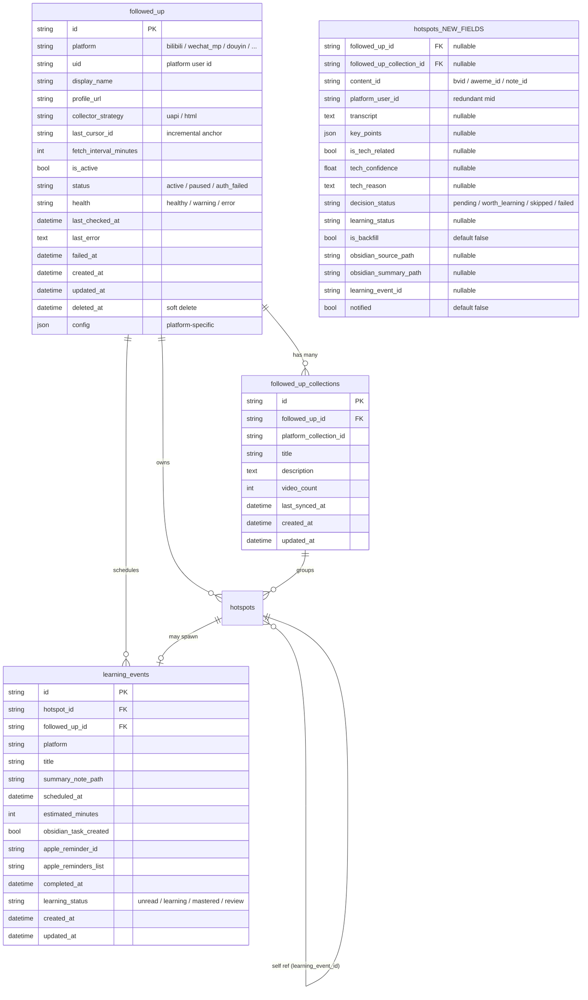

# 01 — 数据模型（DB Schema + Repository + Schema 校验）

> **来源**：原文档 §3（数据模型）
> **上游依赖**：无（基础模块）
> **下游交付物**：
> - 4 个 SQLAlchemy 模型（`followed_up` / `followed_up_collections` / `learning_events` + `hotspots` 新字段）
> - Alembic migration 文件
> - Repository Protocol 接口 + SQLAlchemy 实现
> - Pydantic Schema 校验
> - 完整测试用例清单（单元 + 集成 + 边界）
>
> **subagent 边界**：本模块仅产出 DB schema + 数据访问层，不涉及 API 路由（API 在 Phase 2/4 单独产出）。
> **执行模式**：可与其他 Phase 1 模块（前端 sidebar、Bearer 改造）**并行**。

---


### 3.0 表关系 ER 图



**关系说明**：

- `followed_up` 是顶层实体，被 `followed_up_collections`、`hotspots`、`learning_events` 三方引用
- `followed_up_collections` 是 `followed_up` 的子集合（视频合集），可被 0..N 个 hotspots 引用
- `hotspots.followed_up_id` **可空**：保留原有 `hotspots` 表的"非订阅来源"语义
- `learning_events` 是独立的提醒实体，每次"归档"动作创建一条记录
- `hotspots.learning_event_id` 是反查 FK（避免双外键循环引用）

---

### 3.1 `followed_up`（UP主表）

```python
class FollowedUp(Base):
    __tablename__ = "followed_up"

    id: Mapped[str] = mapped_column(String(32), primary_key=True, default=make_uuid)
    platform: Mapped[str] = mapped_column(String(16), nullable=False)
    uid: Mapped[str] = mapped_column(String(64), nullable=False)
    display_name: Mapped[str] = mapped_column(String(128), nullable=False)
    profile_url: Mapped[str] = mapped_column(String(256), nullable=False)
    collector_strategy: Mapped[str] = mapped_column(String(16), default="uapi")
    last_cursor_id: Mapped[str | None] = mapped_column(String(64), nullable=True)
    fetch_interval_minutes: Mapped[int] = mapped_column(default=30)
    is_active: Mapped[bool] = mapped_column(default=True)
    status: Mapped[str] = mapped_column(String(16), default="active")
    health: Mapped[str] = mapped_column(String(16), default="healthy")
    last_checked_at: Mapped[datetime | None] = mapped_column(nullable=True)
    last_error: Mapped[str | None] = mapped_column(Text, nullable=True)
    failed_at: Mapped[datetime | None] = mapped_column(nullable=True)
    created_at: Mapped[datetime] = mapped_column(default=now_utc)
    updated_at: Mapped[datetime] = mapped_column(default=now_utc, onupdate=now_utc)
    deleted_at: Mapped[datetime | None] = mapped_column(nullable=True)
    config: Mapped[dict | None] = mapped_column(JSON, nullable=True)

    __table_args__ = (
        UniqueConstraint("platform", "uid", name="uq_followed_up_platform_uid"),
    )
```

约束：`UNIQUE(platform, uid) WHERE deleted_at IS NULL`

### 3.2 `followed_up_collections`（合集表）

```python
class FollowedUpCollection(Base):
    __tablename__ = "followed_up_collections"

    id: Mapped[str] = mapped_column(String(32), primary_key=True, default=make_uuid)
    followed_up_id: Mapped[str] = mapped_column(ForeignKey("followed_up.id"), nullable=False)
    platform_collection_id: Mapped[str] = mapped_column(String(64), nullable=False)
    title: Mapped[str] = mapped_column(String(256), nullable=False)
    description: Mapped[str | None] = mapped_column(Text, nullable=True)
    video_count: Mapped[int] = mapped_column(default=0)
    last_synced_at: Mapped[datetime | None] = mapped_column(nullable=True)
    created_at: Mapped[datetime] = mapped_column(default=now_utc)
    updated_at: Mapped[datetime] = mapped_column(default=now_utc, onupdate=now_utc)

    __table_args__ = (
        UniqueConstraint("followed_up_id", "platform_collection_id", name="uq_collection_per_up"),
    )
```

### 3.3 `learning_events`（学习提醒表）

```python
class LearningEvent(Base):
    __tablename__ = "learning_events"

    id: Mapped[str] = mapped_column(String(32), primary_key=True, default=make_uuid)
    hotspot_id: Mapped[str] = mapped_column(ForeignKey("hotspots.id"), nullable=False)
    followed_up_id: Mapped[str] = mapped_column(ForeignKey("followed_up.id"), nullable=False)
    platform: Mapped[str] = mapped_column(String(16), default="bilibili")
    title: Mapped[str] = mapped_column(String(256), nullable=False)
    summary_note_path: Mapped[str | None] = mapped_column(String(512), nullable=True)
    scheduled_at: Mapped[datetime] = mapped_column(default=now_utc)
    estimated_minutes: Mapped[int] = mapped_column(default=15)
    obsidian_task_created: Mapped[bool] = mapped_column(default=False)
    apple_reminder_id: Mapped[str | None] = mapped_column(String(64), nullable=True)
    apple_reminders_list: Mapped[str] = mapped_column(String(64), default="工作学习")
    completed_at: Mapped[datetime | None] = mapped_column(nullable=True)
    learning_status: Mapped[str] = mapped_column(String(16), default="unread")
    created_at: Mapped[datetime] = mapped_column(default=now_utc)
    updated_at: Mapped[datetime] = mapped_column(default=now_utc, onupdate=now_utc)
```

### 3.4 `hotspots` 表新增字段

```python
# hotspots 新增 nullable 字段
followed_up_id: Mapped[str | None] = mapped_column(ForeignKey("followed_up.id"), nullable=True)
followed_up_collection_id: Mapped[str | None] = mapped_column(ForeignKey("followed_up_collections.id"), nullable=True)
content_id: Mapped[str | None] = mapped_column(String(64), nullable=True)
platform_user_id: Mapped[str | None] = mapped_column(String(64), nullable=True)
transcript: Mapped[str | None] = mapped_column(Text, nullable=True)
key_points: Mapped[list | None] = mapped_column(JSON, nullable=True)
is_tech_related: Mapped[bool | None] = mapped_column(nullable=True)
tech_confidence: Mapped[float | None] = mapped_column(nullable=True)
tech_reason: Mapped[str | None] = mapped_column(Text, nullable=True)
decision_status: Mapped[str] = mapped_column(String(16), default="pending")
learning_status: Mapped[str | None] = mapped_column(String(16), nullable=True)
is_backfill: Mapped[bool] = mapped_column(default=False)
obsidian_source_path: Mapped[str | None] = mapped_column(String(512), nullable=True)
obsidian_summary_path: Mapped[str | None] = mapped_column(String(512), nullable=True)
learning_event_id: Mapped[str | None] = mapped_column(String(32), nullable=True)
notified: Mapped[bool] = mapped_column(default=False)
```

---

### 3.5 Alembic 迁移示意

> **项目事实**：AIPulse v0.3 数据库采用 **SQLite + aiosqlite**，所以下列迁移示例使用 SQLite 方言。
> SQLite 支持 `CREATE INDEX ... WHERE` 形式的**部分索引**（partial index），本节直接使用。
> SQLAlchemy 字符串类型通过 `with_variant(String, ...)` 兼容 SQLite。

**迁移文件**：`src-python/migrations/versions/2026_07_25_add_followed_up_tables.py`

```python
"""add followed_up tables and hotspots new columns

Revision ID: 2026_07_25_add_followed_up_tables
Revises: <previous_revision>
Create Date: 2026-07-25 12:00:00.000000

项目数据库：SQLite + aiosqlite
"""
from typing import Sequence, Union

import sqlalchemy as sa
from alembic import op

# revision identifiers, used by Alembic.
revision: str = "2026_07_25_add_followed_up_tables"
down_revision: Union[str, None] = "<previous_revision>"
branch_labels: Union[str, Sequence[str], None] = None
depends_on: Union[str, Sequence[str], None] = None


def upgrade() -> None:
    # --------------------------------------------------------------
    # 1. followed_up 表
    # --------------------------------------------------------------
    op.create_table(
        "followed_up",
        sa.Column("id", sa.String(length=32), primary_key=True),
        sa.Column("platform", sa.String(length=16), nullable=False),
        sa.Column("uid", sa.String(length=64), nullable=False),
        sa.Column("display_name", sa.String(length=128), nullable=False),
        sa.Column("profile_url", sa.String(length=256), nullable=False),
        sa.Column("collector_strategy", sa.String(length=16), nullable=False, server_default="uapi"),
        sa.Column("last_cursor_id", sa.String(length=64), nullable=True),
        sa.Column("fetch_interval_minutes", sa.Integer(), nullable=False, server_default="30"),
        sa.Column("is_active", sa.Boolean(), nullable=False, server_default=sa.true()),
        sa.Column("status", sa.String(length=16), nullable=False, server_default="active"),
        sa.Column("health", sa.String(length=16), nullable=False, server_default="healthy"),
        sa.Column("last_checked_at", sa.DateTime(), nullable=True),
        sa.Column("last_error", sa.Text(), nullable=True),
        sa.Column("failed_at", sa.DateTime(), nullable=True),
        sa.Column("created_at", sa.DateTime(), nullable=False),
        sa.Column("updated_at", sa.DateTime(), nullable=False),
        sa.Column("deleted_at", sa.DateTime(), nullable=True),
        sa.Column("config", sa.JSON(), nullable=True),
        # UNIQUE(platform, uid) —— 应用层检查 deleted_at IS NULL 允许软删除后重名
        sa.UniqueConstraint("platform", "uid", name="uq_followed_up_platform_uid"),
    )
    # 平台+uid 唯一约束本身在 SQLite 是全表唯一；应用层在写入前过滤 deleted_at IS NULL
    # 详见 §3.6 repository.create() 的注释

    # 索引：常用查询路径
    op.create_index("idx_followed_up_platform", "followed_up", ["platform"])
    op.create_index("idx_followed_up_is_active", "followed_up", ["is_active"])
    op.create_index("idx_followed_up_status", "followed_up", ["status"])

    # --------------------------------------------------------------
    # 2. followed_up_collections 表
    # --------------------------------------------------------------
    op.create_table(
        "followed_up_collections",
        sa.Column("id", sa.String(length=32), primary_key=True),
        sa.Column("followed_up_id", sa.String(length=32), nullable=False),
        sa.Column("platform_collection_id", sa.String(length=64), nullable=False),
        sa.Column("title", sa.String(length=256), nullable=False),
        sa.Column("description", sa.Text(), nullable=True),
        sa.Column("video_count", sa.Integer(), nullable=False, server_default="0"),
        sa.Column("last_synced_at", sa.DateTime(), nullable=True),
        sa.Column("created_at", sa.DateTime(), nullable=False),
        sa.Column("updated_at", sa.DateTime(), nullable=False),
        sa.ForeignKeyConstraint(
            ["followed_up_id"],
            ["followed_up.id"],
            name="fk_collections_followed_up",
            ondelete="CASCADE",  # UP主 软删除/物理删除都级联清理合集
        ),
        sa.UniqueConstraint("followed_up_id", "platform_collection_id", name="uq_collection_per_up"),
    )
    op.create_index("idx_collections_followed_up", "followed_up_collections", ["followed_up_id"])

    # --------------------------------------------------------------
    # 3. learning_events 表
    # --------------------------------------------------------------
    op.create_table(
        "learning_events",
        sa.Column("id", sa.String(length=32), primary_key=True),
        sa.Column("hotspot_id", sa.String(length=32), nullable=False),
        sa.Column("followed_up_id", sa.String(length=32), nullable=False),
        sa.Column("platform", sa.String(length=16), nullable=False, server_default="bilibili"),
        sa.Column("title", sa.String(length=256), nullable=False),
        sa.Column("summary_note_path", sa.String(length=512), nullable=True),
        sa.Column("scheduled_at", sa.DateTime(), nullable=False),
        sa.Column("estimated_minutes", sa.Integer(), nullable=False, server_default="15"),
        sa.Column("obsidian_task_created", sa.Boolean(), nullable=False, server_default=sa.false()),
        sa.Column("apple_reminder_id", sa.String(length=64), nullable=True),
        sa.Column("apple_reminders_list", sa.String(length=64), nullable=False, server_default="工作学习"),
        sa.Column("completed_at", sa.DateTime(), nullable=True),
        sa.Column("learning_status", sa.String(length=16), nullable=False, server_default="unread"),
        sa.Column("created_at", sa.DateTime(), nullable=False),
        sa.Column("updated_at", sa.DateTime(), nullable=False),
        sa.ForeignKeyConstraint(
            ["hotspot_id"], ["hotspots.id"], name="fk_learning_events_hotspot"
        ),
        sa.ForeignKeyConstraint(
            ["followed_up_id"], ["followed_up.id"], name="fk_learning_events_followed_up"
        ),
    )
    op.create_index("idx_learning_events_hotspot", "learning_events", ["hotspot_id"])
    op.create_index("idx_learning_events_followed_up", "learning_events", ["followed_up_id"])
    op.create_index("idx_learning_events_scheduled_at", "learning_events", ["scheduled_at"])

    # --------------------------------------------------------------
    # 4. hotspots 表新增字段（全部 nullable，避免影响现有数据）
    # --------------------------------------------------------------
    with op.batch_alter_table("hotspots") as batch_op:
        batch_op.add_column(sa.Column("followed_up_id", sa.String(length=32), nullable=True))
        batch_op.add_column(sa.Column("followed_up_collection_id", sa.String(length=32), nullable=True))
        batch_op.add_column(sa.Column("content_id", sa.String(length=64), nullable=True))
        batch_op.add_column(sa.Column("platform_user_id", sa.String(length=64), nullable=True))
        batch_op.add_column(sa.Column("transcript", sa.Text(), nullable=True))
        batch_op.add_column(sa.Column("key_points", sa.JSON(), nullable=True))
        batch_op.add_column(sa.Column("is_tech_related", sa.Boolean(), nullable=True))
        batch_op.add_column(sa.Column("tech_confidence", sa.Float(), nullable=True))
        batch_op.add_column(sa.Column("tech_reason", sa.Text(), nullable=True))
        batch_op.add_column(sa.Column("decision_status", sa.String(length=16), nullable=False, server_default="pending"))
        batch_op.add_column(sa.Column("learning_status", sa.String(length=16), nullable=True))
        batch_op.add_column(sa.Column("is_backfill", sa.Boolean(), nullable=False, server_default=sa.false()))
        batch_op.add_column(sa.Column("obsidian_source_path", sa.String(length=512), nullable=True))
        batch_op.add_column(sa.Column("obsidian_summary_path", sa.String(length=512), nullable=True))
        batch_op.add_column(sa.Column("learning_event_id", sa.String(length=32), nullable=True))
        batch_op.add_column(sa.Column("notified", sa.Boolean(), nullable=False, server_default=sa.false()))

        # 外键（hotspots 表已有 id 主键）
        batch_op.create_foreign_key(
            "fk_hotspots_followed_up", "followed_up", ["followed_up_id"], ["id"]
        )
        batch_op.create_foreign_key(
            "fk_hotspots_collection", "followed_up_collections", ["followed_up_collection_id"], ["id"]
        )

    # 5. hotspots 表的部分索引（SQLite WHERE 语法）
    # 部分索引 1：active 的 hotspot（deleted_at IS NULL 且未跳过）—— 主查询路径
    op.execute(
        """
        CREATE INDEX idx_hotspots_active
        ON hotspots (decision_status, created_at)
        WHERE deleted_at IS NULL
        """
    )

    # 部分索引 2：待处理 hotspot（pending）—— Agent pipeline 扫表入口
    op.execute(
        """
        CREATE INDEX idx_hotspots_pending
        ON hotspots (followed_up_id, created_at)
        WHERE deleted_at IS NULL AND decision_status = 'pending'
        """
    )

    # 部分索引 3：worth_learning 待通知
    op.execute(
        """
        CREATE INDEX idx_hotspots_worth_notified
        ON hotspots (followed_up_id)
        WHERE deleted_at IS NULL
          AND decision_status = 'worth_learning'
          AND notified = 0
        """
    )

    # 普通索引：按 followed_up_id 查询某 UP主的所有 hotspot
    op.create_index(
        "idx_hotspots_followed_up_id", "hotspots", ["followed_up_id"]
    )
    # content_id 冗余索引：未来按 bvid 反查
    op.create_index(
        "idx_hotspots_content_id", "hotspots", ["content_id"]
    )


def downgrade() -> None:
    # 反向操作，按相反顺序删除
    op.drop_index("idx_hotspots_content_id", table_name="hotspots")
    op.drop_index("idx_hotspots_followed_up_id", table_name="hotspots")
    op.drop_index("idx_hotspots_worth_notified", table_name="hotspots")
    op.drop_index("idx_hotspots_pending", table_name="hotspots")
    op.drop_index("idx_hotspots_active", table_name="hotspots")

    with op.batch_alter_table("hotspots") as batch_op:
        batch_op.drop_constraint("fk_hotspots_collection", type_="foreignkey")
        batch_op.drop_constraint("fk_hotspots_followed_up", type_="foreignkey")
        batch_op.drop_column("notified")
        batch_op.drop_column("learning_event_id")
        batch_op.drop_column("obsidian_summary_path")
        batch_op.drop_column("obsidian_source_path")
        batch_op.drop_column("is_backfill")
        batch_op.drop_column("learning_status")
        batch_op.drop_column("decision_status")
        batch_op.drop_column("tech_reason")
        batch_op.drop_column("tech_confidence")
        batch_op.drop_column("is_tech_related")
        batch_op.drop_column("key_points")
        batch_op.drop_column("transcript")
        batch_op.drop_column("platform_user_id")
        batch_op.drop_column("content_id")
        batch_op.drop_column("followed_up_collection_id")
        batch_op.drop_column("followed_up_id")

    op.drop_index("idx_learning_events_scheduled_at", table_name="learning_events")
    op.drop_index("idx_learning_events_followed_up", table_name="learning_events")
    op.drop_index("idx_learning_events_hotspot", table_name="learning_events")
    op.drop_table("learning_events")

    op.drop_index("idx_collections_followed_up", table_name="followed_up_collections")
    op.drop_table("followed_up_collections")

    op.drop_index("idx_followed_up_status", table_name="followed_up")
    op.drop_index("idx_followed_up_is_active", table_name="followed_up")
    op.drop_index("idx_followed_up_platform", table_name="followed_up")
    op.drop_table("followed_up")
```

**软删除 + 重新添加同名 UP主 的应用层约束说明**：

> `UNIQUE(platform, uid)` 在 SQLite 是**全表唯一**约束，不支持 `WHERE deleted_at IS NULL` 形式（PostgreSQL 支持 partial unique index，但 SQLite 不支持）。
>
> 因此业务层在 `FollowedUpRepository.create()` 中必须：
> 1. 先查询 `WHERE platform = ? AND uid = ? AND deleted_at IS NULL`
> 2. 若存在 → 抛 `DuplicateFollowedUpError`
> 3. 若不存在（包括已软删除的）→ 直接 INSERT（允许同名 UP主 "复活"）
>
> 这与 PostgreSQL 风格 partial unique index 的语义等价，**但由应用层保证一致性**。

---

### 3.6 Repository 层代码示例

> 文件位置：`src-python/src/aipulse/follow/repository.py`
>
> 设计要点：
> - 使用 `typing.Protocol` 抽象接口，具体实现（SQLAlchemy / 测试 in-memory mock）由工厂注入
> - 每个方法显式声明事务语义（`commit: bool = False` 或 `flush: bool`）
> - 返回值统一是不可变 dataclass / Pydantic 模型，避免 ORM Session 泄漏

```python
"""Followed-up UP主数据访问层（Repository Protocol）。

设计模式：Protocol 接口 + SQLAlchemy 实现 + 异步 Session。
"""
from __future__ import annotations

from datetime import datetime
from typing import Optional, Protocol, Sequence
from uuid import uuid4

from sqlalchemy import select, update
from sqlalchemy.ext.asyncio import AsyncSession

from src.aipulse.follow.models import (
    FollowedUp,
    FollowedUpCollection,
    LearningEvent,
)


def make_uuid() -> str:
    """32 位 UUID 字符串（无连字符），与现有 aipulse 项目约定一致。"""
    return uuid4().hex


# ==============================================================
# 错误类型
# ==============================================================

class FollowError(Exception):
    """Follow 模块基类错误。"""


class DuplicateFollowedUpError(FollowError):
    """试图创建一个未软删除但已存在的 (platform, uid) UP主 时抛出。"""


class FollowedUpNotFoundError(FollowError):
    """按 ID 或 uid 找不到 active UP主 时抛出。"""


# ==============================================================
# 通用结果类型
# ==============================================================

class FollowedUpRecord:
    """不可变的 UP主记录（避免 ORM Session 泄漏到业务层）。"""

    def __init__(self, row: FollowedUp) -> None:
        self.id: str = row.id
        self.platform: str = row.platform
        self.uid: str = row.uid
        self.display_name: str = row.display_name
        self.profile_url: str = row.profile_url
        self.collector_strategy: str = row.collector_strategy
        self.last_cursor_id: Optional[str] = row.last_cursor_id
        self.fetch_interval_minutes: int = row.fetch_interval_minutes
        self.is_active: bool = row.is_active
        self.status: str = row.status
        self.health: str = row.health
        self.last_checked_at: Optional[datetime] = row.last_checked_at
        self.last_error: Optional[str] = row.last_error
        self.failed_at: Optional[datetime] = row.failed_at
        self.deleted_at: Optional[datetime] = row.deleted_at
        self.config: Optional[dict] = row.config
        self.created_at: datetime = row.created_at
        self.updated_at: datetime = row.updated_at


class FollowedUpCollectionRecord:
    """不可变的合集记录。"""

    def __init__(self, row: FollowedUpCollection) -> None:
        self.id: str = row.id
        self.followed_up_id: str = row.followed_up_id
        self.platform_collection_id: str = row.platform_collection_id
        self.title: str = row.title
        self.description: Optional[str] = row.description
        self.video_count: int = row.video_count
        self.last_synced_at: Optional[datetime] = row.last_synced_at


class LearningEventRecord:
    """不可变的学习提醒记录。"""

    def __init__(self, row: LearningEvent) -> None:
        self.id: str = row.id
        self.hotspot_id: str = row.hotspot_id
        self.followed_up_id: str = row.followed_up_id
        self.platform: str = row.platform
        self.title: str = row.title
        self.summary_note_path: Optional[str] = row.summary_note_path
        self.scheduled_at: datetime = row.scheduled_at
        self.estimated_minutes: int = row.estimated_minutes
        self.obsidian_task_created: bool = row.obsidian_task_created
        self.apple_reminder_id: Optional[str] = row.apple_reminder_id
        self.apple_reminders_list: str = row.apple_reminders_list
        self.completed_at: Optional[datetime] = row.completed_at
        self.learning_status: str = row.learning_status


# ==============================================================
# Repository Protocol 接口
# ==============================================================

class FollowedUpRepository(Protocol):
    """UP主表数据访问接口。"""

    async def find_by_id(self, followed_up_id: str) -> Optional[FollowedUpRecord]:
        """按主键查找，**包含软删除记录**（调用方按 deleted_at 自行判断）。"""
        ...

    async def find_by_uid(
        self, platform: str, uid: str, *, include_deleted: bool = False
    ) -> Optional[FollowedUpRecord]:
        """按 (platform, uid) 查找。

        include_deleted=False（默认）：仅返回 deleted_at IS NULL 的 active 记录。
        include_deleted=True：返回最新一条记录（用于"复活"流程）。
        """
        ...

    async def list_active(
        self,
        *,
        platform: Optional[str] = None,
        status: Optional[str] = None,
        limit: int = 100,
        offset: int = 0,
    ) -> Sequence[FollowedUpRecord]:
        """列出 active UP主（deleted_at IS NULL AND is_active=true）。

        支持按 platform / status 过滤，按 created_at DESC 排序。
        """
        ...

    async def create(
        self,
        *,
        platform: str,
        uid: str,
        display_name: str,
        profile_url: str,
        collector_strategy: str = "uapi",
        fetch_interval_minutes: int = 30,
        config: Optional[dict] = None,
    ) -> FollowedUpRecord:
        """创建 UP主记录。

        应用层约束：
            - 必须先调 find_by_uid(platform, uid, include_deleted=False)
              检查未软删除的同名 UP主 已存在 → 抛 DuplicateFollowedUpError
            - 已软删除的同名 UP主 允许重新添加（实际是 INSERT 一条新记录，旧记录保持 deleted_at 不变）

        Returns:
            新建的 FollowedUpRecord。
        """
        ...

    async def update(
        self,
        followed_up_id: str,
        *,
        display_name: Optional[str] = None,
        collector_strategy: Optional[str] = None,
        fetch_interval_minutes: Optional[int] = None,
        is_active: Optional[bool] = None,
        status: Optional[str] = None,
        config: Optional[dict] = None,
    ) -> FollowedUpRecord:
        """部分字段更新（PATCH 语义）。其他字段保持不变。"""
        ...

    async def soft_delete(self, followed_up_id: str) -> FollowedUpRecord:
        """软删除：设置 deleted_at = now_utc(), is_active = false。

        不删除 hotspots 子记录（保留历史归档），但将关联的 learning_events.completed_at 不变。
        """
        ...

    async def restore(self, followed_up_id: str) -> FollowedUpRecord:
        """从软删除恢复：清空 deleted_at, is_active = true。

        仅当记录存在且 deleted_at IS NOT NULL 时生效。
        """
        ...


class FollowedUpCollectionRepository(Protocol):
    """合集表数据访问接口。"""

    async def find_by_id(self, collection_id: str) -> Optional[FollowedUpCollectionRecord]:
        ...

    async def list_by_followed_up(
        self, followed_up_id: str
    ) -> Sequence[FollowedUpCollectionRecord]:
        """列出某 UP主的所有合集。"""
        ...

    async def upsert(
        self,
        *,
        followed_up_id: str,
        platform_collection_id: str,
        title: str,
        description: Optional[str] = None,
        video_count: int = 0,
    ) -> FollowedUpCollectionRecord:
        """按 (followed_up_id, platform_collection_id) 唯一键 upsert。"""
        ...

    async def delete(self, collection_id: str) -> None:
        """物理删除合集。关联的 hotspots.followed_up_collection_id 会被 SET NULL（外键 ON DELETE SET NULL）。"""
        ...


class LearningEventRepository(Protocol):
    """学习提醒表数据访问接口。"""

    async def find_by_id(self, event_id: str) -> Optional[LearningEventRecord]:
        ...

    async def list_by_hotspot(self, hotspot_id: str) -> Sequence[LearningEventRecord]:
        """按 hotspot_id 查（通常 1 条；多次归档可能产生多条）。"""
        ...

    async def list_upcoming(
        self,
        *,
        platform: Optional[str] = None,
        learning_status: Optional[str] = None,
        limit: int = 100,
        offset: int = 0,
    ) -> Sequence[LearningEventRecord]:
        """即将学习 tab 数据源。

        默认过滤：learning_status IN ('unread', 'learning'), completed_at IS NULL。
        按 scheduled_at ASC 排序。
        """
        ...

    async def create(
        self,
        *,
        hotspot_id: str,
        followed_up_id: str,
        title: str,
        scheduled_at: datetime,
        estimated_minutes: int = 15,
        summary_note_path: Optional[str] = None,
        platform: str = "bilibili",
        apple_reminders_list: str = "工作学习",
    ) -> LearningEventRecord:
        """创建学习提醒记录。

        默认 scheduled_at = now_utc()（调用方可在传参时显式指定其他时间，如当晚 20:00）。
        """
        ...

    async def mark_completed(self, event_id: str) -> LearningEventRecord:
        """设置 completed_at = now_utc(), learning_status = 'mastered'。"""
        ...

    async def update_status(
        self, event_id: str, learning_status: str
    ) -> LearningEventRecord:
        """更新学习状态（unread / learning / mastered / review）。"""
        ...


# ==============================================================
# SQLAlchemy 实现（参考，具体实现由工厂注入）
# ==============================================================

class SqlAlchemyFollowedUpRepository:
    """SQLAlchemy AsyncSession 实现示例。"""

    def __init__(self, session: AsyncSession) -> None:
        self._session = session

    async def find_by_id(self, followed_up_id: str) -> Optional[FollowedUpRecord]:
        stmt = select(FollowedUp).where(FollowedUp.id == followed_up_id)
        result = await self._session.execute(stmt)
        row = result.scalar_one_or_none()
        return FollowedUpRecord(row) if row else None

    async def find_by_uid(
        self, platform: str, uid: str, *, include_deleted: bool = False
    ) -> Optional[FollowedUpRecord]:
        stmt = select(FollowedUp).where(
            FollowedUp.platform == platform, FollowedUp.uid == uid
        )
        if not include_deleted:
            stmt = stmt.where(FollowedUp.deleted_at.is_(None))
        stmt = stmt.order_by(FollowedUp.created_at.desc()).limit(1)
        result = await self._session.execute(stmt)
        row = result.scalar_one_or_none()
        return FollowedUpRecord(row) if row else None

    async def list_active(
        self,
        *,
        platform: Optional[str] = None,
        status: Optional[str] = None,
        limit: int = 100,
        offset: int = 0,
    ) -> Sequence[FollowedUpRecord]:
        stmt = select(FollowedUp).where(
            FollowedUp.deleted_at.is_(None), FollowedUp.is_active.is_(True)
        )
        if platform:
            stmt = stmt.where(FollowedUp.platform == platform)
        if status:
            stmt = stmt.where(FollowedUp.status == status)
        stmt = stmt.order_by(FollowedUp.created_at.desc()).limit(limit).offset(offset)
        result = await self._session.execute(stmt)
        return [FollowedUpRecord(r) for r in result.scalars().all()]

    async def create(
        self,
        *,
        platform: str,
        uid: str,
        display_name: str,
        profile_url: str,
        collector_strategy: str = "uapi",
        fetch_interval_minutes: int = 30,
        config: Optional[dict] = None,
    ) -> FollowedUpRecord:
        # 应用层唯一性检查（软删除后允许重名）
        existing = await self.find_by_uid(platform, uid, include_deleted=False)
        if existing:
            raise DuplicateFollowedUpError(
                f"UP主 {platform}:{uid} 已存在且未删除 (id={existing.id})"
            )
        row = FollowedUp(
            id=make_uuid(),
            platform=platform,
            uid=uid,
            display_name=display_name,
            profile_url=profile_url,
            collector_strategy=collector_strategy,
            fetch_interval_minutes=fetch_interval_minutes,
            config=config,
        )
        self._session.add(row)
        await self._session.flush()
        return FollowedUpRecord(row)

    async def update(
        self,
        followed_up_id: str,
        *,
        display_name: Optional[str] = None,
        collector_strategy: Optional[str] = None,
        fetch_interval_minutes: Optional[int] = None,
        is_active: Optional[bool] = None,
        status: Optional[str] = None,
        config: Optional[dict] = None,
    ) -> FollowedUpRecord:
        values = {}
        if display_name is not None:
            values["display_name"] = display_name
        if collector_strategy is not None:
            values["collector_strategy"] = collector_strategy
        if fetch_interval_minutes is not None:
            values["fetch_interval_minutes"] = fetch_interval_minutes
        if is_active is not None:
            values["is_active"] = is_active
        if status is not None:
            values["status"] = status
        if config is not None:
            values["config"] = config
        if not values:
            raise ValueError("update() 至少需要一个字段")

        stmt = (
            update(FollowedUp)
            .where(FollowedUp.id == followed_up_id)
            .values(**values)
            .returning(FollowedUp)
        )
        result = await self._session.execute(stmt)
        row = result.scalar_one_or_none()
        if not row:
            raise FollowedUpNotFoundError(f"UP主 id={followed_up_id} 不存在")
        await self._session.flush()
        return FollowedUpRecord(row)

    async def soft_delete(self, followed_up_id: str) -> FollowedUpRecord:
        now = datetime.utcnow()
        stmt = (
            update(FollowedUp)
            .where(FollowedUp.id == followed_up_id)
            .values(deleted_at=now, is_active=False, updated_at=now)
            .returning(FollowedUp)
        )
        result = await self._session.execute(stmt)
        row = result.scalar_one_or_none()
        if not row:
            raise FollowedUpNotFoundError(f"UP主 id={followed_up_id} 不存在")
        await self._session.flush()
        return FollowedUpRecord(row)

    async def restore(self, followed_up_id: str) -> FollowedUpRecord:
        now = datetime.utcnow()
        stmt = (
            update(FollowedUp)
            .where(FollowedUp.id == followed_up_id, FollowedUp.deleted_at.is_not(None))
            .values(deleted_at=None, is_active=True, updated_at=now)
            .returning(FollowedUp)
        )
        result = await self._session.execute(stmt)
        row = result.scalar_one_or_none()
        if not row:
            raise FollowedUpNotFoundError(
                f"UP主 id={followed_up_id} 不存在或未软删除"
            )
        await self._session.flush()
        return FollowedUpRecord(row)
```

---

### 3.7 Schema 校验（Pydantic）

> 文件位置：`src-python/src/aipulse/follow/schemas.py`
>
> 设计要点：
> - `Create` / `Update` / `Response` 三个层级，分离入参与出参
> - `Update` 所有字段 Optional（PATCH 语义）
> - `Response` 是 ORM → API 的不可变快照，禁止外部直接传 Response 写入数据库

```python
"""关注 UP主 Pydantic Schema 定义。"""
from __future__ import annotations

from datetime import datetime
from typing import Annotated, Optional

from pydantic import BaseModel, ConfigDict, Field, field_validator


# ==============================================================
# 通用配置
# ==============================================================

# 限长字符串类型别名（与 SQLAlchemy String 长度对齐）
PlatformStr = Annotated[str, Field(min_length=1, max_length=16)]
UidStr = Annotated[str, Field(min_length=1, max_length=64)]
DisplayNameStr = Annotated[str, Field(min_length=1, max_length=128)]
ProfileUrlStr = Annotated[str, Field(min_length=1, max_length=256)]
CollectorStrategyStr = Annotated[str, Field(pattern=r"^(uapi|html)$")]
StatusStr = Annotated[str, Field(pattern=r"^(active|paused|auth_failed)$")]
HealthStr = Annotated[str, Field(pattern=r"^(healthy|warning|error)$")]
DecisionStatusStr = Annotated[str, Field(pattern=r"^(pending|worth_learning|skipped|failed)$")]
LearningStatusStr = Annotated[
    str, Field(pattern=r"^(unread|learning|mastered|review)$")
]


# ==============================================================
# FollowedUp
# ==============================================================

class FollowedUpBase(BaseModel):
    """FollowedUp 公共字段。"""

    model_config = ConfigDict(from_attributes=True, frozen=True)

    platform: PlatformStr
    uid: UidStr
    display_name: DisplayNameStr
    profile_url: ProfileUrlStr
    collector_strategy: CollectorStrategyStr = "uapi"
    fetch_interval_minutes: int = Field(default=30, ge=1, le=10080)  # 1 分钟 ~ 7 天


class FollowedUpCreate(FollowedUpBase):
    """添加 UP主 的 API 入参。

    **业务约束**：
    - profile_url 应为合法的 URL（B站主页格式：`https://space.bilibili.com/{mid}`）
    - 后端会自动从 profile_url 解析 mid 并填充 uid（如果客户端已传 uid，需一致）
    - config 可选，目前 B站场景下用于 `space_url` 冗余字段
    """

    config: Optional[dict] = None

    @field_validator("profile_url")
    @classmethod
    def validate_bilibili_url(cls, v: str) -> str:
        """仅做格式校验；mid 解析留给 service 层。"""
        if not v.startswith(("http://", "https://")):
            raise ValueError("profile_url 必须以 http:// 或 https:// 开头")
        return v


class FollowedUpUpdate(BaseModel):
    """部分字段更新（PATCH 语义），所有字段可选。"""

    model_config = ConfigDict(from_attributes=True, frozen=True)

    display_name: Optional[DisplayNameStr] = None
    collector_strategy: Optional[CollectorStrategyStr] = None
    fetch_interval_minutes: Optional[int] = Field(default=None, ge=1, le=10080)
    is_active: Optional[bool] = None
    status: Optional[StatusStr] = None
    config: Optional[dict] = None


class FollowedUpResponse(BaseModel):
    """API 响应：包含所有数据库字段 + 健康状态派生字段。"""

    model_config = ConfigDict(from_attributes=True, frozen=True)

    id: str
    platform: PlatformStr
    uid: UidStr
    display_name: DisplayNameStr
    profile_url: ProfileUrlStr
    collector_strategy: CollectorStrategyStr
    last_cursor_id: Optional[str] = None
    fetch_interval_minutes: int
    is_active: bool
    status: StatusStr
    health: HealthStr
    last_checked_at: Optional[datetime] = None
    last_error: Optional[str] = None
    failed_at: Optional[datetime] = None
    config: Optional[dict] = None
    created_at: datetime
    updated_at: datetime
    deleted_at: Optional[datetime] = None  # 软删除标记，前端可见

    # 派生字段（计算属性，不入库）
    health_badge: Optional[str] = None  # "🟢" / "🟡" / "🔴"
    collection_count: Optional[int] = None  # 合集数量（列表接口填充）


# ==============================================================
# FollowedUpCollection
# ==============================================================

class FollowedUpCollectionCreate(BaseModel):
    """添加合集（通常由 collector 自动 upsert，API 不直接暴露）。"""

    model_config = ConfigDict(from_attributes=True, frozen=True)

    followed_up_id: str
    platform_collection_id: str = Field(min_length=1, max_length=64)
    title: str = Field(min_length=1, max_length=256)
    description: Optional[str] = None
    video_count: int = Field(default=0, ge=0)


class FollowedUpCollectionResponse(BaseModel):
    """合集响应。"""

    model_config = ConfigDict(from_attributes=True, frozen=True)

    id: str
    followed_up_id: str
    platform_collection_id: str
    title: str
    description: Optional[str] = None
    video_count: int
    last_synced_at: Optional[datetime] = None
    created_at: datetime
    updated_at: datetime


# ==============================================================
# LearningEvent
# ==============================================================

class LearningEventCreate(BaseModel):
    """创建学习提醒（点击"归档"按钮时触发）。

    默认值约定：
        - scheduled_at: 后端 service 层填充为当晚 20:00（用户可配置）
        - estimated_minutes: 后端 service 层计算为 max(15, video_duration * 2)
    """

    model_config = ConfigDict(from_attributes=True, frozen=True)

    hotspot_id: str
    followed_up_id: str
    title: str = Field(min_length=1, max_length=256)
    scheduled_at: Optional[datetime] = None  # 默认当晚 20:00
    estimated_minutes: Optional[int] = Field(default=None, ge=1, le=1440)  # 最多 24h
    summary_note_path: Optional[str] = Field(default=None, max_length=512)
    platform: PlatformStr = "bilibili"
    apple_reminders_list: str = Field(default="工作学习", max_length=64)


class LearningEventResponse(BaseModel):
    """学习提醒响应。"""

    model_config = ConfigDict(from_attributes=True, frozen=True)

    id: str
    hotspot_id: str
    followed_up_id: str
    platform: PlatformStr
    title: str
    summary_note_path: Optional[str] = None
    scheduled_at: datetime
    estimated_minutes: int
    obsidian_task_created: bool
    apple_reminder_id: Optional[str] = None
    apple_reminders_list: str
    completed_at: Optional[datetime] = None
    learning_status: LearningStatusStr
    created_at: datetime
    updated_at: datetime
```

---

### 3.8 测试用例清单

> 文件位置：
> - 单元测试：`src-python/tests/follow/test_models.py` / `test_repository.py` / `test_schemas.py`
> - 集成测试：`src-python/tests/follow/test_integration.py`

#### 单元测试（SQLAlchemy 模型层）

| # | 用例名 | 验证点 |
|---|---|---|
| 1 | `test_followed_up_unique_uid_per_platform` | 同一 (platform, uid) 未软删除时，repository.create() 抛 `DuplicateFollowedUpError` |
| 2 | `test_followed_up_soft_delete_then_re_add_allowed` | 软删除后再 create 相同 (platform, uid) 成功；旧记录 deleted_at 保持不变，新记录 active |
| 3 | `test_followed_up_soft_delete_sets_deleted_at` | soft_delete() 设置 deleted_at = now_utc()，is_active = false |
| 4 | `test_followed_up_restore_clears_deleted_at` | restore() 软删除记录后，deleted_at IS NULL，is_active = true |
| 5 | `test_followed_up_collection_cascade_delete` | 删除 followed_up → followed_up_collections 自动 CASCADE |
| 6 | `test_followed_up_collection_unique_per_up` | 同一 followed_up 下 platform_collection_id 重复 → upsert 不创建新记录 |
| 7 | `test_learning_event_default_scheduled_at` | 不传 scheduled_at 时，service 层默认填充当晚 20:00 |
| 8 | `test_learning_event_mark_completed_sets_status` | mark_completed() 后 learning_status = 'mastered'，completed_at 不为空 |
| 9 | `test_hotspots_deleted_at_partial_index_used` | `EXPLAIN QUERY PLAN SELECT * FROM hotspots WHERE deleted_at IS NULL AND decision_status='pending'` 显示使用 idx_hotspots_pending 部分索引 |
| 10 | `test_hotspots_followed_up_id_nullable` | 旧 hotspots 记录 followed_up_id IS NULL，不破坏现有数据 |
| 11 | `test_learning_event_unique_per_hotspot` | 同一 hotspot 多次归档允许多条 learning_events（不是物理唯一约束，由业务逻辑控制） |
| 12 | `test_followed_up_config_json_roundtrip` | `config` JSON 字段写入后能完整读回，dict 嵌套对象保留 |

#### Schema 校验测试

| # | 用例名 | 验证点 |
|---|---|---|
| 13 | `test_followed_up_create_invalid_profile_url` | profile_url 不以 http(s):// 开头 → ValueError |
| 14 | `test_followed_up_update_partial_fields` | 仅传 display_name，其他字段保持不变 |
| 15 | `test_followed_up_response_frozen` | FollowedUpResponse 实例不能改属性（frozen=True） |
| 16 | `test_learning_event_create_estimated_minutes_range` | estimated_minutes > 1440 → ValidationError |
| 17 | `test_followed_up_collector_strategy_enum` | collector_strategy = "invalid" → ValidationError（仅允许 uapi/html） |

#### 集成测试（Repository + 真实 SQLite 内存数据库）

| # | 用例名 | 验证点 |
|---|---|---|
| 18 | `test_repository_list_active_filters_deleted` | list_active() 不返回 deleted_at IS NOT NULL 的记录 |
| 19 | `test_repository_list_active_filters_platform` | list_active(platform="bilibili") 仅返回 bilibili 平台的 UP主 |
| 20 | `test_repository_find_by_uid_include_deleted` | include_deleted=True 返回最新一条；include_deleted=False 仅返回 active |
| 21 | `test_repository_update_atomic_fields` | update() 调用后所有字段持久化，未指定字段保留原值 |
| 22 | `test_repository_concurrent_create_same_uid` | 两个并发 create() 同一 (platform, uid)，仅一个成功，另一个抛 DuplicateFollowedUpError |
| 23 | `test_learning_event_list_upcoming_order` | list_upcoming() 按 scheduled_at ASC 排序，且 completed_at IS NULL 过滤生效 |
| 24 | `test_collection_upsert_idempotent` | 重复 upsert 同一 (followed_up_id, platform_collection_id) 不创建重复记录 |
| 25 | `test_followed_up_cascade_to_collections` | soft_delete 一个 UP主 → 关联合集保留（hotspots 保留，合集不级联物理删除） |

#### 关键边界测试（spec 专属）

| # | 用例名 | 验证点 |
|---|---|---|
| 26 | `test_backfill_50_video_limit` | 新增 UP主 时 backfill 上限 50，第 51 个被截断（业务层控制） |
| 27 | `test_hotspot_decision_status_transitions` | `pending → worth_learning → archived` 状态机合法；非法跃迁抛异常 |
| 28 | `test_partial_index_idx_hotspots_worth_notified` | `EXPLAIN QUERY PLAN` 验证 worth_learning + notified=false 的查询走 idx_hotspots_worth_notified 部分索引 |
| 29 | `test_isolated_transaction_rollback` | create() 抛异常时，同事务内的其他改动全部回滚 |
| 30 | `test_followed_up_default_collector_strategy` | create() 不传 collector_strategy 时，默认值为 "uapi" |

---

